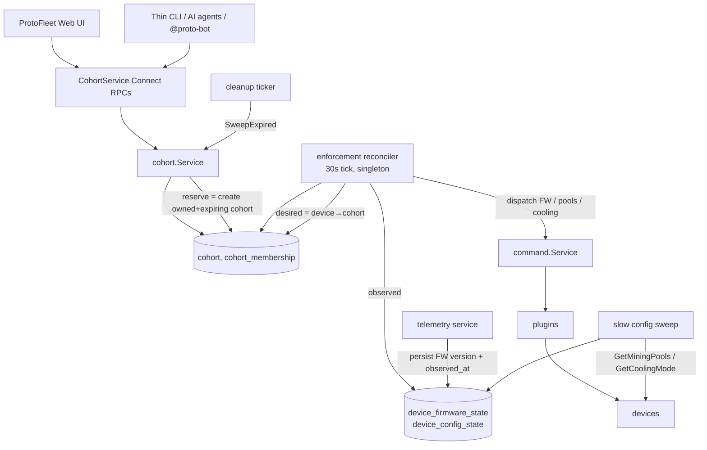
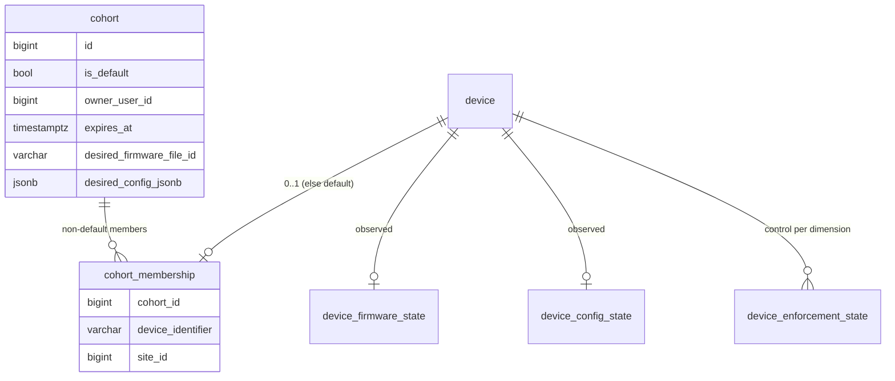
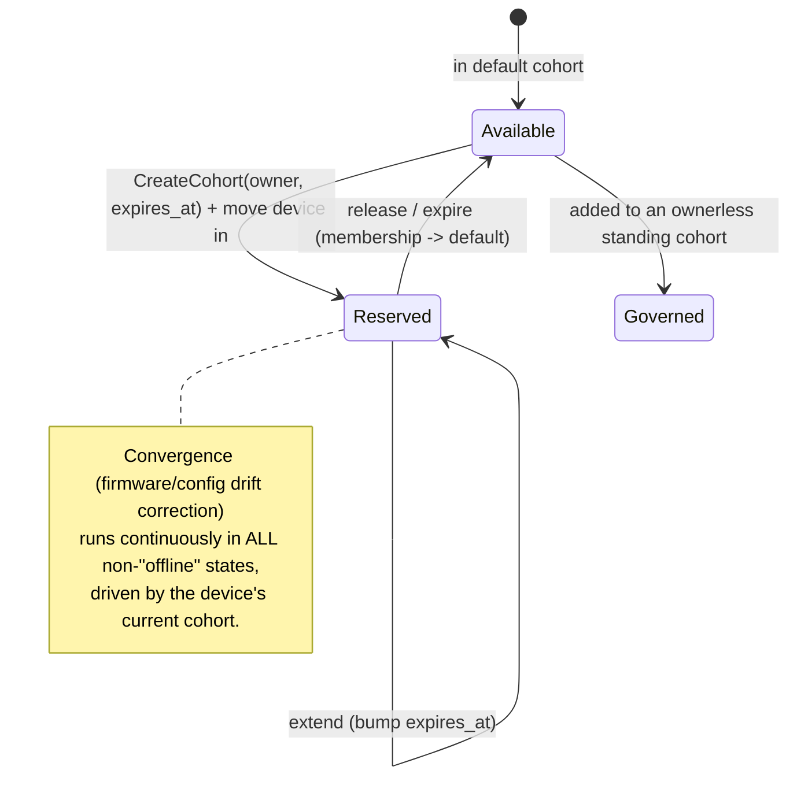
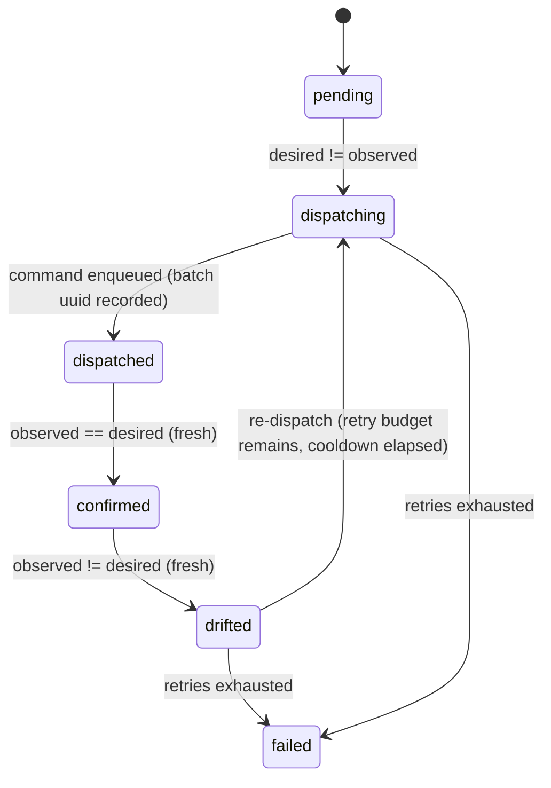

# TDD: Cohorts — fleet-wide firmware/config enforcement & rig reservations

**Author:** Krisztian Kurucz
**Reviewers:** Proto Mining Software Team
**Status:** 📝 Draft — In Review
**Supersedes:** _[Proto SW] Rig Reservation & Deployment System_ (the stateless external
`proto-testrack` CLI design). This document folds that proposal's goals into a first-class
Proto Fleet feature and is the source of truth going forward.

---

## Motivation

Multiple development sites run ~160 mining rigs that developers, CI, and AI coding agents all
share for firmware testing. Today there is no coordination: developers conflict over rigs, rigs
are left in unknown firmware/config states after a test, and there is no cross-site view of what
is free. The earlier proposal solved this with an external CLI that used Proto Fleet as a backing
store by overloading `device_set` groups and a JSON blob crammed into the group `description`,
plus GitHub Actions cron for reset/expiry workers.

Review feedback was to make this **first-class inside Proto Fleet** and to **generalize** it.
Exploring the codebase showed that not only is that the right call, it is *simpler* than the
external design — because Proto Fleet already contains the structural pattern we need
(`curtailment`), and because a small generalization (“cohorts”) subsumes reservation, reset, and
fleet-wide config baselines under one model.

## Goals

- **Cross-site visibility** of every rig, its state, and who is using it — via the web UI, the
  API, and a thin CLI (`--json` + stable exit codes for agents).
- **Atomic, all-or-nothing reservations** with optional expiry.
- **Continuous desired-state enforcement**: a reserved (or baseline-governed) rig is held to a
  target firmware *and* config for as long as it is governed; drift is detected and corrected.
- **Automatic return to known-good** when a reservation ends — as a *consequence* of the model,
  not a bolted-on reset step.
- **Dogfood Proto Fleet**: device ops (pairing, telemetry, firmware update, config) are Proto
  Fleet’s existing capabilities; this feature composes them, it does not reimplement them.
- **Zero new infrastructure**: state lives in Proto Fleet’s Postgres; background work runs in the
  existing `fleetd` process; no external cron, no second datastore.

## Non-Goals

- **Progressive rollout / canary orchestration** (canary → 50% → 100% with health gates). This is
  a future *driver* that mutates cohorts over time; the cohort model supports it but we do not
  build it now.
- **Re-implementing device ops**: pairing, telemetry, firmware upload, and command dispatch are
  Proto Fleet’s and stay so.
- **A firmware build/CI system**: resolving “PR #1247 → its latest `.swu`” is GitHub/CI-specific
  and stays a thin client concern (`swufetch`), which hands the server a concrete firmware file.
- **Deep Memfault coupling**: Memfault remains an optional delivery channel, not a system of record.

---

## Background: what the repo already provides

Four premises from the original proposal are contradicted by the code, and they reshape the design:

1. **`device_set` has no extension points.** The table is `id, org_id, type, label, description,
   created_at, updated_at, deleted_at`; the `DeviceSet` message has no metadata map, no status, no
   owner, no expiry (`proto/device_set/v1/device_set.proto`, `GroupInfo` is an empty placeholder).
   The only free-form field is a 500-char `description` string. Storing reservation state there is
   the anti-pattern.
2. **Multi-site is within one server**, not a fleet of instances: `device.site_id` is a column
   (`server/migrations/000045_add_site_id_to_device.up.sql`); `MULTI_SITE_ENABLED` is a
   frontend-only flag. “Cross-site” is a `WHERE site_id IN (...)` query, not federation.
3. **No firmware variant/distro registry exists.** Firmware is an opaque UUID file
   (`server/internal/infrastructure/files/firmware.go`); there is no `release`/`mfg`/`dev` channel
   or “latest matching build.” Any “known-good firmware” notion must be built.
4. **The reset-worker / expiry-sweeper machinery already exists in-server** — see `curtailment`
   below, plus the session-cleanup ticker in `server/cmd/fleetd/main.go`. No external cron needed.

### `curtailment` is the structural template

`curtailment` (shipped) is a named, owned, org-scoped operation over a *scope* of devices with a
lifecycle state machine, frozen-or-mutable per-device member rows, a background **reconciler** that
drives device commands and performs genuine **drift detection + auto-correction**, audit, and a
command-exclusivity filter. A cohort is the same machine with different verbs. We clone its
layering rather than invent one.

| Curtailment concept | File (verified) | Cohort analog |
| --- | --- | --- |
| `curtailment_event` (named op over a scope) | `migrations/000042_create_curtailment.up.sql:36` | `cohort` (desired-state cell) |
| `curtailment_target` (per-device row) | `migrations/000042:141` | per-device observed/enforcement state |
| One-non-terminal-per-device exclusivity | `migrations/000072_add_curtailment_target_device_exclusivity.up.sql` | `UNIQUE(org_id, device_identifier)` partition |
| 30s reconciler, observe→drift→re-dispatch→escalate | `curtailment/reconciler/reconciler.go` (`observeActive`, `checkDrift`, `confirmOneDispatched`) | enforcement reconciler |
| Atomic insert of op + members | `stores/sqlstores/curtailment.go:102` (`InsertEventWithTargets`) | atomic `CreateCohort` + members |
| Command-exclusivity filter | `command/curtailment_active_filter.go` | `CohortMembershipFilter` |
| Singleton heartbeat (`CHECK(id=1)`) | `migrations/000042:187` | reconciler heartbeat |
| Owner/actor from `session.Info` | `handlers/curtailment/handler.go:36` | same |

---

## Solution options

**Whether to build in-server at all:**

- **Rejected — stateless external CLI over `device_set` groups + GitHub Actions cron.** Fragile
  JSON-in-`description` state with a 500-char cap; derived/un-queryable status; accepted concurrency
  races; external cron to operate; a second system that does not dogfood Fleet; and it assumes
  premises 1–4 above that the code contradicts.
- **Chosen — an in-server cohort feature**, modeled structurally on `curtailment`, with the agent CLI
  retained as a thin client. Detailed below.

**How to model membership (given we build in-server).** All three options below implement the *same*
logical model (exclusive set + desired firmware/config + owner/expiry + a reconciler); they differ
only in where membership and exclusivity live:

- **(A) Extend the `device_set` GROUP type** with an `exclusive` toggle + desired firmware/config.
  *Rejected:* groups are *defined* by being overlapping and imperative (see "Cohorts vs. groups"
  below), so an `exclusive` toggle makes one noun mean two contradictory things, and the partition
  invariant becomes a cross-table constraint a unique index can't express locally.
- **(B) A separate cohort that *references* a `device_set` for membership.** *Rejected:* a cohort
  needs a partition but device_sets are overlapping, so exclusivity becomes an awkward cross-table
  invariant; and a 1:1 cohort↔device_set pairing is just (C) with an extra hop and two coupled
  lifecycles. The indirection only pays off when cohorts reference *shared* groups — exactly the case
  that breaks exclusivity and ownership.
- **(C) Chosen — a cohort that owns its own membership** (`cohort` + `cohort_membership`). The
  partition is one local `UNIQUE(org_id, device_identifier)` constraint; ownership and lifecycle are
  fully controlled by the cohort's own RPCs; groups stay a clean, separate organizational primitive
  (cohorts can still be *created from* a group — see the bridge below). Cost: a second device-grouping
  concept and a small reimplementation of membership, both judged worthwhile for the clean partition
  and the clean separation from groups.

---

## The cohort model

> A **cohort** is a *desired-state cell*: a mutable set of devices plus the firmware and config they
> should run, optionally owned, optionally time-bounded. The fleet is **partitioned** — every device
> is in exactly one cohort, or implicitly in the single **global default cohort**. A continuous
> reconciler drives each device to *its cohort’s* desired state and corrects drift. A **reservation
> is just a cohort with an owner and an expiry.**

Consequences that fall out of this — and that the original design had to build by hand:

- **Reset-on-release is not a mechanism.** Releasing or expiring a cohort moves its devices back to
  the default cohort, which merely *changes their desired state*; the same enforcement loop converges
  them. No reset queue, no reset worker, no reset-target registry as a distinct concept.
- **Re-reserving a freed rig skips the baseline reflash.** If a device leaves cohort A and is
  immediately pulled into cohort B (which pins its own firmware), the reconciler drives straight to
  B’s target — it never bounces through the baseline. Strictly less flashing than “reset, then deploy.”
- **Exclusivity is the model’s invariant**, enforced by one UNIQUE constraint — not a special
  reservation feature. The reconciler therefore never sees conflicting desired states for a device.
- **Enforcement is best-effort and optional.** A cohort with no desired firmware/config enforces
  nothing. Want guaranteed-clean rigs between reservations? Set a default firmware file on the
  default cohort. Don’t care? Leave it unset.
- **A cohort holds *complete* desired state.** Two rigs that want the same firmware but different
  pools need two cohorts. For dev rigs the distinct combinations are few; we accept some cohort
  proliferation rather than build intent-layering now.

---

## Cohorts vs. groups (device_sets): division of labor

Cohorts do **not** replace groups; they are a different *modality* over a set of devices, and both
will coexist. Groups (`device_set` GROUP) already let you push firmware/pools/cooling/power to a set —
but as a one-shot, user-initiated bulk action (`device_set.proto:12-13`, "grouping devices for
filtering and bulk operations"; the bulk actions live in the client's `DeviceSetActionsMenu`). So the
distinguishing axis is **not** "can you apply config to a set" — it is imperative vs. declarative:

| | Group (`device_set` GROUP) | Cohort |
| --- | --- | --- |
| Modality | **imperative** — "apply X to these now" | **declarative** — "these *should* be X" |
| Duration | one-shot, fire-and-forget | continuous, drift-corrected |
| Membership | **overlapping** (many groups per device) | **exclusive** (one desired-state per device) |
| Ownership / lifecycle | none | owner, expiry |
| Purpose | organize, filter, see rollups, bulk-act | own a set and continuously enforce its state |

A cohort is the declarative/continuous/exclusive/owned counterpart to a group's
imperative/one-shot/overlapping bulk action. Folding the two into one primitive (option A above) would
make a single noun bimodal; keeping them separate keeps each coherent. The organizational axes are
orthogonal and coexist: **groups** (ad-hoc logical), **racks** (physical placement),
**sites/buildings** (geographic), and now **cohorts** (desired-state ownership). Groups remain useful
after cohorts ship — they are still how a user curates and bulk-acts on ad-hoc sets.

**The bridge — create a cohort from a group.** Because groups are where users already curate sets, the
primary cohort-creation path resolves a group's *current* members and **freezes** them into the new
(exclusive) cohort — converting an overlapping selection into an exclusive, enforced set at a point in
time. This is also the concrete implementation of curtailment's `ScopeDeviceSets`, currently
`Unimplemented` (`curtailment/service.go:1134`): the same "resolve a `device_set` id → member
identifiers" helper serves both. After creation the cohort owns its membership independently — later
edits to the source group do **not** silently change the cohort (critical for reservations: nobody can
add devices to your lease by editing a group).

**UX caution.** There are now two ways to get firmware onto a set — "bulk-update group G now"
(imperative) and "pin firmware via a cohort" (declarative, enforced). The UI must make this
distinction explicit so users choose intentionally.

---

## Architecture



Components, all inside `fleetd`:

- **`cohort.Service`** — CRUD + membership + allocation, cloned from the `curtailment` service shape.
- **Enforcement reconciler** — a singleton 30s loop cloned from `curtailment/reconciler`, the only
  component that issues device commands to converge devices to their cohort’s desired state.
- **Expiry sweep** — folded into the existing cleanup ticker in `main.go`.
- **Observed-state shadows + a slow config sweep** — make “current firmware/config per device”
  queryable, which is the new substrate continuous enforcement needs.
- **Thin CLI** — keeps the reservation-flavored verbs and the `--json`/exit-code contract; the
  GitHub/CI artifact resolution (`swufetch`) stays here and passes the server a concrete firmware file.

---

## Data model

Illustrative SQL (the concrete migration — `000078`, the next free number after `000077` — is written
during implementation). Conventions mirror `curtailment` (`migrations/000042`): typed columns for
anything filtered/sorted/uniqueness-constrained; JSONB for flexible payloads; `org_id` FK
`ON DELETE RESTRICT`; the shared `update_updated_at_column()` trigger; partial indexes.

### `cohort`

```sql
CREATE TABLE cohort (
    id                       BIGSERIAL    PRIMARY KEY,
    org_id                   BIGINT       NOT NULL,
    label                    TEXT         NOT NULL,
    is_default               BOOLEAN      NOT NULL DEFAULT FALSE,

    -- Owner = caller identity (from session.Info). NULL for the default cohort and for
    -- ownerless standing cohorts. Username denormalized so list/`my` views need no join.
    owner_user_id            BIGINT       NULL,
    owner_username           TEXT         NULL,
    expires_at               TIMESTAMPTZ  NULL,   -- a "reservation" is an owned cohort with an expiry

    -- Desired firmware: a pinned concrete file, e.g. a PR artifact.
    -- NULL => no firmware enforcement.
    desired_firmware_file_id VARCHAR      NULL,

    -- Desired config (pools / cooling / power). NULL => no config enforcement.
    desired_config_jsonb     JSONB        NULL,

    state                    TEXT         NOT NULL DEFAULT 'active',  -- 'active' | 'released'
    purpose                  TEXT         NOT NULL,
    source_actor_type        TEXT         NOT NULL,   -- 'user' | 'api_key' | 'scheduler'
    source_actor_id          TEXT         NULL,
    idempotency_key          TEXT         NULL,
    created_at               TIMESTAMPTZ  NOT NULL DEFAULT CURRENT_TIMESTAMP,
    updated_at               TIMESTAMPTZ  NOT NULL DEFAULT CURRENT_TIMESTAMP,

    CONSTRAINT fk_cohort_org FOREIGN KEY (org_id) REFERENCES organization(id) ON DELETE RESTRICT,
    CONSTRAINT fk_cohort_owner FOREIGN KEY (owner_user_id) REFERENCES "user"(id),
    CONSTRAINT ck_cohort_purpose_nonempty CHECK (length(trim(purpose)) > 0)
);

-- Exactly one default cohort per org.
CREATE UNIQUE INDEX uq_cohort_one_default_per_org ON cohort (org_id) WHERE is_default;
-- Idempotent create collapses retries (mirrors uq_curtailment_event_idempotency, 000042:125).
CREATE UNIQUE INDEX uq_cohort_idempotency ON cohort (org_id, idempotency_key)
    WHERE idempotency_key IS NOT NULL;
-- Hot paths: "my active cohorts" and the expiry sweep.
CREATE INDEX idx_cohort_owner_active ON cohort (org_id, owner_user_id) WHERE state = 'active';
CREATE INDEX idx_cohort_expiry ON cohort (expires_at)
    WHERE state = 'active' AND expires_at IS NOT NULL;
```

### `cohort_membership` — the partition

```sql
CREATE TABLE cohort_membership (
    cohort_id         BIGINT      NOT NULL,
    org_id            BIGINT      NOT NULL,
    device_identifier VARCHAR     NOT NULL,
    site_id           BIGINT      NULL,        -- snapshot for cross-site queries without re-joining device
    added_at          TIMESTAMPTZ NOT NULL DEFAULT CURRENT_TIMESTAMP,

    CONSTRAINT fk_cohort_membership_cohort FOREIGN KEY (cohort_id) REFERENCES cohort(id) ON DELETE CASCADE,
    -- THE PARTITION INVARIANT: a device is in at most one non-default cohort.
    CONSTRAINT uq_cohort_membership_one_per_device UNIQUE (org_id, device_identifier)
);
CREATE INDEX idx_cohort_membership_cohort ON cohort_membership (cohort_id);
```

**Default-cohort membership is sparse / implicit.** We never write membership rows for the default
cohort; a device with **no** membership row *is* in the default cohort. “Move a device back to default”
= delete its membership row. This keeps the table proportional to non-default membership and makes the
`UNIQUE` constraint do all the exclusivity work. The default cohort’s members are computed as
“org devices with no membership row” (`device LEFT JOIN cohort_membership … WHERE membership IS NULL`).

### Enforcement substrate (the new, read-side work)

Continuous enforcement needs the server to *observe* current firmware/config so it can detect drift.

```sql
-- Observed firmware per device + freshness. Written from the existing telemetry seam
-- (persistFirmwareVersionIfChanged, telemetry/service.go:871) which today writes
-- discovered_device.firmware_version on-change but has no observed_at timestamp.
CREATE TABLE device_firmware_state (
    device_identifier VARCHAR      PRIMARY KEY,
    org_id            BIGINT       NOT NULL,
    firmware_version  VARCHAR(255) NOT NULL,
    observed_at       TIMESTAMPTZ  NOT NULL,   -- the missing freshness signal
    updated_at        TIMESTAMPTZ  NOT NULL DEFAULT CURRENT_TIMESTAMP
);

-- Observed config per device, refreshed by a SLOW sweep (decouples per-device GetMiningPools/
-- GetCoolingMode RPC fanout from the fast 30s drift tick). Pool usernames are stored
-- worker-name-normalized (see reconciler §) so desired/observed compare cleanly.
CREATE TABLE device_config_state (
    device_identifier   VARCHAR      PRIMARY KEY,
    org_id              BIGINT       NOT NULL,
    observed_pools_jsonb JSONB       NOT NULL DEFAULT '[]'::jsonb,
    observed_cooling_mode TEXT       NULL,
    observed_power_mode   TEXT       NULL,     -- NULL until GetPowerTarget exists (see §)
    observed_at         TIMESTAMPTZ  NOT NULL,
    updated_at          TIMESTAMPTZ  NOT NULL DEFAULT CURRENT_TIMESTAMP
);

-- Control-loop bookkeeping per (device, dimension): the convergence state machine + dispatch cursors.
-- Distinct from the observed shadows (truth) and the cohort (desired). Survives membership changes —
-- when a device's cohort changes, the reconciler simply re-targets.
CREATE TABLE device_enforcement_state (
    device_identifier  VARCHAR     NOT NULL,
    org_id             BIGINT      NOT NULL,
    dimension          TEXT        NOT NULL,   -- 'firmware' | 'pools' | 'cooling' | 'power'
    state              TEXT        NOT NULL,   -- pending|dispatching|dispatched|confirmed|drifted|failed
    retry_count        INT         NOT NULL DEFAULT 0,
    last_batch_uuid    VARCHAR(36) NULL,
    last_dispatched_at TIMESTAMPTZ NULL,
    last_error         TEXT        NULL,
    updated_at         TIMESTAMPTZ NOT NULL DEFAULT CURRENT_TIMESTAMP,
    PRIMARY KEY (device_identifier, dimension)
);
```



---

## Lifecycle & operations

### Allocation (reserve) — atomic, all-or-nothing

“Reserve N rigs matching `--product`/`--site`” = create an owned, expiring cohort and atomically move
N *available* devices (those currently in the default cohort, i.e. with no membership row) into it, in
one transaction. We clone `InsertEventWithTargets` (`stores/sqlstores/curtailment.go:102`):

1. Selector pre-filters candidates to default-cohort devices matching the request.
2. In one tx: insert the `cohort` row, then bulk-insert `cohort_membership` rows.
3. A `uq_cohort_membership_one_per_device` violation (someone grabbed a device first) rolls back the
   **whole** transaction → maps to Connect `AlreadyExists` → CLI **exit code 2** (“none available”,
   retry-with-backoff is reasonable). This is the all-or-nothing guarantee; the constraint is the race
   backstop behind the selector pre-filter (defense-in-depth, exactly as curtailment does it).

### Membership mutation

Add/remove devices to a cohort at any time (e.g. a developer expanding PR coverage to more rigs after
creating the cohort). Each move is one transaction subject to the authz rule below. Moving a device
*into* a cohort deletes any prior membership row (default) and inserts the new one.

### Expiry & release → convergence (no reset path)

- **Expiry**: the cleanup ticker (`main.go`, beside `sessionSvc.CleanupExpired`) runs
  `cohortSvc.SweepExpired`: for each `active` owned cohort past `expires_at`, in one tx delete its
  membership rows (devices fall back to default) and set `state='released'`.
- **Manual release**: same effect, on demand.
- **Convergence**: once a device is back in the default cohort, its *desired* state is the default
  cohort’s (if any). The enforcement reconciler observes `observed ≠ desired` and drives it — the
  identical loop that enforces any cohort. There is no special “reset” code.

### Effective device state (derived, for visibility)

Computed at read time, never stored as a single field:

| Inputs | Effective state |
| --- | --- |
| In an owned cohort, `expires_at` in future | **reserved** by `owner_username` until T |
| In a non-default, ownerless cohort | **governed** by `label` |
| In the default cohort | **available** |
| `device_enforcement_state` any dimension `dispatching`/`drifted` | **converging** |
| any dimension `failed` | **needs attention** |
| Fleet reports offline | **offline** |



---

## Continuous enforcement reconciler

A singleton 30s-tick goroutine cloned from `curtailment/reconciler/reconciler.go`: `Start`/`Stop` with a
shutdown watchdog, a `CHECK(id=1)` heartbeat row (mirroring `curtailment_reconciler_heartbeat`,
`000042:187`), per-tick and per-device panic isolation, and optimistic-concurrency state writes.

**Desired state is unambiguous** thanks to the partition: for each device, look up its cohort (or the
default), read `desired_firmware_file_id` and `desired_config_jsonb`, and compare against the observed
shadows.

**Per-device, per-dimension state machine** (firmware / pools / cooling / power are *independent* — we
must never reflash firmware to correct a pool drift):



Mechanics carried over from curtailment, with firmware-specific hardening:

- **Observe → drift → re-dispatch → escalate.** Stale observations (old `observed_at`) are treated as
  *unverifiable → hold*, never as drift — the same missing-evidence asymmetry curtailment uses so a
  flaky sensor can’t trigger a reflash storm.
- **Dispatch surfaces** (existing code):
  - Firmware → `command.Service.FirmwareUpdate(ctx, selector, firmwareFileID)`
    (`command/service.go:1357`); returns a batch identifier.
  - Pools → a credential-free, actor-gated reapply path. The standard `UpdateMiningPools` runs
    `verifyUserCredentials`, which the synthetic reconciler context can’t satisfy; reuse the executor’s
    stored-worker-name reapply (`command/execution_service.go:483`).
  - Cooling → `command.Service.SetCoolingMode`.
  - Power → `command.Service.SetPowerTarget` (set-only today; see SDK gap).
- **Mandatory open-batch guard for firmware** (not idempotent mid-install): before re-dispatch, skip
  if the device’s last firmware batch is not finished (`queue.IsBatchFinished` /
  `GetBatchStatusAndDeviceCounts`), and treat plugin firmware-install states `installing`/`confirming`
  as “in progress, hold.”
- **Anti-reflash-storm debounce**: a long `FirmwareReDispatchCooldown` (30–60 min) plus a requirement
  of N consecutive fresh drift observations before re-dispatch.
- **Config-drift normalization** is worker-name-aware: the executor suffixes pool usernames
  (`appendMinerNameToPoolUsername`); the observed-vs-desired comparison strips/reconstructs the suffix
  (`workername.FromPoolUsername`). This normalization lives in one shared helper so the slow sweep and
  the drift check agree.
- **SDK getter gap**: `GetCoolingMode` already exists (`sdk/v1/interface.go:398`), so cooling is
  drift-detectable now. **`GetPowerTarget` does not exist** — power enforcement is gated on adding it to
  the `DeviceConfiguration` interface and implementing it across every plugin (antminer, virtual,
  asicrs; this triggers `proto-regen` + `asicrs-build`). Until then, power is set-on-assignment only.
- **Curtailment interaction**: a device under an active curtailment is power-controlled; the cohort
  reconciler’s dispatch to it is filter-skipped. v1 rule: **curtailment wins** (don’t reflash a device
  that’s meant to be off); the cohort reconciler treats the skip as “hold, don’t burn retry budget.”

---

## Exclusivity & authorization

- **Exclusivity** is the `UNIQUE(org_id, device_identifier)` partition — structurally, a device cannot
  be in two non-default cohorts.
- **Authorization is on membership *movement***, which is where the “lease” actually lives:
  - Pulling a device **from the default cohort** is free (subject to `cohort:manage`).
  - Moving a device **out of an owned cohort** requires being its owner, or admin.
- **Command-exclusivity filter** `CohortMembershipFilter`, cloned from
  `command/curtailment_active_filter.go` and registered in `main.go`: a command targeting a device in an
  *owned* cohort, issued by a non-owner, is skipped. The reconciler’s own traffic bypasses via a new
  `session.ActorCohort` actor (added beside `ActorCurtailment`, `session/models.go:39`).

---

## Interfaces

### RPC — `cohort.v1.CohortService` (Connect)

| RPC | Purpose | CLI verb |
| --- | --- | --- |
| `CreateCohort` | Create a cohort; optionally owner=caller, `expires_at`, desired FW/config, initial members (explicit identifiers **or** `source_device_set_id` to freeze a group's current members — the group→cohort bridge). Atomic all-or-nothing. | `reserve`, `deploy` |
| `UpdateCohort` | Change desired FW/config; bump `expires_at`. | `extend`, `redeploy` |
| `AddDevicesToCohort` / `RemoveDevicesFromCohort` | Mutable membership (expand/shrink coverage). | — |
| `ReleaseCohort` | Members → default, `state='released'`. | `release`, `cancel` |
| `GetCohort` / `ListCohorts` / `GetMyCohorts` | Read. | `status`, `rigs`, `my` |
| `ListDevices` | Devices with effective cohort + observed-vs-desired state; `site_id` filter. | `rigs` |
| `AdminReassign` / `AdminReleaseCohort` | Force-move / force-release another owner’s cohort. | `reset` |

Each mutating RPC reads the caller via `middleware.RequirePermission(ctx, …)` →`*session.Info`
(`handlers/curtailment/handler.go:36`); owner = `info.UserID` + `info.Username`, org = `info.OrganizationID`.
API keys (`fleet_…`) already resolve to `session.Info`, so `Authorization: Bearer fleet_…` attributes
ownership for free.

### CLI (thin client)

The CLI keeps the original reservation-flavored ergonomics — `reserve`, `release`, `extend`, `deploy`,
`my`, `rigs`, `status` — now as thin wrappers over the RPCs above. The contract for agents is preserved:

- `--json` on every command.
- Stable exit codes: `0` success; `1` error; `2` none available (`AlreadyExists`) → retry with backoff.
- No interactive prompts; everything via flags.

What stays client-side: `swufetch` (resolve a PR/release to a concrete `.swu`, upload it via the
firmware HTTP endpoint, and pass the resulting `firmware_file_id` as the cohort’s desired firmware). The
GitHub/CI-specific resolution is the one piece that does not belong in the server.

### AI agent recipe

```shell
export FLEET_API_KEY="fleet_a1b2c3d4_..."

# Reserve a rig (cohort = owner+expiry) with the PR build as its desired firmware.
# swufetch resolves PR -> .swu, uploads it, and the CLI passes the firmware_file_id.
RIG=$(protofleet reserve --site dalton --count 1 --product R2 \
        --deploy-pr 1247 --purpose "agent: test PR 1247" --duration 2h --json)
RESERVATION=$(echo "$RIG" | jq -r '.cohort_id')
RIG_IP=$(echo "$RIG" | jq -r '.devices[0].ip')

# Enforcement converges the rig to the PR build automatically; poll until confirmed.
protofleet status "$RESERVATION" --json   # device.firmware_state == "confirmed"

pytest python/tests/system/ --ip "$RIG_IP" --json-report > result.json; RESULT=$?

protofleet release "$RESERVATION" --json   # devices -> default cohort -> converge to baseline
exit $RESULT
```

### Web UI

A `client/src/protoFleet/features/cohorts/` page showing: every device with its cohort, owner,
effective state, and observed-vs-desired firmware/config; cohort list with expiry countdowns; the
default cohort’s baseline; and per-device convergence/health. Replaces the original static gh-pages
dashboard. (Route registration follows the `routePrefetch.ts` + `router.tsx` runbook.)

---

## Wiring (`server/cmd/fleetd/main.go`)

Alongside the curtailment block: construct the store and `cohort.Service` (with the activity-log audit
logger and the device-identifier resolver) → `commandSvc.RegisterFilter(NewCohortMembershipFilter(...))`
→ add `cohortSvc.SweepExpired` to the cleanup ticker → start the enforcement reconciler with a paired
`defer Stop()` → `mux.Handle(cohortv1connect.NewCohortServiceHandler(...))` → register the service name
and any admin RPC in `SessionOnlyProcedures`.

## Permissions

Add `cohort:read` / `cohort:manage` (and a `ResourceCohort`) to `authz/catalog.go` (constants +
catalog entries + `AllPermissions()`), projected into the role-seed migration `000053`, with the
admin gate applied to `AdminReassign` / `AdminReleaseCohort`.

---

## Work breakdown / phasing

- **Phase 0 — skeleton.** `proto/cohort/v1/cohort.proto`; migration `000078` (`cohort`,
  `cohort_membership`, default-cohort seed per org); authz constants. `just gen` (`proto-regen`,
  `db-generation-hygiene`).
- **Phase 1 — MVP: lease + visibility.** Cohort CRUD, mutable membership, the partition + authz-on-move,
  owner/expiry (reservation verbs), `ListDevices` visibility, the expiry sweep, the command filter,
  audit, the web feature, and the thin-CLI repoint. Desired FW/config is *recorded* but enforced only
  via existing one-shot deploy commands.
- **Phase 2 — continuous firmware + config enforcement.** `device_firmware_state` + `device_config_state`
  shadows; the enforcement reconciler doing convergence from pinned cohort firmware files (firmware
  first — readback already exists; then pools and cooling). Reset-on-release “just works” here via
  convergence.
- **Phase 3 — power enforcement.** Add `GetPowerTarget` to the SDK and all plugins; enable power as an
  enforced dimension.
- **Phase 4 — deferred.** Progressive-rollout driver; site/building-scoped baselines if a single global
  default proves too coarse; Memfault as an optional delivery channel.

Dependency spine: `cohort CRUD → firmware shadow → continuous firmware → {pools, cooling} →
GetPowerTarget across plugins → continuous power`.

---

## Risks & open questions

- **Per-tick device-RPC fanout.** `GetMiningPools`/`GetCoolingMode`/`GetPowerTarget` are per-device RPCs;
  calling them in the 30s drift tick would storm the fleet. Mitigated by the slow sweep into
  `device_config_state` — the fast tick reads only the shadow. *Open:* sweep cadence vs. drift-detection
  latency; piggyback on telemetry polling vs. a dedicated loop.
- **Reflash storms / hysteresis.** A device that reboots slowly post-flash can read “still drifted” next
  tick. Mitigated by the mandatory open-batch guard + firmware cooldown + N-consecutive-observation
  hysteresis. *Open:* exact thresholds.
- **Firmware staleness & offline-mid-membership.** Stale `observed_at` ⇒ hold. *Open:* does an
  offline-mid-lease device hold indefinitely, or fail a dimension after a timeout (cf. curtailment’s
  restore-dispatch timeout)?
- **Reboot-required vs. drift.** A device showing the old version because it’s mid-reboot after a
  successful flash is not drift. *Open:* model a distinct `pending_reboot` sub-state and possibly issue
  a `Reboot` rather than counting it as drift.
- **Multi-instance single-writer.** Like curtailment, the reconciler is a singleton with a heartbeat but
  no leader election. Firmware is *not* idempotent, so two reconcilers both clearing the open-batch guard
  in one window could double-flash. *Open:* add a `pg_advisory_xact_lock` (as authz reconcile does) or
  `SELECT … FOR UPDATE` specifically around the firmware dispatch path.
- **Stacked command filters.** Schedule × curtailment × cohort filters now all gate commands. *Open:*
  define explicit precedence (v1: curtailment > cohort).
- **Best-effort default for mixed miner types.** A default cohort without a desired firmware file
  leaves firmware unmanaged; surface this visibly rather than making users infer it from no-ops.
- **Credential-bypass pool path.** The actor-gated, credential-free pool reapply needs a security review.
- **Cohort proliferation.** “Complete desired state per cohort” means distinct (FW, config) combos = new
  cohorts. Accepted for now; revisit intent-layering only if it bites.
- **Two grouping concepts (cohorts and groups).** This is the deliberate cost of option (C). The risk is
  user confusion between "bulk-update group G now" (imperative) and "pin firmware via a cohort"
  (declarative, enforced). *Mitigations:* the explicit division-of-labor framing above, the
  group→cohort bridge so groups feed cohorts rather than compete, and UI copy that names the modality.
  *Open:* whether some bulk group actions should eventually be re-expressed as "create a cohort"
  prompts, so the imperative path nudges toward the declarative one where enforcement is wanted.

---

## Appendix: relationship to the superseded design

| Superseded (external CLI) | This design (in-server cohorts) |
| --- | --- |
| `reservation:<uuid>` group + JSON `description` | `cohort` row (typed columns + optional desired-state JSONB) |
| `reset:pending:N` queue groups | none — reset is convergence to the default cohort |
| `command_batch_log` polling from the CLI | in-process `queue.IsBatchFinished` / `GetBatchStatusAndDeviceCounts` |
| GitHub Actions reset worker (5-min cron) | in-server enforcement reconciler (30s tick) |
| GitHub Actions expiry sweeper | in-server cleanup ticker |
| Fleet API key → owner | unchanged: `fleet_…` → `session.Info` |
| Accepted concurrency race | `UNIQUE(org_id, device_identifier)` partition |
| Static gh-pages dashboard | `features/cohorts/` web UI |
| “Site → its own Fleet instance” + `fleetcli` | single server; `device.site_id`; no federation |
| `swufetch` PR→`.swu` resolution | unchanged: stays a thin client |
