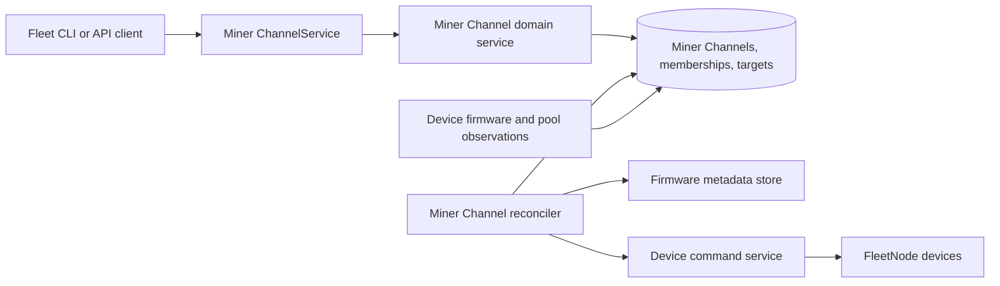

# Miner Channels: reservations and continuous fleet enforcement

## Summary

A miner channel is an exclusive desired-state cell for miners. Operators use the Fleet CLI or Connect API to reserve devices, assign firmware by manufacturer and model, assign an ordered pool configuration, and release the devices when the work is complete. The server continuously reconciles each member with that desired state.

This first slice is intentionally headless. It includes the operational API, CLI, persistence, authorization, audit logging, and reconciliation loop. Browser miner channel pages, rollout dashboards, firmware history, post-upgrade validation, telemetry comparison, and power enforcement are deferred.

## Data model

- Every organization has one persisted default miner channel whose membership is implicit.
- Non-default membership rows are sparse and exclusive: a device without a row belongs to the default miner channel, and a unique constraint prevents a device from joining two explicit miner channels.
- An owned miner channel may expire. Release and expiry remove its memberships, returning devices to the default miner channel.
- Firmware targets are keyed by normalized manufacturer and model and reference metadata-bearing firmware files.
- Pool configuration is stored as typed desired JSON. Device firmware/config observations and enforcement state are stored independently so reconciliation survives restarts.

## Request flow

Reservation creation and membership moves are transactional. The command filter rejects user commands against an owned miner channel unless the caller owns it; commands emitted by the miner channel reconciler carry the miner channel actor and bypass that filter.

## Reconciliation

On each tick, the reconciler resolves a device's effective miner channel and compares observed firmware and pool state with its targets. It records pending, dispatched, confirming, converged, held, or failed state; retries bounded failures; and re-dispatches when confirmed state later drifts. Removing a target clears its enforcement state without issuing a reset command.

Firmware targets are per manufacturer/model because identical firmware bytes may have different compatibility metadata. Pool enforcement is skipped and reported as unsupported when a driver cannot read or apply pool configuration.

## Operational interface

The service exposes miner channel CRUD, membership changes, release, firmware-target management, organization and owner listings, device status, and administrative reassignment/release. Read responses include current and desired firmware/config convergence state, but no historical or comparative analytics.

## Verification

- Domain and store tests cover atomic allocation, ownership, expiry, release, idempotency, and default membership.
- Command tests cover owner exclusion and miner channel-actor bypass.
- Reconciler tests cover firmware and pool convergence, retries, unsupported devices, target removal, and drift correction.
- Handler and Fleet CLI tests cover the operational RPC surface.
- Migration tests run against Postgres, followed by generated-code checks, lint, builds, and an isolated CLI workflow.
