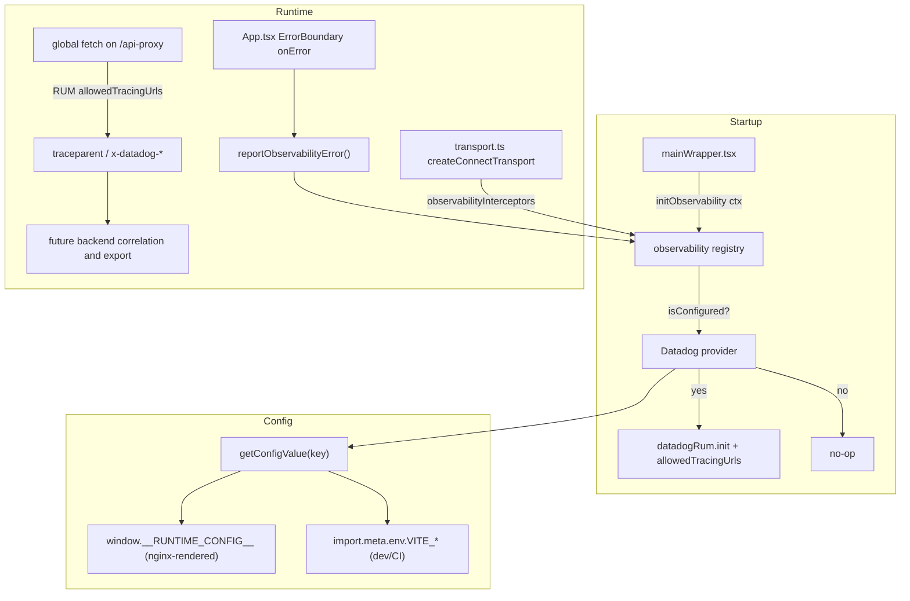

# feat: Pluggable client observability with Datadog RUM + API tracing

## Summary

Add a vendor-neutral observability layer to the ProtoFleet web client. A small provider
registry initializes any configured backend at startup; a Datadog RUM provider is the first
implementation. When the required Datadog config keys are present the provider initializes
RUM (page/session monitoring, error capture, and trace-context injection on client→server API
calls); when they are absent it is a complete no-op. The abstraction is shaped so Sentry or
PostHog can be added later by writing one more provider file — no changes to the entry point,
transport, or error boundary.

Config resolves **runtime-first with a build-time fallback**: deployed operators set OS env
vars that nginx renders into a `window.__RUNTIME_CONFIG__` blob at container start (no
rebuild), while local dev and CI builds continue to use Vite `VITE_*` vars. This matches the
repo's existing "operator edits an env file, containers read it" deployment model.

Trace-context injection provides the client half of future front-end↔back-end correlation.
Associating and exporting backend spans to the same observability system is explicitly deferred.

**Product Contract preservation:** N/A — solo plan (`ce-plan-bootstrap`), no upstream
brainstorm to preserve.

---

## Problem Frame

Operators and developers currently have no visibility into client-side behavior: page load
performance, JS errors reaching users, or where latency originates on a slow API call. There
is no error/analytics/telemetry integration anywhere in `client/` today (confirmed: the only
`useTelemetry*` code is miner-domain data, not app observability). When a user reports "the
fleet page is slow," there is no signal to say whether the cost is client render, network, or
server handling.

We want:
1. A way to turn on Datadog RUM by configuration, with a clean no-op when unconfigured.
2. A bootstrapping pattern generic enough that Sentry/PostHog follow the same shape.
3. Future-ready trace-context injection on client→server API calls.

### Scope Boundaries

**In scope**
- Generic observability provider interface + registry + startup bootstrap (in `shared/`).
- Datadog RUM provider (init, error capture, tracing config).
- Runtime-config accessor with build-time (`VITE_*`) fallback.
- Trace-context injection on ConnectRPC calls, ready for future backend correlation.
- Wiring into the ProtoFleet entry point and error boundary.
- Deployment plumbing so operators can enable via env vars without a rebuild.

### Deferred to Follow-Up Work
- Wiring the same bootstrap into the **protoOS** client (`client/src/protoOS/mainWrapper.tsx`).
  The abstraction lives in `shared/` and is designed for it, but protoOS enablement is a
  separate change.
- Actual Sentry / PostHog providers (the pattern is proven by Datadog; no second provider is
  built here).
- Datadog Session Replay tuning beyond a sample-rate knob (default off).
- Custom RUM actions / user identification beyond anonymous session + build metadata.
- Server-side trace parenting/linking and export to Datadog (see Risks).

### Non-goals
- Replacing or changing the miner-telemetry domain features (`useTelemetryMetrics`, etc.).
- Building an in-house metrics/telemetry backend — this integrates a vendor SDK.

---

## Requirements

- **R1** — A provider is initialized only when its required config keys are present; otherwise
  the app runs unchanged with zero SDK side effects (no network, no globals patched).
- **R2** — Adding a new provider (Sentry/PostHog) requires writing one provider module and
  registering it; no edits to the entry point, transport, or error boundary.
- **R3** — Datadog RUM, when enabled, captures page/session data and forwards React
  render-time errors caught by the shared `ErrorBoundary`.
- **R4** — Client→server API calls (ConnectRPC) carry trace context scoped to the same-origin
  API path, providing the client half of future backend correlation.
- **R5** — Configuration is resolvable at deploy time by an operator (runtime injection) and
  at dev/CI time via `VITE_*`, through one accessor with a documented precedence.
- **R6** — A provider `init()` failure must not crash or block app startup.
- **R7** — Datadog config keys are typed (no untyped `import.meta.env` access for new vars).

---

## Key Technical Decisions

**KTD1 — Provider registry pattern, abstraction in `client/src/shared/observability/`.**
A provider-agnostic interface + registry lives in `shared/` (mirroring how `version.ts` and
`ErrorBoundary` are shared across both apps). Providers are self-describing: each reads its own
config and reports whether it `isConfigured()`. The registry iterates registered providers and
initializes the configured ones. Rationale: satisfies R2 and keeps app code vendor-free;
`shared/` must not import `@/protoFleet` or `@/protoOS` (app-specific values are passed in as
an init context).

**KTD2 — Datadog distributed tracing via RUM `allowedTracingUrls`, not a bespoke interceptor.**
`@datadog/browser-rum` instruments the global `fetch`; connect-web's transport calls global
`fetch` (its custom wrapper delegates to it), so configuring `allowedTracingUrls` to match the
`/api-proxy` origin makes RUM inject `traceparent` / `x-datadog-*` headers on every RPC and
tie them to RUM resource timings. This provides the client half of a future RUM↔APM path and
requires no change to how the ~25 clients are built (all share one transport). Rationale:
directly serves R4 without claiming backend correlation that this change does not configure.

**KTD3 — Vendor-neutral interceptor seam kept, unused by Datadog.**
The registry exposes an optional `observabilityInterceptors()` contribution that the transport
composes into `createConnectTransport({ interceptors })`. Datadog returns none (it uses
`allowedTracingUrls`), but the seam lets a future provider that does *not* auto-instrument
fetch add explicit RPC instrumentation without touching transport code. Avoids double header
injection today while keeping R2 true for tracing, not just init.

**KTD4 — Runtime-config accessor with build-time fallback.**
A single `getConfigValue(key)` reads `window.__RUNTIME_CONFIG__?.[key]` first, then falls back
to `import.meta.env['VITE_' + key]`. Deployed nginx renders `window.__RUNTIME_CONFIG__` from
container env at start; dev/CI use `VITE_*`. Rationale: satisfies R5 and the "operator
configures → enabled" intent for prebuilt static artifacts, while preserving the established
`VITE_*` dev ergonomics. Precedence (runtime > build-time) lets an operator override a baked
default.

**KTD5 — Enablement = both required Datadog keys present.**
`DD_APPLICATION_ID` and `DD_CLIENT_TOKEN` are the required keys; all others have defaults. This
is the single enable/no-op switch (R1).

**KTD6 — Error forwarding through the existing `ErrorBoundary.onError` seam.**
The shared `ErrorBoundary` already calls `props.onError?.(normalized, errorInfo)`. ProtoFleet's
`App` passes an `onError` that fans out to `reportObservabilityError(...)`. No new error
plumbing; unconfigured → the fan-out is a no-op (R3, R6).

---

## High-Level Technical Design



Config precedence for every key: `window.__RUNTIME_CONFIG__[KEY]` → `import.meta.env.VITE_KEY`
→ provider default.

---

## Output Structure

```
client/src/shared/observability/
├── index.ts                     # barrel: initObservability, reportObservabilityError, observabilityInterceptors
├── types.ts                     # ObservabilityProvider, ObservabilityInitContext
├── registry.ts                  # provider list + iterate/guard/init logic
├── runtimeConfig.ts             # getConfigValue(key) runtime-first accessor + window typing
├── registry.test.ts
├── runtimeConfig.test.ts
└── providers/
    ├── datadog.ts               # Datadog RUM provider
    └── datadog.test.ts
```

---

## Implementation Units

### U1. Add Datadog SDK dependency and typed env vars

**Goal:** Make `@datadog/browser-rum` available and type the new config vars.
**Requirements:** R7.
**Dependencies:** none.
**Files:**
- `client/package.json` (add `@datadog/browser-rum`, exact-pinned per repo convention)
- `client/package-lock.json` (regenerated)
- `client/src/vite-env.d.ts` (augment `ImportMetaEnv` with `VITE_DD_*` keys)
**Approach:** Install with `--save-exact` against the public npm registry (`client/.npmrc`
points at npmjs, not Artifactory — so no registry override needed for the client). Add an
`ImportMetaEnv` interface listing `VITE_DD_APPLICATION_ID`, `VITE_DD_CLIENT_TOKEN`,
`VITE_DD_SITE`, `VITE_DD_SERVICE`, `VITE_DD_ENV`, `VITE_DD_RUM_SAMPLE_RATE`,
`VITE_DD_SESSION_REPLAY_SAMPLE_RATE`, `VITE_DD_TRACE_SAMPLE_RATE` (all optional strings).
**Patterns to follow:** existing exact-pin style in `client/package.json`; `vite-env.d.ts`.
**Test scenarios:** `Test expectation: none -- dependency + type declarations, no runtime behavior.`
**Verification:** `npm ci` resolves; `npm run typecheck` passes with the new typings.

### U2. Runtime-config accessor with build-time fallback

**Goal:** One accessor that resolves config runtime-first, then `VITE_*`, used by all providers.
**Requirements:** R5.
**Dependencies:** none.
**Files:**
- `client/src/shared/observability/runtimeConfig.ts`
- `client/src/shared/observability/runtimeConfig.test.ts`
**Approach:** Export `getConfigValue(key: string): string | undefined` returning
`window.__RUNTIME_CONFIG__?.[key] ?? readViteEnv('VITE_' + key)`. Declare a `Window`
augmentation for `__RUNTIME_CONFIG__?: Record<string, string>`. Treat empty string as unset.
Keep it framework-free and side-effect-free so `shared/` boundary rules hold.
**Patterns to follow:** `client/src/shared/utils/version.ts` (module-level env reads, fallbacks).
**Test scenarios:**
- Happy path: runtime value present → returns runtime value (input `window.__RUNTIME_CONFIG__ = {DD_CLIENT_TOKEN: "rt"}`, `getConfigValue("DD_CLIENT_TOKEN")` → `"rt"`).
- Fallback: no runtime value, `VITE_DD_CLIENT_TOKEN` set → returns the Vite value.
- Precedence: both set → runtime wins.
- Empty/edge: runtime value is `""` → treated as unset, falls back; neither set → `undefined`.
**Verification:** unit tests pass; no `console.log` introduced.

### U3. Provider interface, registry, and error/interceptor fan-out

**Goal:** Vendor-neutral core: types, registry, `initObservability`, `reportObservabilityError`,
`observabilityInterceptors`.
**Requirements:** R1, R2, R6.
**Dependencies:** U2.
**Files:**
- `client/src/shared/observability/types.ts`
- `client/src/shared/observability/registry.ts`
- `client/src/shared/observability/index.ts`
- `client/src/shared/observability/registry.test.ts`
**Approach:** Define `ObservabilityProvider { name; isConfigured(): boolean;
init(ctx: ObservabilityInitContext): void; reportError?(error, meta?): void;
connectInterceptors?(): Interceptor[]; }` and `ObservabilityInitContext { service; version;
env; apiTracingOrigin; }` (`Interceptor` from `@connectrpc/connect`). Registry holds the
provider array (Datadog registered in U4 or via a `providers.ts` list). `initObservability(ctx)`
iterates: skip unconfigured; wrap each `init()` in try/catch that logs via `console.error` (the
sanctioned level) so one failure never blocks startup (R6). `reportObservabilityError` fans out
to configured providers' `reportError`. `observabilityInterceptors()` concatenates
`connectInterceptors()` from configured providers.
**Patterns to follow:** sanctioned `console.error` usage (`router.tsx`); barrel-export style.
**Test scenarios:**
- Configured provider → `init` called once with the context.
- Unconfigured provider → `init` not called.
- `init` throws → error swallowed/logged, `initObservability` still returns, other providers still init (integration: two providers, first throws, second still initialized).
- `reportObservabilityError` → only configured providers' `reportError` invoked.
- `observabilityInterceptors()` → returns interceptors only from configured providers (empty when none).
- Idempotency: calling `initObservability` twice does not double-init a provider (guard flag).
**Verification:** unit tests pass; `shared/` imports no app modules.

### U4. Datadog RUM provider

**Goal:** Implement the Datadog provider: enablement, init with tracing, error capture.
**Requirements:** R1, R3, R4, R5.
**Dependencies:** U1, U2, U3.
**Files:**
- `client/src/shared/observability/providers/datadog.ts`
- `client/src/shared/observability/providers/datadog.test.ts`
- register it in the registry (`registry.ts` or a `providers.ts` list from U3)
**Approach:** `isConfigured()` → both `getConfigValue("DD_APPLICATION_ID")` and
`getConfigValue("DD_CLIENT_TOKEN")` non-empty (KTD5). `init(ctx)` calls `datadogRum.init({
applicationId, clientToken, site (default "datadoghq.com"), service (ctx.service default
"proto-fleet-client"), env (DD_ENV || ctx.env), version (ctx.version), sessionSampleRate,
sessionReplaySampleRate (default 0), trackResources: true, trackLongTasks: true,
trackUserInteractions: true, allowedTracingUrls: [ match fn accepting ctx.apiTracingOrigin /
`/api-proxy/` requests ], traceSampleRate })`. Numeric sample rates parsed from strings with
safe defaults. `reportError(error, meta)` → `datadogRum.addError(error, meta)`.
`connectInterceptors()` → `[]` (KTD2/KTD3). Read all config via `getConfigValue`; read
`version` from `buildVersionInfo` in the init context (passed by caller, not imported here to
keep `shared/` self-contained — `buildVersionInfo` is already in `shared/` so a direct import is
also acceptable).
**Patterns to follow:** `featureFlags.ts` (`=== "true"`/default parsing), `version.ts`.
**Execution note:** implement `isConfigured` and the init-arg mapping test-first — the no-op
guard (R1) and correct `allowedTracingUrls` shape (R4) are the load-bearing behaviors.
**Test scenarios:**
- `isConfigured` false when either required key missing → `init` maps to no `datadogRum.init` call.
- `isConfigured` true when both present.
- `init` calls `datadogRum.init` once with `applicationId`/`clientToken` from config and
  `version` from the context.
- `allowedTracingUrls` matches an `/api-proxy/...` URL and does **not** match an unrelated
  third-party URL (assert via the provided match function).
- Optional keys: defaults applied when unset (site, service, sample rates); overridden when set.
- `reportError` forwards to `datadogRum.addError`.
- Sample-rate parsing: non-numeric string → default; valid string → parsed number.
**Verification:** unit tests pass with the Datadog SDK mocked (see U6 setup).

### U5. Wire bootstrap, tracing interceptors, and error forwarding into ProtoFleet

**Goal:** Activate the layer in the ProtoFleet app.
**Requirements:** R2, R3, R4, R6.
**Dependencies:** U3, U4.
**Files:**
- `client/src/protoFleet/mainWrapper.tsx` (call `initObservability(ctx)` beside `logBuildVersion()`)
- `client/src/protoFleet/api/transport.ts` (spread `observabilityInterceptors()` into `interceptors`)
- `client/src/protoFleet/components/App/App.tsx` (pass `onError` to `ErrorBoundary` → `reportObservabilityError`)
**Approach:** Build the init context from `buildVersionInfo` (service `"proto-fleet-client"`,
`version: buildVersionInfo.commit`, env from config/build) and the API origin derived from
`API_PROXY_BASE`. Add `interceptors: observabilityInterceptors()` to `createConnectTransport`
(empty array today → transport behavior unchanged when unconfigured, R2). Pass
`onError={(err, info) => reportObservabilityError(err, { react: info })}` at the `ErrorBoundary`
in `App.tsx`. All three seams are no-ops when nothing is configured.
**Patterns to follow:** `mainWrapper.tsx` `logBuildVersion()` call site; `ErrorBoundary`
`onError` prop already threaded.
**Test scenarios:**
- `Covers R6.` transport constructs successfully with empty interceptors (unconfigured) — existing API tests still pass.
- `App` renders and, when a child throws, the `onError` prop invokes `reportObservabilityError` (mock the observability module; assert called with the error).
- Smoke: `mainWrapper` module import triggers `initObservability` exactly once (mock registry).
**Verification:** `npm run typecheck`, targeted vitest for `App` + transport, existing api tests green.

### U6. Test setup mock for the Datadog SDK

**Goal:** Prevent tests from touching the real SDK / network.
**Requirements:** supports R1/R3/R4 test isolation.
**Dependencies:** U1.
**Files:**
- `client/src/tests/setup.ts` (add `vi.mock('@datadog/browser-rum', ...)` with spies for `init`, `addError`)
**Approach:** Provide a module mock exposing `datadogRum` with `vi.fn()` `init`/`addError`/etc.
so provider tests assert call shape without side effects. Keep alongside the existing global
stubs (`ResizeObserver`, observers).
**Patterns to follow:** existing global stubs in `client/src/tests/setup.ts`.
**Test scenarios:** `Test expectation: none -- test infrastructure; exercised by U4/U5 tests.`
**Verification:** U4/U5 suites run without network; full `npm test` green.

### U7. Deployment runtime-config injection (operator enablement without rebuild)

**Goal:** Let a self-hosting operator enable Datadog via env vars on the prebuilt client image.
**Requirements:** R5 (deploy-time half).
**Dependencies:** U2.
**Files:**
- `deployment-files/client/Dockerfile` (add an entrypoint that renders runtime config, keep nginx CMD)
- `deployment-files/client/docker-entrypoint.d/40-render-runtime-config.sh` (new; emits `window.__RUNTIME_CONFIG__`)
- `deployment-files/client/nginx.http.conf`, `deployment-files/client/nginx.https.conf` (serve the generated `config.js` no-cache)
- `deployment-files/docker-compose.yaml` (pass `DD_*` env into the `fleet-client` service)
- `client/src/protoFleet/index.html` (load `<script src="/config.js"></script>` before the module bundle)
- `deployment-files/run-fleet.sh` and `.env` example (surface `DD_*` keys to operators)
**Approach:** The `nginx:alpine` base already runs `/docker-entrypoint.d/*.sh` before starting
nginx — add a script that writes `/usr/share/nginx/html/config.js` containing
`window.__RUNTIME_CONFIG__ = { DD_APPLICATION_ID: "$DD_APPLICATION_ID", ... }` from container
env (only keys that are set; omit empties so `getConfigValue` treats them as unset → no-op when
the operator configures nothing, R1). Serve `config.js` with `Cache-Control: no-store` so
operator changes take effect on restart. `index.html` loads it before `mainWrapper.tsx` so
`window.__RUNTIME_CONFIG__` exists at init. Dev is unaffected (no `config.js` served by Vite →
falls back to `VITE_*`).
**Execution note:** mostly packaging/config; prefer a container smoke check (start image with
and without `DD_*` env, confirm `config.js` contents and that the app no-ops when unset) over
unit tests.
**Test scenarios:** `Test expectation: none behaviorally in JS.` Verify via runtime smoke:
- With `DD_APPLICATION_ID`+`DD_CLIENT_TOKEN` set → `config.js` contains both keys; RUM initializes.
- With no `DD_*` env → `config.js` omits them (or is empty) → app runs, no RUM, no errors.
**Verification:** build the deployment client image; `curl` `config.js` in both env states;
confirm `index.html` references the script and the app boots either way.

### U8. Documentation

**Goal:** Document the config keys, precedence, and how to add a new provider.
**Requirements:** R2, R5 (discoverability).
**Dependencies:** U1–U7.
**Files:**
- `client/README.md` (observability section: `VITE_DD_*` for dev, runtime `DD_*` for deploy, precedence)
- `client/src/shared/observability/index.ts` (concise doc comment: how to add a provider)
- deployment docs where env vars are listed (alongside `SESSION_COOKIE_SECURE`)
**Approach:** Short, example-driven. Note that only `DD_APPLICATION_ID` + `DD_CLIENT_TOKEN`
are required; everything else defaults; absent → no-op. Document the Sentry/PostHog "write one
provider" path.
**Test scenarios:** `Test expectation: none -- docs only.`
**Verification:** docs render; keys match code.

---

## System-Wide Impact

- **External contract surfaces:** new env vars consumed by CI build (`VITE_DD_*`) and by the
  deployment client container (`DD_*`); a new `config.js` served by nginx; `index.html` gains a
  script tag. These are additive and inert when unset.
- **Transport:** all ~25 ConnectRPC clients share one transport; the interceptor array is empty
  today, so behavior is unchanged until a provider contributes interceptors.
- **Both apps:** the core lives in `shared/`; protoOS wiring is deferred but unblocked.

---

## Risks & Dependencies

- **End-to-end trace correlation is deferred.** The backend currently treats incoming requests
  as public endpoints and the bundled OTEL collector exports server traces to Jaeger, not the
  operator's Datadog org. This change only injects scoped trace context and records client-side
  resource timing. A follow-up must define the trust/association policy for browser-supplied
  context and export server spans to the same backend before claiming end-to-end traces.
- **Datadog RUM patches global `fetch`.** connect-web's custom `fetch` wrapper delegates to
  global `fetch`, so instrumentation applies — but confirm the wrapper isn't replaced by a
  non-global fetch in future. *Mitigation:* a test asserting the transport uses global fetch;
  the KTD3 interceptor seam is the fallback if auto-instrumentation ever breaks.
- **Runtime `config.js` caching.** If cached, operator changes won't apply. *Mitigation:*
  `Cache-Control: no-store` on `config.js`.
- **Secret handling.** `DD_CLIENT_TOKEN` is a public RUM client token (safe for browser), not a
  secret API key — document this so operators don't paste a privileged key.
- **Bundle size.** `@datadog/browser-rum` adds to the bundle; it is only *initialized* when
  configured, but the code is present. *Mitigation:* acceptable; revisit dynamic import if
  bundle budget becomes a concern (noted, not done here).

---

## Alternative Approaches Considered

- **Build-time-only `VITE_*` config.** Simplest and consistent with existing client config, but
  a self-hosting operator with a prebuilt artifact could not enable Datadog without rebuilding —
  fails the "operator configures → enabled" intent. Rejected as the sole mechanism; kept as the
  dev/CI fallback layer (KTD4).
- **Bespoke ConnectRPC tracing interceptor as the primary tracing mechanism.** Vendor-neutral,
  but would duplicate/collide with RUM's own fetch instrumentation. Rejected as primary;
  retained as an optional seam for a future provider (KTD3).
- **React context provider for observability.** Heavier than needed — init is a one-time
  startup side effect, better placed in `mainWrapper.tsx` next to `logBuildVersion()`. Error
  forwarding uses the existing `ErrorBoundary.onError` seam instead of new context.

---

## Definition of Done

- Provider registry + Datadog provider implemented in `client/src/shared/observability/`, with
  unit tests green (U2–U4, U6).
- With no Datadog config: app builds, boots, and behaves exactly as today; no SDK init, no
  network, transport interceptors empty (R1, R6).
- With `DD_APPLICATION_ID` + `DD_CLIENT_TOKEN` set (dev via `VITE_*`, deploy via runtime
  `config.js`): RUM initializes, captures errors via `ErrorBoundary.onError`, and API calls to
  `/api-proxy` carry trace headers (R3, R4, R5).
- Adding a hypothetical second provider requires only a new file under `providers/` + registry
  entry (R2) — verified by the registry's provider-agnostic tests.
- Deployment image renders `config.js` from env; documented in `client/README.md` and deploy
  docs (U7, U8).
- `npm run typecheck`, `npm test`, and lint pass; no new `console.log`.

---

## Verification Contract

- **Unit:** `runtimeConfig.test.ts`, `registry.test.ts`, `providers/datadog.test.ts` cover
  precedence, no-op gating, init-arg mapping, `allowedTracingUrls` matching, error fan-out,
  init-failure isolation, idempotency.
- **Integration:** `App` error → `reportObservabilityError`; transport constructs with empty +
  non-empty interceptor arrays; existing api suites remain green.
- **Runtime smoke (U7):** deployment client image serves correct `config.js` in
  configured/unconfigured states; app boots and no-ops when unset.
- **Gates:** `npm run typecheck`, `npm test`, client lint (no new `console.log`), and (for U7)
  a container build + `curl config.js`.

---

## Sources & Research

- Codebase map (this session): entry `client/src/protoFleet/mainWrapper.tsx`; env pattern
  `client/src/shared/utils/version.ts`, `client/src/protoFleet/constants/featureFlags.ts`;
  transport `client/src/protoFleet/api/transport.ts` (no interceptors today; single shared
  transport for ~25 clients in `clients.ts`); error seam
  `client/src/shared/components/ErrorBoundary/ErrorBoundary.tsx` (`onError`); test setup
  `client/src/tests/setup.ts`; boundaries + `no-console` in `client/eslint.config.js`.
- Deployment: `deployment-files/client/Dockerfile` (prebuilt static + nginx, no entrypoint
  today), `deployment-files/docker-compose.yaml` `fleet-client` service, CI `VITE_*` injection
  in `.github/workflows/proto-fleet-artifact-build.yml`.
- External: `@datadog/browser-rum` RUM init + `allowedTracingUrls` distributed-tracing config
  (Datadog Browser RUM docs) — to be confirmed against the installed SDK version during U4.
