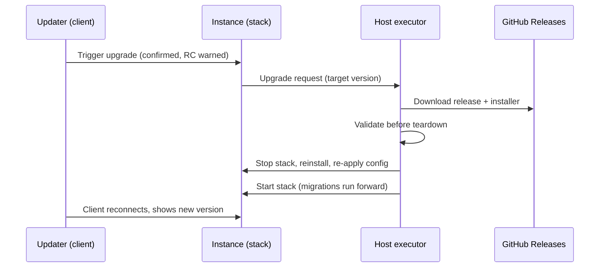
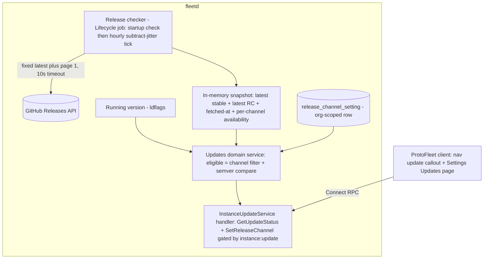

# Release Update Notifications and One-Click Upgrade - Plan

## Goal Capsule

- **Objective:** Proto Fleet instances detect new GitHub releases and let permission-holding operators upgrade from the client — first via a copy-paste install command, then with one click.
- **Product authority:** the Product Contract below, confirmed with the requesting operator on 2026-07-27.
- **Execution scope:** this plan implements phase 1 (R1–R10). Phase 2 (one-click executor, R11–R17) is deferred to a follow-up plan — see Scope Boundaries.
- **Open blockers:** none.

---

## Product Contract

### Summary

Proto Fleet instances will check GitHub releases for newer versions and prompt users who hold an instance-update permission (SUPER_ADMIN by default, assignable to other roles). Phase 1 ships the prompt with release notes and a copy-paste upgrade command; phase 2 adds a host-side executor that performs the upgrade with one click. An instance-level release-channel setting (Stable vs Stable + RC) gates whether prereleases appear.

### Problem Frame

Learning that a new Proto Fleet version exists currently means manually watching the GitHub releases page. Upgrading means ssh-ing into the host and running the installer by hand, once per host, every release. Nothing in the product signals that a running instance is stale. For the maintainers this is recurring toil; for external operators running their own instances there is no in-product way to discover releases at all, so installs drift out of date silently.

### Key Decisions

- **One-click upgrade is the destination, delivered in two phases.** Phase 1 ships detection plus a prompt with a copy-paste install command; phase 2 adds the host-side executor for true one-click. The executor is the long pole, and phase 1 doubles as the migration path: the manual upgrade it prompts for is the one that installs the executor.
- **Fail loud, no auto-rollback.** Database migrations run forward-only and deployed migrations are immutable, so restoring the previous binary after a failed upgrade can strand it against a newer schema. Instead the executor validates everything it can before tearing the stack down, and any failure surfaces a clear error; recovery is over ssh.
- **RC visibility is an instance-level release-channel setting in the UI** (Stable vs Stable + RC), editable by holders of the update permission. Not host config, because changing channels shouldn't need ssh; not per-user, because the instance runs one version and divergent prompts invite confusion. `nightly-*` prereleases are never shown on any channel.
- **Updating is a granular, assignable permission.** Held by the built-in SUPER_ADMIN role by default (the owner-equivalent role, which automatically holds every catalog permission) and assignable to other roles through the existing permission catalog. Deliberately excluded from ADMIN's default seed so orgs opt in via the role editor.
- **Upgrades stay human-triggered.** An upgrade takes the whole stack down, so unattended auto-update is out for now; scheduled or maintenance-window auto-update can layer on later without rework.

### Actors

- A1. Updater — a user holding the instance-update permission (SUPER_ADMIN by default).
- A2. Regular user — any signed-in user without that permission; never sees upgrade prompts.
- A3. Instance — the running Proto Fleet deployment (server + client), which checks for releases and reports its own version.
- A4. Host executor (phase 2) — the host-side component that performs the upgrade while the stack is down.

### Requirements

**Release detection**

- R1. The instance periodically checks GitHub releases for `block/proto-fleet` and determines whether a release newer than the running version exists.
- R2. The instance exposes its running release version so current-vs-latest comparison and display are possible.
- R3. The release-channel setting filters what counts as eligible: Stable shows only stable releases; Stable + RC also shows `vX.Y.Z-rc.N` prereleases; `nightly-*` releases are never eligible.
- R4. When GitHub is unreachable, the feature degrades silently: no prompt, no user-facing errors, no log spam.

**Notification prompt (phase 1)**

- R5. When a newer eligible release exists, updaters (A1) see a prompt in the client; regular users (A2) see nothing.
- R6. The prompt shows the new version, links to its release notes, and provides the exact copy-paste install command for that version.
- R7. The prompt is dismissible per release: dismissing suppresses that version and the prompt reappears for the next eligible release.
- R8. After the instance is upgraded, prompts for that or older releases clear on their own.

**Settings and permissions**

- R9. The release-channel setting (Stable / Stable + RC) lives in instance settings in the client, editable only by updaters.
- R10. Seeing prompts, changing the channel, and triggering upgrades are gated by one granular permission, assignable to roles, held by SUPER_ADMIN by default and deliberately absent from ADMIN's default seed.

**One-click upgrade (phase 2)**

- R11. An updater can trigger the upgrade to an eligible release directly from the client.
- R12. A host-side executor performs the upgrade non-interactively and survives the stack teardown the upgrade causes.
- R13. The executor re-applies the previous deployment configuration — preserved env files and prior run options (beta alerts, system monitoring, tracing) — so an upgrade never silently disables features.
- R14. The executor validates everything it can (download, integrity, binaries) before stopping the running stack, minimizing the window a failure leaves the instance down.
- R15. A failed upgrade fails loud: the failure and its logs reach the updater — in the client when the stack is up, otherwise retrievable on the host — with documented ssh recovery steps.
- R16. Triggering an upgrade requires explicit confirmation; when the target is an RC, the confirmation warns that there is no downgrade path until the next stable release.
- R17. During an upgrade the client communicates expected downtime and recovers to the new version when the stack returns.

### Key Flows

- F1. Learn and upgrade manually (phase 1)
  - **Trigger:** a new eligible release is published.
  - **Steps:** instance detects it → updater sees the prompt → reviews release notes → copies the install command → runs it over ssh → on next load the prompt is gone and the new version shows.
  - **Covers R1–R8.**
- F2. One-click upgrade (phase 2)
  - **Trigger:** updater clicks upgrade on the prompt.
  - **Steps:** confirmation (RC warning when applicable) → executor downloads and validates the release → stack teardown and reinstall with prior configuration → stack returns → client reconnects and shows the new version. On failure the error and logs surface, and the instance stays recoverable over ssh.
  - **Covers R11–R17.**

### Acceptance Examples

- AE1. **Covers R3.** Given an instance on the Stable channel, when `v0.3.0-rc.1` is published, no prompt appears; when `v0.3.0` is published, the prompt appears.
- AE2. **Covers R3.** Given an instance on Stable + RC, when `nightly-20260727-abc1234` is published, no prompt appears.
- AE3. **Covers R1, R3.** Given an instance running `v0.2.9-rc.5` on Stable + RC, when stable `v0.2.9` is published, the prompt offers it — a stable release supersedes its own RCs.
- AE4. **Covers R4.** Given the host cannot reach GitHub, when the check runs, the instance behaves normally with no prompt and no surfaced error.
- AE5. **Covers R5, R10.** Given a user whose role lacks the update permission, when a newer release exists, they see no prompt and no channel setting.
- AE6. **Covers R13 (phase 2 — verified by the follow-up executor plan, not this one).** Given an instance last deployed with beta alerts enabled, when a one-click upgrade completes, beta alerts are still enabled.
- AE7. **Covers R15 (phase 2 — verified by the follow-up executor plan, not this one).** Given the new stack fails health checks after teardown, the upgrade reports failure with logs available and recovery steps; the instance is never silently left down.

### Success Criteria

- Operators stop checking GitHub: a new eligible release is visible in the client within a day of publication.
- Phase 2: a happy-path upgrade completes from the client with zero ssh, and downtime is limited to the stack-restart window.
- External operators adopt both phases with no setup beyond running one manual upgrade (the one that installs the executor).

### Scope Boundaries

**Deferred to Follow-Up Work**

- Phase 2 one-click executor (R11–R17): needs its own implementation plan once the executor mechanism questions below are settled. Phase 1 leaves the seams clean — the install command is composed server-side, and the updates RPC surface extends naturally with an upgrade-trigger call.
- Playwright E2E coverage for the banner and settings page, following the repo's post-feature E2E workflow.

**Deferred for later**

- Unattended auto-updates and maintenance windows.
- Routing new-release notifications through the existing alert channels (e.g. Slack) — a cheap adjacent add once detection exists.
- Multi-instance orchestration (upgrading many instances from one place).
- An activity/audit event for `SetReleaseChannel`. Phase 1 deliberately matches the alerts-settings precedent (no activity logging on settings mutations); revisit alongside phase 2, where upgrade triggering makes auditability material.

**Out**

- Auto-rollback and downgrades — unsafe under forward-only migrations.
- Nightly-channel notifications.
- ProtoOS: it is served by the miner's embedded API server, not fleetd, and has no permission surface. This feature is ProtoFleet-only.

### Dependencies / Assumptions

- Release tagging stays as today: stable tags `vX.Y.Z`, RCs `vX.Y.Z-rc.N` (marked prerelease), nightlies `nightly-*` (marked prerelease). The channel filter keys off this.
- Deployment hosts can reach GitHub over HTTPS; today's installer already downloads release assets from there.
- The server binary already embeds its release version at build time but does not expose it to the client; R2 closes that gap.
- The upgrade procedure is already scripted end-to-end (`deployment-files/install.sh` plus `deployment-files/run-fleet.sh`); phase 2 automates the existing procedure rather than inventing a new one. Its interactive prompts and per-run flags currently assume a human operator.
- Existing installs gain the executor only through one more manual upgrade; phase 1's prompt is what drives that.
- Granular permission machinery (permission catalog, role-permission assignment, built-in vs custom roles) exists; the update permission slots into it.

### Outstanding Questions

Deferred to phase-2 planning (do not block phase 1):

- Executor mechanism — systemd unit, out-of-stack container, or extension of an existing host-side component — and how the client's trigger reaches it securely.
- Non-interactive mode for the installer, and where prior run options are persisted for re-apply.
- Authority scope for the upgrade trigger: `instance:update` lives in per-org roles while an upgrade restarts the shared instance. Fine under the enforced single-org invariant; re-examine before the executor grants any org-scoped principal that power.

---

## Planning Contract

**Product Contract preservation:** changed A1, R10, Summary, and Key Decision 4 wording — "Owner" mapped to `SUPER_ADMIN`. The codebase has no Owner role; built-in roles are `SUPER_ADMIN` / `ADMIN` / `FIELD_TECH`, and `SUPER_ADMIN` is the owner-equivalent that automatically holds every catalog permission. Scope Boundaries gained the ProtoOS exclusion and the Deferred to Follow-Up Work subsection. All other Product Contract text and IDs are unchanged.

### Key Technical Decisions

- **Channel-agnostic checker; filter at read time.** The background checker always caches both the latest stable and the latest RC; the RPC layer applies the caller's channel setting when computing the eligible release. Channel flips never touch the poller, and AE1/AE3 fall out of a pure read-time comparison.
- **Hourly poll with subtract-only jitter.** Default cadence: one non-blocking check shortly after startup, then one check every hour **minus** 10–20% jitter (48–54 minutes). Subtract-only jitter decorrelates instances that share NAT egress without ever stretching the maximum gap beyond one hour. Nonzero overrides must be at least five minutes so duration truncation cannot collapse the timer into a busy loop. The production repository URL is fixed in code, while tests inject an `httptest` URL directly into the checker.
- **Two baseline GitHub requests plus conditional exact-tag revalidation.** `GET /repos/block/proto-fleet/releases/latest` supplies one stable fallback when prereleases crowd stable releases out of the list page; `GET /repos/block/proto-fleet/releases?per_page=100&page=1` supplies current stable and prerelease candidates. The checker does not crawl release history. It retains each endpoint's ETag and decoded response, sends `If-None-Match`, and reuses the cached value on `304`. At the hourly cadence, anonymous public-repository requests keep deployment configuration simpler; authenticated polling can be added later if real-world rate limits require it. It semver-maxes canonical stable and RC tags across those bounded responses. When a higher cached stable or RC ages out of them, one `GET /repos/block/proto-fleet/releases/tags/{tag}` request revalidates that candidate before it remains eligible. A 404 or channel reclassification drops the cached candidate; a transient or malformed revalidation retains its data for retry but marks only that channel unavailable. Stable tags must be exactly `vX.Y.Z`; RC tags exactly `vX.Y.Z-rc.N`; both grammars are paired with `semver.IsValid` to reject leading-zero numeric components. This also excludes semver-valid feature-branch tags such as `v0.2.9-pr737.1`.
- **Semver via `golang.org/x/mod/semver`.** Already an indirect dependency of `server/go.mod`; promote to direct (run `go work sync`). Always `IsValid`-filter before `Compare` — invalid tags (nightlies, hand-made tags) silently lose all comparisons rather than erroring — and keep the leading `v`.
- **A non-semver running version disables comparison.** `version = "dev"` (local builds) and `nightly-*` builds yield `status_available = false` and `update_available = false` with at most one debug log; a valid running version newer than the latest release remains an available, no-update result. Never treat unparseable as "show latest".
- **Release-channel setting stored as an org-scoped row.** Org-scoped rows are the codebase's settings convention, and the single-org invariant is enforced rather than conventional: the only org-creation path in the server is guarded by a has-user check, and login hard-fails unless the user belongs to exactly one org. An `organization_id`-keyed row is therefore instance-level in practice, and because eligibility is computed at read time, the decision stays coherent even if multi-org ever lands. `RequireOrgWidePermission` then fits the permission check naturally.
- **Permission `instance:update`, SUPER_ADMIN-held, built-in ADMIN-excluded.** One catalog key covers seeing prompts, changing the channel, and (phase 2) triggering upgrades. `SUPER_ADMIN` acquires it automatically via `ReconcileFull`/`AllPermissions()`; it is explicitly excluded from `adminSeedPermissions()` (mirroring the existing `role:manage` exclusion). Built-in roles are immutable in the UI, so opt-in means creating a custom ADMIN-like role and granting `instance:update` through the existing role editor. No seed migration is needed: boot-time `authz.Reconcile` upserts every catalog entry before the listener starts, so existing databases receive the permission row from the `catalog.go` change alone.
- **One gated status read; whole service session-only.** `GetUpdateStatus` already returns `current_version`, so a separate `GetVersion` RPC would duplicate the read surface without a caller. `GetUpdateStatus` and `SetReleaseChannel` require `instance:update`, and both register in `SessionOnlyProcedures` (`server/internal/handlers/interceptors/config.go`) so API keys can neither read update status nor flip the channel.
- **The server composes the install command from two independently constrained inputs.** The status response carries the full copy-paste command — `bash <(curl -fsSL "<base>/<tag>/install.sh") <tag>`. The download base must exactly match the allowlisted Proto Fleet GitHub release path; startup rejects every other value, including alternate HTTPS hosts and values containing shell syntax. Command composition checks the allowlist again, uses the canonical constant rather than the raw config value, and accepts only the same canonical stable/RC tags as the checker. The installer self-detects architecture via `uname -m`, so the command never encodes arch or OS. The composed command pins the installer to the target tag's release asset, diverging from the README's unpinned `fleet.proto.xyz` bootstrap form.
- **Per-browser dismissal.** Dismissal persists in `localStorage` as the dismissed release tag, via the existing `useReactiveLocalStorage` hook (the reactive variant — the callout must disappear immediately on dismiss; the non-reactive `useLocalStorage` would not trigger a re-render). Teammates who also hold the permission each manage their own prompt, and the callout re-shows whenever the eligible tag differs from the stored dismissed tag — plain tag inequality, no client-side version comparison needed (R7). No server-side dismissal storage in phase 1.
- **Silent degradation is explicit, not misleading.** Any ordinary list-fetch failure or malformed payload keeps the last-known-good release data, marks both channels unavailable, and logs at `slog.Debug` (R4). A reported GitHub rate limit suppresses further requests until its reset and emits one actionable warning for that cycle. A failed exact-tag revalidation marks only the affected channel unavailable; three consecutive failures emit one warning without dropping the unverified cached release. Stable and Stable+RC reads use documented snapshot accessors; an RC-only snapshot can offer a verified RC that is newer than the running version, but cannot claim the instance is current while stable discovery is unknown. The prompt remains hidden and Settings renders “Update status unavailable” rather than claiming the instance is current. Malformed individual releases are skipped without aborting the cycle. Each polling iteration contains panics, marks both channels unavailable, logs the defect with a stack trace, and leaves the next scheduled cycle running.
- **The updates RPC is the sole source of truth for "current version" in this feature.** The client's baked-in `buildVersionInfo.version` (Vite env) is a different value that can disagree with the server after an upgrade with a stale tab; feature UI must never read it for the server version.

### High-Level Technical Design

Callout visibility at any moment is a pure function: `update_available && hasPermission && !dismissed(tag)` — no stored callout state on the server, so R8 (clears after upgrade) and channel flips need no special-casing.

### Assumptions

- Phase 2 (R11–R17) is deferred to a follow-up plan; this plan implements R1–R10 and leaves the seams (server-side command composition, extensible updates service) for it.
- Exactly one organization per instance — verified as enforced, not merely conventional: the only org-creation path is guarded by a has-user check, and login hard-fails unless the user belongs to exactly one org. This is the basis for org-scoped storage satisfying the Product Contract's "instance-level" intent.
- The update callout lives at the bottom of the left navigation panel, directly above the logout CTA (user-directed placement, 2026-07-27) — `client/src/protoFleet/components/NavigationMenu/Navigation.tsx` renders both. The repo has no pre-existing global callout slot, so this is a new slot in that nav footer region, and the callout must handle the nav's collapsed (icon-width) laptop state.
- Migration number `000131` follows main's `000130`; re-check after any merge from main (`ls server/migrations/ | grep -F '.up.sql' | cut -c1-6 | sort | uniq -d` — see `docs/solutions/database-issues/duplicate-golang-migrate-version-after-merge-2026-05-12.md`).

### Sequencing

U1, U2, U3 are independent and can proceed in any order. U4 depends on all three. U5 and U6 depend on U1 + U4 and are independent of each other.

---

## Implementation Units

### U1. Updates proto contract and generated code

- **Goal:** Define the `instance.v1.InstanceUpdateService` Connect RPC contract and regenerate Go/TS code.
- **Requirements:** R2, R5, R6, R9 (contract surface).
- **Dependencies:** none.
- **Files:** `proto/instance/v1/updates.proto` (new); regenerated `server/generated/grpc/instance/v1/**` and `client/src/protoFleet/api/generated/instance/v1/**` via `just gen` (never hand-edited).
- **Approach:** Mirror `proto/alerts/v1/alerts.proto` for file/service/message structure; take the `option idempotency_level` idiom from `proto/ping/v1/ping.proto` and `proto/serverlog/v1/serverlog.proto` (`NO_SIDE_EFFECTS` on reads — alerts.proto carries none). Service: `GetUpdateStatus` → `{current_version, channel, latest_eligible (ReleaseInfo), update_available, install_command, status_available}`; `SetReleaseChannel(channel)`. `ReleaseChannel` enum: `STABLE`, `STABLE_AND_RC` (+ unspecified zero value per proto style); `ReleaseInfo`: `version`, `release_notes_url`, `published_at`, `prerelease`.
- **Patterns to follow:** `proto/alerts/v1/alerts.proto` (structure), `proto/ping/v1/ping.proto` (idempotency options); commit proto + generated output together (repo rule).
- **Test scenarios:** Test expectation: none — contract-only; behavior is tested in U2/U4. `just gen` + `buf` lint are the proof.
- **Verification:** `just gen` succeeds and lints; generated code compiles with the rest of the tree.

### U2. Release checker domain package

- **Goal:** Background job that polls GitHub releases and maintains an in-memory snapshot of the latest stable and latest RC.
- **Requirements:** R1, R3 (fetch-side filtering), R4.
- **Dependencies:** none.
- **Files:** `server/internal/domain/updates/config.go`, `server/internal/domain/updates/checker.go`, `server/internal/domain/updates/github.go`, `server/internal/domain/updates/checker_test.go` (+ JSON fixtures under `server/internal/domain/updates/testdata/`); `server/go.mod` + `go.work.sum` (promote `golang.org/x/mod` to direct; run `go work sync`).
- **Approach:** kong `Config` (mirroring `server/internal/domain/diagnostics/config.go`): `CheckInterval` (default `1h`, minimum nonzero override `5m`), `DownloadBaseURL` (default and only accepted value `https://github.com/block/proto-fleet/releases/download`), and `Enabled`. The releases API base is a fixed internal constant; tests inject an `httptest` URL directly. Download-base validation emits a generic error that never echoes configuration. Checker implements `runtimejobs.Lifecycle` mirroring the diagnostics closer (idempotent Start/Stop, timer + subtract-only jitter, one non-blocking startup check, per-iteration panic containment that invalidates both channels). HTTP uses the stdlib client with a 10s timeout, identifying `User-Agent` / `X-GitHub-Api-Version` headers, endpoint ETag caches, and rate-limit-reset suppression. Each cycle independently fetches the fixed `/releases/latest` stable fallback and `/releases?per_page=100&page=1` list; stream-decode at most 100 raw entries and cap the body at 8 MiB; require exact stable `vX.Y.Z` or RC `vX.Y.Z-rc.N` grammar plus `semver.IsValid`; semver-max each channel across the bounded responses. Release notes URLs and prerelease metadata are derived from that trusted repository/tag classification rather than body fields. When a higher cached candidate is missing, revalidate it through the exact tag endpoint before retaining it. A 404 or a response no longer eligible for that channel removes it; a transient, malformed, or tag-mismatched response retains the cached data but marks only that channel unavailable. A list failure retains cached release data and marks both channels unavailable. Snapshot availability is channel-specific and exposed through invariant-preserving accessors so a successful RC list remains usable even when stable discovery is incomplete.
- **Execution note:** Test against `httptest.Server` fixtures; no live GitHub calls in tests.
- **Test scenarios:**
  - Happy path: fixture with newer stable → snapshot carries it with notes URL and published-at.
  - Covers AE3 (fetch side): fixture containing `v0.2.9` stable and `v0.2.9-rc.5` prerelease → stable max is `v0.2.9`, RC max is `v0.2.9-rc.5`.
  - Covers AE2 (fetch side): `nightly-*` and hand-made non-semver tags are filtered out by `IsValid`.
  - Covers R3: a published semver-valid feature-branch test build (fixture tag `v0.2.9-pr737.1`) is never selected as the RC candidate — only canonical `vX.Y.Z-rc.N` tags qualify.
  - Canonical grammar: stable shorthand/build-metadata tags and stable/RC numeric components with leading zeros are rejected.
  - Stable candidates marked `prerelease` by GitHub are rejected even when their tag has canonical stable grammar.
  - Stable candidates are semver-maxed across `/latest` and list page 1 so a later-created maintenance release cannot hide a higher major present in the current page.
  - A higher cached stable or RC that ages out of the bounded inputs remains eligible only after exact-tag revalidation.
  - A withdrawn or reclassified cached release is dropped; a transient exact-tag failure retains its data but marks only that channel unavailable.
  - A `/releases/latest` failure does not block stable or RC candidates discovered from the release list.
  - A transient `/releases/latest` failure revalidates and retains the cached stable when page 1 contains only prereleases; without a verified cached or list-derived stable, only stable status is unavailable.
  - An RC-only snapshot can offer a verified RC newer than the running version, but is unavailable when that RC is equal or older because stable discovery cannot prove the instance is current.
  - A primed checker snapshot becomes unavailable after a contained panic and recovers on the next successful cycle.
  - Page bound: fixture with 30+ nightly entries preceding the newest RC on page 1 → the RC is still selected; a full page causes no page-2 request.
  - Config validation: `DownloadBaseURL` rejects alternate hosts and shell syntax such as `$()`, backticks, quotes, backslashes, and whitespace without echoing the rejected value.
  - Config validation rejects negative or sub-five-minute nonzero polling intervals.
  - Covers AE4: server 500 / timeout / 403 rate-limit → cached release data retained, affected channel status marked unavailable, no error returned, only debug logging.
  - Lifecycle: Start is idempotent; Stop honors context and drains the goroutine.
- **Verification:** `go test ./internal/domain/updates` from `server/` passes without network access.

### U3. Channel setting storage, permission catalog, and migrations

- **Goal:** Persist the per-org release channel and register the `instance:update` permission.
- **Requirements:** R9 (storage), R10.
- **Dependencies:** none.
- **Files:** `server/migrations/000131_create_release_channel_setting.up.sql` / `.down.sql`; `server/sqlc/queries/updates.sql`; regenerated `server/generated/sqlc/**` via `just gen`; `server/internal/domain/authz/catalog.go`; `server/internal/domain/authz/builtin.go`; store integration test alongside existing authz/store tests.
- **Approach:** Table `release_channel_setting(organization_id BIGINT PRIMARY KEY REFERENCES organization(id), channel TEXT NOT NULL CHECK (channel IN ('stable','stable_and_rc')), updated_at TIMESTAMPTZ NOT NULL DEFAULT now())`; sqlc queries: get by org (`:one`) and upsert. Missing row reads as `stable` (handled in the service layer, not SQL). Permission: `PermInstanceUpdate = "instance:update"` constant + `CatalogEntry` in `catalog.go`; explicitly exclude from `adminSeedPermissions()` in `builtin.go` (mirror the `role:manage` exclusion). No seed migration: boot-time reconcile upserts every catalog row on existing databases, and `SUPER_ADMIN` acquires the key automatically via `ReconcileFull`.
- **Patterns to follow:** `server/migrations/000076_create_curtailment_mqtt_source.up.sql` (column/constraint style), `server/sqlc/queries/alert_channel.sql` (query idiom).
- **Test scenarios:**
  - Integration (via `testutil.GetTestDB`): get with no row returns the stable default; upsert to `stable_and_rc` then get returns it; second upsert overwrites.
  - Catalog: `AllPermissions()` includes `instance:update`; `adminSeedPermissions()` does not.
  - Reconcile: after reconcile, `SUPER_ADMIN` effective permissions include `instance:update` (mirror existing reconcile test coverage).
- **Verification:** migrations apply cleanly on a fresh test database (`just db-up` + `just test`); `just gen` leaves no uncommitted diff; `ls server/migrations/ | grep -F '.up.sql' | cut -c1-6 | sort | uniq -d` is empty.

### U4. Updates domain service, RPC handler, and fleetd wiring

- **Goal:** Serve version and gated update status over Connect RPC; wire the checker lifecycle into fleetd.
- **Requirements:** R2, R3 (read-side filtering), R4 (surface behavior), R5 (server-enforced), R9, R10.
- **Dependencies:** U1, U2, U3.
- **Files:** `server/internal/domain/updates/service.go` (+ `service_test.go`); `server/internal/handlers/updates/handler.go` (+ tests); `server/internal/handlers/interceptors/config.go` (+ test); `server/cmd/fleetd/main.go`; `server/cmd/fleetd/config.go`; `deployment-files/docker-compose.yaml`.
- **Approach:** The domain service composes the checker snapshot, the settings store, and the running version: eligible = latest stable when channel is `stable`, else the semver max of latest stable and latest RC. `status_available` requires a semver-valid running version and a complete selected-channel view; Stable+RC may still surface a verified RC-only offer when it is newer than the running version, but cannot report up to date from that partial view. `update_available = status_available && Compare(eligible, current) > 0`; `install_command` is composed only when status is available, the configured download base matches the canonical allowlist, and the eligible tag passes the checker's canonical stable/RC predicate. Handler mirrors `server/internal/handlers/alerts/handler.go`: compile-time interface assertion; both `GetUpdateStatus` and `SetReleaseChannel` call `middleware.RequireOrgWidePermission(ctx, authz.PermInstanceUpdate)` first. Wiring in `main.go`: embed the updates `Config` in `config.go`, construct checker + service, register `instancev1connect.NewInstanceUpdateServiceHandler`, add the service to reflection, and run the checker with the active runtime jobs. Register both procedures in `SessionOnlyProcedures`, redact the status response from debug logs, and forward `UPDATES_ENABLED` through the packaged Compose deployment.
- **Test scenarios:**
  - Covers AE5: `GetUpdateStatus` and `SetReleaseChannel` without the permission (via `handlerstest.CtxWithPermissions`) → `connect.CodePermissionDenied`.
  - Covers AE1: channel `stable`, snapshot has newer RC only → `update_available = false`; snapshot gains newer stable → `true` with stable as eligible.
  - Channel `stable_and_rc`, newer RC → eligible is the RC.
  - Covers AE3: current `v0.2.9-rc.5`, stable `v0.2.9` on either channel → eligible `v0.2.9`.
  - Current version `dev` or `nightly-20260727-abc` → `update_available = false` regardless of snapshot.
  - Current version newer than every release (local build) → `update_available = false`.
  - Channel flip from `stable_and_rc` to `stable` with an RC pending → next status call recomputes and drops the RC.
  - `install_command` matches the plan's command template for the eligible tag (asserted against the template, not the README's unpinned bootstrap form).
  - Empty snapshot or a failed latest list fetch → `status_available = false`, `update_available = false`, no install command; a successful empty list restores availability without offering an update.
  - A non-semver running version and an RC-only partial snapshot without a newer RC both report `status_available = false`.
  - `SetReleaseChannel` persists and is returned by the next `GetUpdateStatus`.
  - Non-session (API-key) actors are rejected on both procedures per `SessionOnlyProcedures` (follow existing interceptor-config test precedent).
  - `GetUpdateStatus` is present in `RedactedResponseProcedures` so debug logs do not capture patch metadata or the host command.
  - Defensive: an eligible candidate outside the exact stable/RC tag grammar never yields an `install_command`, and `update_available` stays false.
- **Verification:** `just test` (server) green; the service appears in gRPC reflection like its peers.

### U5. Client update callout in the navigation panel

- **Goal:** Permission-gated, per-release-dismissible update callout pinned at the bottom of the left nav, directly above the logout CTA.
- **Requirements:** R5, R6, R7, R8.
- **Dependencies:** U1, U4.
- **Files:** `client/src/protoFleet/api/clients.ts` (register `InstanceUpdateService` client); `client/src/protoFleet/features/updates/api/useUpdateStatus.ts`; `client/src/protoFleet/features/updates/components/UpdateCallout.tsx` (+ `UpdateCallout.test.tsx`); `client/src/protoFleet/components/NavigationMenu/Navigation.tsx` (new slot in the pinned footer region, immediately above the logout button).
- **Approach:** `useUpdateStatus` wraps the RPC in `usePoll` (callback-style `{fetchData, poll, pollIntervalMs, enabled}`, mirroring `useActiveAlerts.ts`), with `enabled` true only when `useHasPermission('instance:update')` holds — non-updaters never fetch. The callout renders only when `status_available && update_available`, then shows the new-version headline, release-notes link, copy-install-command control, and dismiss affordance. The nav collapses to icon width on laptop and expands on hover; in the collapsed state the callout renders an icon-only affordance and shows its full content when expanded or hovered. Dismissal stores the dismissed release tag via `useReactiveLocalStorage`; the callout re-shows whenever the eligible tag differs from the stored dismissed tag. After an upgrade the RPC reports the new current version and `update_available` goes false. Never read `buildVersionInfo.version` for the server version.
- **Patterns to follow:** `Navigation.tsx` footer region (mount point + responsive classes), `useActiveAlerts.ts` (poll hook shape), `CreateApiKeyModal.tsx` (copy + toast), `DismissibleCalloutWrapper.tsx` (dismiss affordance), `Preferences.test.tsx` (plain `render()` + per-hook `vi.mock`, no provider wrappers).
- **Test scenarios (Vitest):**
  - No permission (mock `useHasPermission` false) → no fetch, renders nothing (AE5 client side).
  - Update available → renders version, notes link href, and install-command copy control.
  - Copy click → clipboard util called with the exact `install_command`; success toast pushed; clipboard failure pushes error toast.
  - Dismiss → callout hides and the tag persists via the reactive localStorage hook; same tag stays hidden on re-render; a different eligible tag shows again.
  - Collapsed-state affordance present: the icon-only element and the full content carry the same responsive-class idiom as the logout label (assert classes).
  - `update_available = false` → renders nothing.
- **Verification:** `npm run test` in `client/` green; ESLint clean; callout visible above the logout button for permission holders when an update is eligible.

### U6. Client settings page for the release channel

- **Goal:** Settings surface showing server version, latest available release, and the channel control.
- **Requirements:** R2 (display), R9.
- **Dependencies:** U1, U4.
- **Files:** `client/src/protoFleet/features/settings/components/Updates.tsx` (+ `Updates.test.tsx`); `client/src/protoFleet/config/navItems.ts`; `client/src/protoFleet/router.tsx`; `client/src/protoFleet/routePrefetch.ts`.
- **Approach:** Mirror `Network.tsx` for structure (`SettingsPageHeader`, bordered card, skeleton loading) and the `CreateApiKeyModal.tsx` save pattern (RPC call → `pushToast` success/error). Content: current server version; “Update status unavailable” when `status_available` is false; when status is available and a newer eligible release exists, its version, release-notes link, and install-command copy control; otherwise an explicit up-to-date state. RPC transport failures keep the existing error state. A Stable / Stable + RC control calls `SetReleaseChannel`; the checkbox and command-copy control remain disabled through the save and corresponding refetch. Status requests carry a monotonically increasing request ID so an older response cannot overwrite a newer persisted channel and offer. RC helper copy notes that RC installs cannot downgrade until the next stable. Register the route across `routePrefetch.ts`, `router.tsx`, and `navItems.ts` with `requiredPermission: 'instance:update'`.
- **Test scenarios (Vitest):**
  - Renders current and latest versions, release-notes link, and install-command copy control from a mocked status response (regardless of any dismissed nav callout).
  - `status_available = false` → renders “Update status unavailable”; available status with `update_available = false` → renders the up-to-date state; status-RPC transport failure → renders the error state.
  - Changing the channel calls `SetReleaseChannel` with the new value and toasts success.
  - Two status requests resolved out of order retain the newer response; channel and copy controls remain disabled until save plus refetch completes.
  - RPC failure on save toasts error and leaves the control on the persisted value.
  - Nav entry carries `requiredPermission: 'instance:update'` (follow existing navItems test precedent if one exists; otherwise assert the component guard).
- **Verification:** `npm run test` in `client/` green; the page appears under Settings only for permission holders.

---

## Verification Contract

| Gate | Command | Applies to | Done signal |
|---|---|---|---|
| Lint (root aggregate) | `just lint` | all units | exits clean, zero warnings |
| Server tests | `just test` from `server/` (Postgres via `just db-up`) | U2, U3, U4 | all packages pass, including new `internal/domain/updates` and handler tests |
| Client tests | `npm run test` from `client/` | U5, U6 | Vitest suite passes including new component tests |
| Generated code in sync | `just gen` then `git status` | U1, U3 | no uncommitted diff after regeneration |
| Go workspace sync | `go work sync` at repo root | U2 | no `go.work.sum` drift |
| Migration hygiene | `ls server/migrations/ \| grep -F '.up.sql' \| cut -c1-6 \| sort \| uniq -d` | U3 | empty output (no duplicate versions) |

## Definition of Done

- U1–U6 implemented with their enumerated test scenarios; R1–R10 each traceable to at least one unit and test.
- R11–R17 remain deferred and are recorded under Scope Boundaries — no phase-2 code in this change.
- All Verification Contract gates pass locally.
- Proto, sqlc, and generated code committed together with their sources; migrations `000131+` only, no edits to existing migrations.
- Ordinary release-fetch failures remain Debug-only; rate exhaustion and repeated revalidation failure emit bounded warnings, while a recovered programming panic emits an Error with a stack trace.
- PR description follows the repo convention (diff stats, mechanism, mermaid diagram, code-area table, testing notes).

---

### Sources

- `client/src/shared/utils/version.ts` — client build version injected via Vite env vars.
- `server/cmd/fleetd/main.go` — release version embedded via ldflags; currently logged, never exposed over an API.
- `server/internal/runtimejobs/lifecycle.go` and `server/internal/domain/diagnostics/` — the Lifecycle background-job pattern the checker mirrors.
- `server/internal/handlers/interceptors/config.go` — `SessionOnlyProcedures` / `UnauthenticatedProcedures` surface control.
- `server/internal/domain/alerts/grafana_client.go` — outbound HTTP client pattern (timeout, context, no retries).
- `server/internal/domain/authz/catalog.go`, `server/internal/domain/authz/builtin.go` — permission catalog, built-in roles, reconcile behavior.
- `server/internal/handlers/middleware/permission.go` — `RequireOrgWidePermission` and friends.
- `server/internal/handlers/handlerstest/permissions.go`, `server/internal/testutil/database_setup.go` — test harnesses for permission and DB tests.
- `client/src/shared/components/Callout/DismissibleCalloutWrapper.tsx`, `client/src/shared/hooks/usePoll.ts`, `client/src/shared/hooks/useReactiveLocalStorage.ts`, `client/src/shared/utils/utility.ts` — callout, polling, dismissal, and clipboard building blocks.
- `client/src/protoFleet/components/NavigationMenu/Navigation.tsx` — the left nav; its pinned footer (logout CTA) hosts the new update callout slot.
- `.github/workflows/release.yml` and `.github/workflows/nightly-builds.yml` — how stable, RC, and nightly releases are cut and marked prerelease.
- `.github/workflows/proto-fleet-artifact-build.yml` — writes `deployment/version.txt` into the release tarball and injects the ldflags version.
- `deployment-files/install.sh` and `deployment-files/run-fleet.sh` — today's upgrade procedure; installer self-detects arch from `uname -m`.
- GitHub REST releases API: [docs.github.com/en/rest/releases/releases](https://docs.github.com/en/rest/releases/releases); rate limits: [docs.github.com/en/rest/using-the-rest-api/rate-limits-for-the-rest-api](https://docs.github.com/en/rest/using-the-rest-api/rate-limits-for-the-rest-api) — unauthenticated requests share 60/hr per IP; correctly authenticated conditional requests that return `304` do not consume the primary quota.
- `golang.org/x/mod/semver`: [pkg.go.dev/golang.org/x/mod/semver](https://pkg.go.dev/golang.org/x/mod/semver) — prerelease precedence, `IsValid` semantics, leading-`v` requirement.
- `docs/solutions/database-issues/duplicate-golang-migrate-version-after-merge-2026-05-12.md` — migration version collision prevention.
- `docs/plans/2026-05-19-001-feat-granular-rbac-plan.md` — RBAC background.
