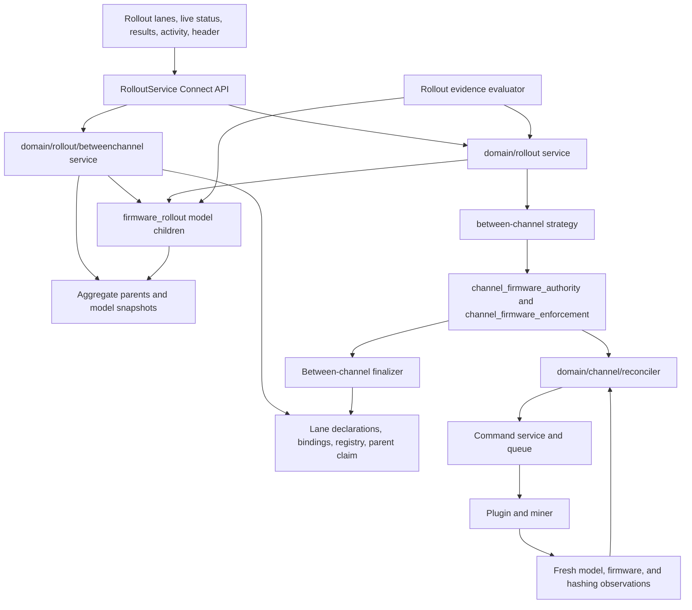
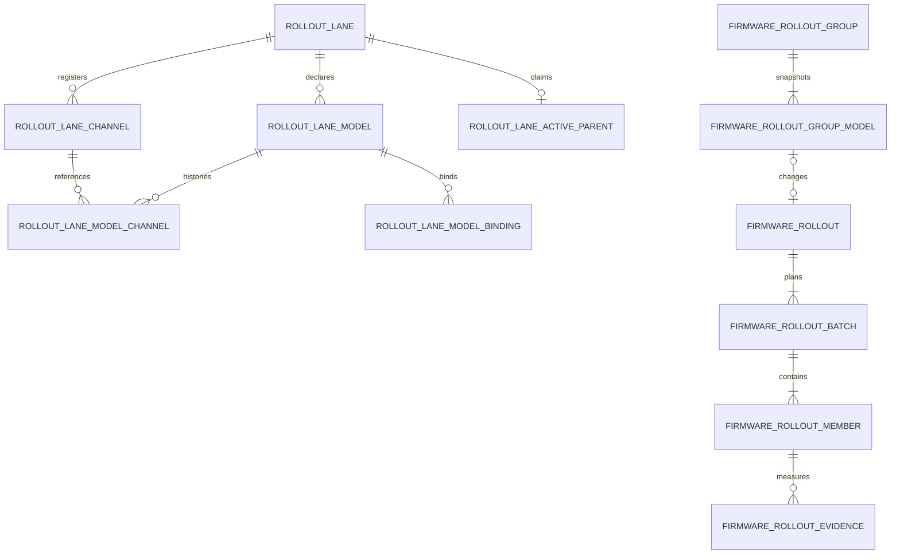
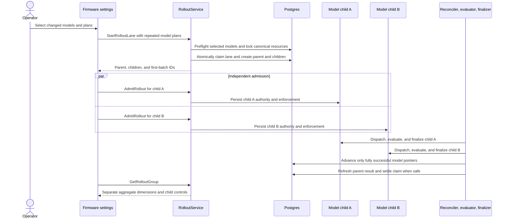

# TDD: Software Channels for Proto Fleet

Related documents: RFC: Software Channels for Proto Fleet (and its Round 1 feedback tab), TDD: Rig FW Phased Deployment via ProtoFleet, Notes: Cohort design for Proto Fleet, rollout design jam notes (Aug 6, Aug 11).

## Motivation

A firmware update in Proto Fleet today is a one-shot bulk command: the operator selects miners, picks a firmware file, and the update dispatches to the whole selection as one un-gated batch. As the fleet grows from hundreds of miners to thousands across multiple sites, that leaves the riskiest operation the product performs without the safeguards it needs:

- No staged exposure. There is no way to update a few miners, observe them, and expand on evidence; a regression reaches the whole selection un-gated, and a bad release can cut a site's hashrate in one step.
- No health verification. Success means the update command completed, not that the miner came back online and hashing on the new version.
- No durable record. Nothing records what an update was trying to achieve, on which miners, or whether it achieved it; per-miner command detail is eventually pruned by retention.
- No desired state. Nothing records what a miner should be running, so a miner offline during an update silently stays on the old version, and drift can be neither detected nor corrected.

Software channels address this the way mature device-fleet update platforms do:

- A _software channel_ declares what its members should run as a firmware release per hardware model.
- Under Model B, operators manage a stable _rollout lane_ with explicit model declarations. Fleet represents each declared release as an immutable per-model _physical channel_.
- A new release reaches selected model members through independently controlled child rollouts with staged batches, durable progress, and a parent result for the overall operator action.
- A _rollout policy_ paces and gates one model-homogeneous child batch at a time. Evidence never combines hashrate across hardware models.
- _Reconciliation_ keeps members on their declaration's current target afterward, including miners that were offline during the rollout.

This TDD turns these concepts into a concrete design: the schema, the APIs, the reconciliation and rollout machinery, and the delivery phasing.

## Goals

These are the v1 goals; any proposed design must satisfy them. Functional:

1. **Channels as the unit of desired state.** Operators can create software channels and explicitly assign miners. Membership is exclusive and opt-in: a miner belongs to at most one channel, channel-less miners keep today's behavior, and Fleet defines no channels by default. A channel declares firmware per hardware model. Under Model B, the rollout lane contains only explicit model declarations, including declarations with zero members, and undeclared models are left alone.
2. **Compliance visibility.** Per-channel and per-miner views of declared versus reported state, available before any enforcement acts on it.
3. **Staged rollouts with a durable record.** A rollout changes one or more selected models in batches, with pause, resume, and abort on each model child. Unchanged models are omitted. The aggregate parent and child records preserve status, per-miner progress, and outcomes after command retention. Revert affects only miners transitioned by the selected child.
4. **Evidence-gated advancement.** A child batch advances on evidence from its model-homogeneous cohort: each miner's telemetry compared before and after the update, with error rates surfaced alongside. Advancement can be automated against operator-defined thresholds or held for manual approval. Evidence and policy decisions stay child and batch scoped.
5. **Delegated control.** An external service can create an aggregate rollout and drive each child through the API: choose batch membership, advance, pause, abort, revert, and complete, while Fleet stays the system of record. The aggregate parent has no control endpoint. An operator can always pause or abort a child, which detaches that child from controller writes.
6. **Continuous reconciliation.** Fleet detects and corrects drift from the channel's declared state, converges miners that were offline or newly assigned, and tracks per-miner convergence. Deliberate exceptions survive it: a group or batch of miners held back for pre/post-rollout comparison is not drift to correct, and the design must define how that hold-back works and how held-back miners count toward channel compliance.
7. **A defined interaction model.** The design specifies what direct one-off and bulk actions do to a channel-managed miner, and how they behave against an in-flight rollout: blocked, queued, or erroring, but never undefined.

Safety and policy:

8. **Safe execution.** A miner mid-update is never re-dispatched to, health is verified before a batch counts as done, and enforcement is bounded and haltable: visibility ships before enforcement, and an operator can stop in-flight enforcement at any time. Abort is quick and cheap: a single action stops the rollout from issuing new work, so an in-flight rollout never delays an emergency operation. In an emergency curtailment, the operator or Fleet aborts the rollout and curtails immediately.
9. **Rollout logic split.** The product ships only generic rollout policies. Complex advancement logic, such as regression analysis and decision rules tuned to our own firmware and hardware, is not part of Proto Fleet's code in v1: it lives outside, driving rollouts through the API seam. The split is a waypoint, not the end state: the seam is designed so advancement logic can later run as an extension alongside Fleet, or move in-product once Fleet accumulates enough telemetry signal to gate rollouts itself (a candidate delivery phase of its own).

Integration and delivery:

10. **Prefer existing machinery over new.** Where the product already has a primitive that fits, the design should extend it rather than build a parallel one, provided the reuse is both conceptually aligned and compatible at the code level, not a force-fit. The model must back the rollout UI flows already designed: the batches method, pilot review, and the activity surfaces.
11. **Independently useful phases.** Delivery is phased so each step stands alone: channel entity and membership, then enforcement, then staged rollouts, then policies and external control.

## Non-Goals

- **Configuration enforcement.** Channels carry firmware only in v1. Operational configuration (pool settings, power limits, tuning) is deferred pending its own follow-up; if it joins the channel later, it arrives as a profile the channel can optionally enforce, and gets designed then.
- **PDU firmware.** PDUs are not yet a managed device class in Fleet: no device type, driver, or firmware-delivery path exists. The firmware release model should not preclude them, but nothing here builds them.
- **Staging one-shot bulk actions.** Reboots and curtailment are not rollouts, even when batched. The UI may share batching and pacing controls across both, but this design does not turn bulk actions into rollouts or route them through channels.
- **The external controller, and defining regressions.** This TDD specifies the API surface a controller drives. The controller itself (regression analysis, advancement heuristics) is separate work under separate ownership, and what counts as a firmware regression stays outside the product entirely (G9).
- **Richer telemetry analysis.** v1 advancement evidence is each miner compared against its own pre-update state. Batch-to-batch baselines and statistical anomaly detection are later work.
- **Organizational labeling.** Channels declare software state only. How miners are grouped, labeled, and filtered stays a separate concern, whatever today's groups end up being called.
- **Developer rig reservations.** Reserving, leasing, and resetting test rigs is developer tooling. Channels contribute exclusive dev channels and a known-good stream to reset to, nothing more.
- **Fleet's own updates.** The Fleet server updating itself (the instance release channel) is a separate mechanism and stays that way.
- **Scheduling.** Rollouts are initiated by an operator or an external controller. Time-based or event-triggered starts are not part of this design.
- **Per-miner settings.** Channel state is shared by all members. Per-miner identity such as hostnames or network settings is not channel content.

## Critical Factors

The solution options in the next section are weighed against these factors.

1. **Firmware dispatch is destructive and not safely repeatable.** A flash can brick a miner; a miner mid-update must never be re-dispatched to, and recovery after a failure needs authoritative state. Whoever owns that state is effectively the system of record, which is why "drive the existing one-shot APIs from outside" is not a neutral option: a crashed orchestrator loses track of in-flight updates.
2. **Install feedback is weak and uneven.** Some third-party miners cannot report install progress at all; command success only means the upload was accepted and a reboot was issued. Verification has to come from observed state: the miner came back, reports the target version, and is hashing, and its telemetry needs a 15 to 30 minute stabilization window before pre/post comparison means anything. Batch completion is therefore slow by nature, and the design must treat waiting as the normal case, not a timeout path.
3. **Rollouts are long-running and must survive failures.** With stabilization windows, review gates, and offline miners, a rollout spans hours to days. Its state must be durable across Fleet restarts, and the design must define what happens when an external controller goes silent mid-rollout: the rollout is recoverable and abortable regardless.
4. **Channels join a product that already has command paths.** One-off commands, bulk actions, and the curtailment reconciler (which already owns per-miner desired power state) all touch the same miners. Enforcement dimensions need clear ownership so two systems never fight over one miner, and emergency operations take precedence: abort must be immediate so a rollout never delays curtailment (G8). The new machinery adds claimants of its own: the channel reconciler, an in-flight rollout, and a deliberate hold-back (G6) can each assert what a miner should run, so the design must give each miner a single authority at any moment. A rollout's pending members are not drift to correct, and neither are held-back comparison groups.
5. **Scale bounds everything.** At thousands of miners across sites, enforcement must be paced and capped (the reconciler acts on a bounded number of miners at a time; mass membership changes above a threshold are refused), and rollout status must stay cheap to compute and query at fleet size.
6. **The API is public product surface.** Proto Fleet is open source, so the controller API must be generic: complete enough for any third-party controller, with authentication and authorization for who may advance or abort, and no concepts specific to our own firmware or operations leaking into it (G9). The contract must also outlive its first consumer: the same seam should serve advancement logic running as an extension alongside Fleet later, without growing a parallel surface.
7. **Reuse cuts both ways.** Exclusive device_sets (racks), firmware file records, TimescaleDB telemetry, and the activity/command history all look reusable, and G10 prefers extending them. But each reuse must hold conceptually and at the code level; where a primitive was built for a different meaning (organizational groups being many-to-many is the canonical example), forcing it costs more than a new concept.

## Rollout Model: Within or Between Channels

Design review reopened a fork the RFC's Round 1 had settled toward staged activation: what a rollout fundamentally is. Two approaches were proposed: rollouts _within_ a channel, with channels front and center in the UI; and rollouts _between_ channels, where the channel graph need not be user-facing. Both models are specified here, and two prototypes (one per model, sharing the invariant machinery) will be compared on operator ergonomics before this fork is closed. Everything after this section stands for both models except where flagged.

**Model A: within a channel (staged activation).** A channel is a long-lived cohort ("production", "canary") whose declaration changes over time. A rollout publishes a new release to the channel and admits members to it batch by batch; members transition in place, and the cohort persists across releases.

**Model B: between channels (confirmed migration).** A physical channel is pinned to one model release and does not change after creation. Operators use one stable rollout lane that owns explicit model declarations. Each declaration has its own current physical-channel pointer, immutable channel history, optimistic revision, and active or ended member bindings. Admission installs child rollout authority and target desired state while the miner remains in its model's source physical channel. Fresh target firmware, fresh model identity, and hashing confirmation then finalize the source-to-target membership move atomically.

### Common ground

- Channels as exclusive, opt-in device_set containers with per-model declarations (Axis 1), audited membership, and the same CRUD surface. Model B exposes the lane as the user-facing aggregate and keeps physical channels as immutable release storage.
- Per-member enforcement rows and one enforcement engine as the only executor (Axis 2). The row is each miner's actionable desired state and a rollout controls when rows change. Model A writes the target at admission against the channel's new declaration. Model B writes the target at admission under rollout authority, then changes membership only after confirmation.
- Staged, batched child rollouts with pause, resume, abort, and revert; a durable overall parent; snapshot-based evidence and gated advancement (Axes 3, 6).
- Abort establishes a no-new-work boundary. Undispatched members do not start, pre-abort claims may settle, transitioned members stay transitioned, and revert remains a separate action.
- The interaction model: the channel owns firmware, direct updates are refused at preflight, curtailment always wins (Axis 4).
- One imperative child control API used by the manual UI now and available to later policy runners or external controllers (Axis 5). Aggregate parents are read-only projections.

The difference concentrates in one place: **how confirmed target state is represented**. Model A rewrites a stable channel declaration and admits members in place. Model B installs temporary model-child authority, then finalizes confirmed miners into that declaration's immutable target physical channel.

### Core differences

| Dimension         | A: within (staged activation)                                        | B: between (migration)                                                                                          |
| ----------------- | -------------------------------------------------------------------- | --------------------------------------------------------------------------------------------------------------- |
| Channel identity  | Stable cohort, changing content                                      | Stable content, changing cohort                                                                                 |
| A rollout mutates | The declaration, then per-member admission                           | Rollout authority at admission, then membership after confirmation                                              |
| Mid-rollout state | One channel, mixed versions, tracked by the rollout record           | Admitted miners stay in source while converging; confirmed miners move to target                                |
| Compliance        | Member vs current declaration; needs "pending, not drift" and `held` | Target membership is confirmed compliance; admitted source members are tracked by rollout and enforcement state |
| Hold-back         | `held` enforcement rows inside the channel                           | Members left in the source channel                                                                              |
| Revert            | Rewrite rows to recorded revert targets                              | Restore source firmware, then move confirmed members back to source                                             |
| Abort aftermath   | Must define what the channel declares (open item)                    | Undispatched members stay source; pre-abort claims may settle; no forced revert                                 |
| Channel lifecycle | Few, long-lived, operator-created                                    | One per release per declared model; retirement policy required                                                   |
| Cohort continuity | The channel is the cohort                                            | The stable rollout lane is the cohort facade                                                                    |
| Version history   | Declaration history plus rollout records                             | Per-model channel and binding history form the version timeline                                                  |
| UI mapping        | Publish on the channel page (the existing rollout UI prototype)      | Stable-view facade over churning channels, or channel-per-version exposed                                       |

### Trade-offs

- **Model A: within.**
  - Cohort stability: hold-backs, comparisons, dashboards, and permissions attach to one object that persists across releases.
  - No channel churn: no per-release naming scheme, creation, or retirement flow.
  - Membership changes stay rare and operator-meaningful, keeping the audit stream high-signal.
  - Matches the existing rollout UI prototype directly.
  - Costs: mid-rollout heterogeneity is real machinery (admission, `held`, "pending, not drift"); the abort-aftermath declaration question must be answered explicitly; past declared states need their own history record to stay legible.
- **Model B: between.**
  - Target channels are homogeneous by construction because membership moves only after fresh firmware and hashing confirmation.
  - Abort has a simple boundary: no new claims start, undispatched members remain in source, and pre-abort claims may settle.
  - Per-miner version history falls out of membership history.
  - Confirmation has one atomic membership mutation after the shared executor proves target state.
  - Costs: channel count grows as lanes × declared models × releases, and lifecycle becomes hidden machinery behind the lane facade; the model pointers, bindings, registry, and physical channels must remain consistent; fleet-scale rollouts produce membership churn through the exclusivity index and activity log; hold-backs and failures split physical membership even though the lane presents one operator-facing aggregate.

### Resolution path

Two prototypes, one per model, compared on operator ergonomics: the publish/move flow, mid-rollout legibility, hold-back handling, abort and its aftermath, and what the fleet view looks like after several consecutive releases.

The prototypes share one substrate because admission has a model-neutral post-condition: every admitted member has an enforcement row whose desired release is the target, whose cause is the rollout, and whose revert snapshot captures the source. Model A writes that row against a changed stable-channel declaration. Model B creates one existing `firmware_rollout` child per changed model and writes child authority while membership remains in the source physical channel. Its strategy finalizer moves membership after fresh target firmware, model identity, and hashing confirmation. The enforcement engine, child controls, abort boundary, revert machinery, and durable audit remain shared, so the public admit verb does not decide the model fork (F6).

The outcome selects the model and this TDD is updated in place. The Proposed Solution below describes the shared base and both admission branches without selecting a winner.

## Solution Options

The RFC settled two concept-level forks: the rollout logic split, and the channel as a product concept stored on existing set machinery. The rollout model itself is carried open in the previous section, and the axes below are model-invariant except where flagged (Axis 3). Options cite the Critical Factors (F1–F7 by their numbering above), each axis ends on the recommended option, and the recommendations compose into the Proposed Solution that follows.

One piece of prior art recurs. The curtailment reconciler is the in-product precedent for continuous desired-state enforcement: per-target rows carrying desired state, lifecycle, and a baseline snapshot; a bounded singleton tick loop with heartbeat; compare-and-set transitions keyed by dispatch batch UUID; dispatch through the shared command service under a dedicated actor.

### 1. Where channel state lives

Racks already solve exclusive membership on shared machinery: a `device_set` type made exclusive by the partial unique index `idx_one_rack_per_device`, a 1:1 extension table for type-specific shape, and an atomic move RPC. Retrofitting exclusivity onto groups was rejected in RFC review (Decision 3).

- **1a. Standalone channel tables:** a `miner_channel` table plus its own membership table with a one-channel-per-device constraint.
  - No shared-table blast radius.
  - Duplicates device_set machinery (CRUD, labels, org scoping, permissions, list UI) against the Round 1 consensus (Q1); a parallel surface to maintain indefinitely (F7).
- **1b. `device_set` type `'channel'` plus channel extension tables (recommended).** Add `'channel'` to the type enum, enforce exclusivity with `idx_one_channel_per_device` (the racks pattern), hang channel state off extension tables.
  - Per-model declarations keyed (channel, manufacturer, model) → firmware file: one channel holds a mixed fleet, each model resolving to its own artifact.
  - Rack and channel exclusivity are independent partial indexes, so a miner keeps its rack; org-scoped sets mean channels span sites by construction, resolving the RFC's site-scoping question.
  - Costs: guard the many queries that hardcode `'rack'` versus `'group'`; a dedicated atomic assign RPC; a `ChannelInfo` proto arm; rack-only side effects (site cascade, slots) stay off the channel path.
  - RoM: medium.

Declarations, either way: firmware files are filesystem artifacts with a metadata sidecar, not DB rows, so a declaration needs a lifecycle guard (a declared file cannot be silently deleted) and reuses the existing target-match validation (PR #815).

### 2. How desired state is tracked and enforced

Whoever owns per-miner desired firmware is the safety-critical core (F1): compare desired against reported state (`discovered_device.firmware_version`, roughly 5-minute refresh, invalidated after reboot) and correct drift within bounded budgets (F5). Event-only convergence (acting just on reconnect or assignment) was considered and folded in: alone it gives no steady-state drift detection and no compliance guarantee, but its triggers become fast paths of the loop below.

- **2a. Extend the curtailment reconciler into a multi-dimension engine.**
  - One engine to operate, but the loop is power-entangled end to end: tables, desired states, power-threshold drift predicates, Curtail dispatch.
  - Curtailment's corrective action is cheap and repeatable; a flash is destructive and is not (F1). The force-fit G10 warns about, with regression risk in a feature customers contractually depend on.
- **2b. A sibling channel reconciler on the proven loop pattern (recommended).** Per-member enforcement rows (desired firmware; lifecycle pending → dispatching → dispatched → confirmed / drifted / held / failed; retry budget; last dispatch batch), driven by a dedicated bounded tick loop.
  - Reuses curtailment's operational patterns: singleton with heartbeat; compare-and-set keyed by batch UUID, so a crashed tick cannot double-dispatch (F1); dispatch via the command service under a dedicated actor.
  - Semantics differ where they must: the drift predicate is version match plus online-and-hashing health (G8); dispatch never re-issues while a flash may be in flight.
  - The rows natively give compliance counts (G2), convergence tracking and the `held` state for hold-backs (G6), and "pending, not drift" (F4).
  - RoM: large; the biggest new component, but isolated from curtailment.

Phasing: rows and comparison ship first with dispatch disabled (Phase 1, G2); bounded corrective dispatch follows (Phase 2). Retry exhaustion lands in `failed` and surfaces for attention; escalation into notifications follows the notification stack's existing patterns.

### 3. How a rollout executes

Dispatch today means immutable command batches (`command_batch_log` plus per-device `queue_message`, per-device serialization, 15-minute firmware worker timeout): no append, pause, or mid-flight abort, capped per-miner results, and a schema that anticipates pruning. That is a usable dispatch primitive but not a rollout record (G3); a parallel dispatch engine of our own is rejected outright (F7, G10).

- **3a. Rollout as an orchestrator dispatching command batches directly**, suppressing the reconciler while it runs.
  - Thinnest layer over today's code.
  - Two writers of firmware state to mutually exclude per miner (F4), and the reconciler must still catch offline members afterwards, so the handoff ambiguity shows up anyway.
  - Durable rollout state must be copied out of the prunable batch tables regardless.
- **3b. Rollout as gated admission into enforcement (recommended shared contract).** A strategy prepares the source and target representation, then the rollout admits members batch by batch. Admission writes each member's enforcement row (desired = the target release, source recorded as the revert target), and the 2b engine performs every physical transition.
  - Rollout work and drift correction share one executor and one set of safety rails (F1, F4).
  - Offline members stay pending until they return; no special path.
  - Abort is one action that starts no new work: admission stops, pending work is cancelled, a pre-abort claim may settle, and transitioned members keep the new release (G8). Revert is separate and deliberate.
  - Cause attribution on enforcement rows distinguishes rollout, membership, drift correction, and between-channel revert authority.
  - RoM: medium on top of 2b.

Promotion needs no pipeline object under 3b. Under Model A, publishing to another channel starts that channel's rollout. Under Model B, a non-empty declaration target changes only through a model child; a zero-member declaration uses metadata-only publication with no rollout or evidence rows. Membership changes write enforcement rows directly and are audited.

Model note: under Model B, an aggregate start atomically creates one control-free `firmware_rollout_group`, one child `firmware_rollout` per selected changed model, and one active-parent claim for the lane. Unchanged models are omitted. Each child freezes a model-homogeneous cohort and batch plan, then admits independently. The finalizer moves a member only after fresh target firmware, fresh model identity, and hashing confirmation. Revert restores source firmware under separate authority before source membership is finalized.

### 4. What direct actions do to channel-managed miners

The mechanisms exist: fail-closed preflight filters (curtailment already blocks non-curtailment commands on actively curtailed devices, its reconciler bypassing its own filter via a dedicated actor) and per-device queue serialization, so overlapping commands on one miner wait rather than interleave.

- **4a. Allow direct firmware updates; revert on the next pass.** No refusal path to build, but two systems fight over one miner (F4), the losing flash was destructive and pointless (F1), and compliance flaps confusingly.
- **4b. Lock managed miners against all direct actions.** Rejected: curtailment must always win (G8), and blocking operational actions over a software-state membership is hostile at site scale.
- **4c. The channel owns firmware; everything else stays open (recommended).**
  - Direct one-off and bulk firmware updates are refused at preflight for channel-managed miners (a channel filter on the curtailment-filter pattern, already contract-tested); the refusal points at the channel: publish there, or unassign.
  - Cheap dev and maintenance channels cover the legitimate one-off; Round 1 favored this over pinning.
  - Reboot, pools, curtailment, and diagnostics stay available: one authority for the one dimension the channel declares (F4), no wasted destructive flashes (F1).
  - RoM: small.

Against an in-flight rollout the same split holds: non-firmware bulk actions are neither blocked nor queued by the rollout, since per-device queue ordering already serializes the few miners actually mid-flash, miners themselves may refuse or defer, and outcomes surface per miner. Curtailment takes precedence in both directions: enforcement dispatch to actively curtailed members is skipped per member (held, not failed: the engine must not fail a whole batch over one filtered miner), and an emergency abort is a single action stopping all pending rollout work (G8).

### 5. How policies and external controllers drive rollouts

- **5a. Fleet polls an external verdict service**, the earlier phased-deployment TDD's hold / forward / rollback shape. Set aside by RFC Decision 1: the progression model stays fixed in product code, every new advancement scheme is a product change, and gated progress depends on the polled service's availability.
- **5b. One imperative child control API; the UI is its first consumer (recommended).** Aggregate start creates a read-only parent and selected model children. The existing child surface admits or continues, reads evidence, pauses, resumes, aborts, reverts, and completes.
  - The prototype UI uses manual review by default and offers an opt-in hashrate policy for multi-batch rollouts. Fleet can continue a healthy batch after the configured maximum drop and healthy duration without changing the underlying controls.
  - Later built-in policies can extend this mechanism beyond hashrate or add different progression shapes without adding a parallel lifecycle.
  - An external controller is the same caller over the Connect API with an API key: delegated control (G5) is a permission grant into the existing RBAC catalog (channel- and rollout-scoped permissions beside today's device and command grants), not a special mode, and needs no dedicated UI method.
  - Operators keep precedence: pause and abort outrank built-in automation and the external controller for that child; detaching a controller revokes its writes (F3). Sibling children remain independent. Controller silence policy is deferred with external controller hardening. Nothing external is ever required to abort or revert.
  - The cost: the API is public product surface designed once, early, where naming, auth, and error semantics carry compatibility weight from the first release (F6).
  - RoM: medium.

### 6. What evidence gates advancement

Raw telemetry (`device_metrics`, roughly 10-second samples, 10-day retention) answers ±30-minute pre/post windows (F2) with about 180 points per window. There is no per-miner error-rate time series; errors are incident rows opened and closed per device.

- **6a. Compute evidence on demand from telemetry.** No new storage, but the durable outcome (G3) evaporates with raw retention after 10 days, and every status render re-runs window queries at fleet size (F5).
- **6b. Snapshot baselines and persist verdicts on the child rollout record (recommended).**
  - Each child cohort and batch is model-homogeneous. At admission, snapshot the preceding 30 minutes of available hashrate for every frozen child-batch member. A member without samples remains explicitly unavailable.
  - After batch completion, refresh the same model cohort's post-update hashrate for up to 30 minutes. Persist per-member evidence plus the paired child-batch baseline, current average, delta, coverage, freshness, and verdict.
  - Outcomes survive retention (G3), and review screens read stored summaries rather than scanning hypertables (F5).
  - An optional hashrate-only policy accepts a maximum drop and healthy duration. Automatic continue requires complete paired coverage, fresh post samples for every member, and consecutive healthy 10-second buckets for the full duration. Hashrate is never aggregated across models.
  - Missing or stale evidence never advances. An out-of-threshold bucket records a held verdict and resets the dwell. Operators can continue a held rollout only through a confirmation that shows the measured evidence and records the override.
  - Power, efficiency, temperature, incident thresholds, and richer statistical analysis remain later work.
  - RoM: small to medium.

The prototype advancement default (G4) remains manual review between batches. Operators can opt into server-side auto-continue for hashrate only by setting a maximum drop and healthy duration. Pause and abort take precedence, and incomplete, stale, or unhealthy evidence leaves the rollout under operator control.

## Proposed Solution

The implementation is split into a model-neutral base and sibling admission branches. The base is load-bearing for both prototypes. The implemented between-channel branch exercises Model B while Model A remains open for comparison. This design does not select a winner.

The shared organizing rule remains: **`channel_firmware_enforcement` rows are the only actionable desired-firmware state, and the channel reconciler is the only component that dispatches channel-managed firmware** (F1, F4).

**Shared base**

- A physical channel is a `device_set` of type `channel`; exclusive `device_set_membership` is independent from rack placement.
- `firmware_release_set` and `firmware_release_target` snapshot immutable firmware identity, version, and checksum. `device_set_channel` pins a physical channel to one release set.
- `channel_firmware_authority` names who controls a miner's firmware target. `channel_firmware_enforcement` stores desired release, lifecycle, command correlation, fresh observations, model validation boundary, and cause.
- The channel reconciler claims work by compare-and-set and dispatches through the command service. Once a command may have reached a miner, Fleet does not dispatch it again automatically. Ambiguous execution becomes `attention_required`.
- The existing `firmware_rollout`, batch, member, control, cause, and evidence tables remain the independently controlled model-child record.
- The generic rollout service delegates admission, completion, and revert through strategy interfaces. The parent never becomes a second control state machine.

**Implemented Model B branch**

- `rollout_lane` is the stable operator-facing aggregate. It owns only explicit `rollout_lane_model` declarations. A declaration may have zero active members.
- Each declaration owns a current release target and physical-channel pointer, a model revision, immutable `rollout_lane_model_channel` history, and active or ended `rollout_lane_model_binding` rows.
- `rollout_lane_channel` is the canonical lane-owned physical-channel registry. Setup, membership, finalization, revert, and archive validate both canonical physical membership and the active model binding.
- Canonical model identity uses normalization-versioned v1 keys from non-empty normalized manufacturer and model values. `discovered_device.model_identity_observed_at` changes only when discovery writes model identity.
- Deprecated lane-wide scalar fields are projections only while every declaration points to the same physical channel. Divergence makes the scalar unavailable and rejects legacy flat writes. A supported single-model legacy write maps to that declaration's revision.

The Model B lifecycle is:

1. A declaration mutation creates exactly one model declaration, singleton release set, immutable physical channel, registry and history rows, optional active bindings, and setup convergence atomically. Zero members are valid.
2. A zero-member target change uses `PublishRolloutLaneModelTarget`. It creates immutable release and physical-channel history and advances only that declaration pointer. It creates no parent, child, cohort, batch, ownership, or evidence.
3. `StartRolloutLane` accepts one or more changed non-empty model plans. It preflights all plans, acquires one `rollout_lane_active_parent` claim, and atomically creates one `firmware_rollout_group` parent plus one existing `firmware_rollout` child per changed model. Unchanged and undeclared models are omitted.
4. The caller admits each child separately with the returned first-batch ID and an attempt-scoped deterministic key. A definitive rollback advances the admission attempt; an unknown transaction result preserves the started control for reconciliation and replay.
5. Each child independently admits, continues, pauses, resumes, aborts, completes, evaluates evidence, finalizes, and reverts. Ordinary child controls lock only that child, its declaration, source and target physical channels, and sorted devices.
6. Membership remains in the source physical channel while enforcement is pending, flashing, or verifying. Dispatch and finalization require fresh model identity. Finalization also requires fresh target firmware and hashing.
7. Only full child success advances that declaration's current pointer. `completed_with_failures` leaves the pointer at source and the model split, blocking another child until selective revert closes the split.
8. Successful-child revert requires the pointer at target, restores eligible members, then restores the source pointer. Split-child revert requires the pointer at source, selects only succeeded target-bound members, and leaves the pointer unchanged.
9. Abort and revert terminalize open evidence with a durable cancellation reason and disable automation. A pre-abort claim may settle, but no new work starts.
10. The active-parent claim releases only after child execution, ownership, controls, authority, enforcement, finalization, revert, and required evidence settle. Restart reconstruction reads these durable rows.

The operator surface presents model declarations, membership migration, and firmware convergence separately. Live rollout and result views show one control-free parent with model-labelled child cards. The header shows one parent with model and action counts. Result acknowledgement is stored client-side as parent ID plus server `result_revision`, and only when `result_ready` is true.

**Model A branch**

The sibling prototype keeps a stable physical channel and changes its declaration. It reuses immutable releases, enforcement rows, the reconciler, generic child rollouts, evidence, controls, abort boundary, and revert snapshots. Its admission strategy, aggregate representation, and channel-history presentation remain comparison variables.

**Interaction and control**

- Direct firmware updates to channel-managed miners fail closed in command preflight. Reboot, diagnostics, pool changes, and curtailment remain available.
- Curtailment takes precedence. The reconciler does not consume a firmware attempt while a miner is actively curtailed.
- Child lifecycle controls use expected revisions and idempotency keys. Parent IDs fail precondition at child control procedures.
- Manual child-batch review is the default. A model child can opt into hashrate-only auto-continue with a maximum drop and healthy duration.
- Automatic continue uses the same revision-checked child Continue control as manual review. It requires complete fresh paired coverage for that model-homogeneous batch.
- Scheduling, policy metrics beyond hashrate, controller silence policy, and external controller hardening remain later work.

## Technical Design

### Architecture

The server remains one deployable. Connect handlers call domain services backed by sqlc stores over Postgres and TimescaleDB. The channel reconciler, between-channel finalizer, and rollout evidence evaluator run as bounded runtime jobs beside existing command execution. Parent result refresh and active-claim settlement occur in the same database transactions that settle child work. No new queue or dispatch path is introduced.

Components, mapped to the codebase:

- **Release and physical-channel storage** (`domain/collection`, `SQLCollectionStore`): immutable release snapshots, artifact guards, exclusive physical membership, and guarded channel assignment.
- **Firmware enforcement** (`domain/channel`, `SQLChannelEnforcementStore`, `domain/channel/reconciler`): model-aware desired state, at-most-once claim and command correlation, identity freshness, firmware and hashing confirmation, and attention-required outcomes.
- **Generic model child** (`domain/rollout`, `SQLRolloutStore`): `firmware_rollout` batches, members, revisions, idempotent controls, admission attempts, evidence, causes, and strategy seams.
- **Model B topology** (`domain/rollout/betweenchannel`, `SQLRolloutLaneStore`): lane declarations, immutable model channel history, active and historical bindings, aggregate start, active-parent claims, pointer advancement, selective revert, archive, and atomic membership finalization.
- **Aggregate projection** (`domain/rollout`, `SQLRolloutStore`): group and model snapshots, bulk child hydration, lifecycle, activity, needs-action, terminal outcome, evidence readiness, result readiness, and result revision.
- **Command service** (`domain/command`): one channel-managed firmware preflight filter plus the existing queue and worker. The reconciler's dedicated actor is the only bypass.
- **Evidence evaluator** (`domain/rollout/evidence`, `SQLRolloutEvidenceStore`): child-batch candidate selection, paired hashrate evidence, dwell, and exactly-once child Continue controls.
- **Client** (`useRolloutApi`, `RolloutLanesTab`, `BetweenChannelRolloutStatus`, `useRolloutPillData`): grouped declarations, control-free parent summary, child controls, durable reopen, parent results, and result acknowledgement.

### Data model and ownership

| State | Authoritative storage | Write authority |
| --- | --- | --- |
| Stable lane and canonical physical registry | `rollout_lane`, `rollout_lane_channel` | Between-channel lane transactions |
| Per-model declaration and pointer | `rollout_lane_model` | Declaration publication, successful child completion, successful-child revert |
| Immutable model channel history | `rollout_lane_model_channel` referencing `rollout_lane_channel` | Declaration creation, publication, aggregate start |
| Active and ended model bindings | `rollout_lane_model_binding` | Declaration and membership mutations, finalizer, revert, archive |
| One active overall orchestration | `rollout_lane_active_parent` | Aggregate start and canonical settlement |
| Aggregate identity and frozen model vector | `firmware_rollout_group`, `firmware_rollout_group_model` | Atomic aggregate start; result refresh updates projection fields |
| Independent model execution | `firmware_rollout` and its batch, member, control, cause, evidence rows | Generic rollout service, strategy, finalizer, evaluator |
| Actionable desired firmware | `channel_firmware_authority`, `channel_firmware_enforcement` | Setup or child admission; reconciler by compare-and-set |
| Dispatch and observations | `command_batch_log`, `queue_message`, `discovered_device`, `device_metrics` | Command runtime and telemetry ingestion |

`rollout_lane.revision` is aggregate read invalidation. `rollout_lane_model.revision` is write concurrency for one declaration. `rollout_lane.current_channel_id` is representative compatibility data only. It must not select targets or authorize writes after model topology is enabled.

### Lifecycle and safety invariants

- The rollout service never calls the command service. It writes durable intent; only the reconciler dispatches.
- One aggregate start locks the lane, active-parent claim, selected declarations in canonical model order, source and target physical channels by ID, and sorted devices. Creation is all-or-nothing across selected models.
- Ordinary child controls lock only the child, its declaration, source and target physical channels, and sorted devices. They do not lock a sibling, the lane, or the parent claim.
- Same-model membership is blocked by active or unsettled child work. Disjoint model membership can proceed.
- Restart resumes from parent, child, claim, control, authority, enforcement, finalization, revert, and evidence rows. A claimed or enqueued firmware attempt remains correlated to one command batch and is never recreated automatically.
- Before dispatch, stale or empty model identity holds work. A fresh mismatch becomes terminal attention required. Finalization defers until model identity is newer than command completion, then requires a fresh match.
- Abort halts child authority before pending work is cancelled. Finalization may still settle a claim created before the halt.
- Finalization validates declaration pointer, canonical physical registry, active model binding, authority, enforcement, and member revisions in one transaction. A conflict becomes attention required instead of overwriting topology.
- Only every-member success advances a declaration pointer. Split failure leaves source authoritative until selective revert restores target-bound successes.
- Abort and revert cancel open baseline and post evidence, persist the cancellation reason, finalize the post window, and prevent automatic continuation.
- Archive fails while any child execution, owner, control, authority, enforcement, finalization, revert, or required evidence remains unsettled. Successful archive ends active bindings and preserves lane, channel, parent, child, and binding history.
- Activity is a projection. Rollout, member, enforcement, and cause rows remain authoritative if activity logging fails.

### Aggregate projection

The parent has no control revision or writable lifecycle. Reads derive these dimensions independently:

- **Lifecycle:** `active` while any child is nonterminal; otherwise `terminal`.
- **Activity:** highest-priority child activity in this order: failed admission, attention required, review, paused, reverting, finalizing, running, created, settled.
- **Needs action:** true for a child-local admission failure, attention-required member, review gate, held automation, or equivalent operator gate. It is not a lifecycle state.
- **Terminal outcome:** pending until every child is terminal. Uniform outcomes project as successful, reverted, aborted, or completed with failures. `mixed` is used only when terminal child outcomes differ. A single unsuccessful child and uniform unsuccessful siblings are not mixed.
- **Evidence readiness:** pending while any required child-batch evidence is open; ready after all required evidence is finalized or cancelled.
- **Result readiness:** true only when lifecycle is terminal and evidence readiness is ready.
- **Result revision:** monotonic dismissal metadata updated transactionally when terminal outcome or result readiness changes. Revert can therefore resurface a previously acknowledged result.

The lane active-parent claim is orchestration ownership, not parent lifecycle. Its stricter settlement predicate can outlive a terminal child while authority, finalization, revert, or evidence is still closing.

### Interfaces

**Connect APIs**

- Lane reads and legacy facade: `PreviewRolloutLane`, `CreateRolloutLane`, `GetRolloutLane`, `GetRolloutLaneForRollout`, `ListRolloutLanes`, `ListRolloutLaneMembers`, `GetRolloutLaneAssignments`, legacy membership preview and update, and `DeleteRolloutLane`.
- Declaration and membership: `PreviewRolloutLaneModelDeclaration`, `CreateRolloutLaneModelDeclaration`, `PublishRolloutLaneModelTarget`, `PreviewRolloutLaneModelMembershipChange`, and `UpdateRolloutLaneModelMembership`.
- Topology administration: `GetRolloutLaneTopologyReadiness`, `RepairRolloutLaneModelBinding`, and `EnableRolloutLaneModelTopology`.
- Aggregate start and reads: `StartRolloutLane`, `GetRolloutGroup`, and `ListRolloutGroups`. `GetRollout` returns its parent when the ID is a child, and lane lookup accepts a parent or child ID.
- Generic child lifecycle: `CreateRollout`, `GetRollout`, `ListRollouts`, `AdmitRollout`, `ContinueRollout`, `PauseRollout`, `ResumeRollout`, `AbortRollout`, `RevertRollout`, and `CompleteRollout`.
- Every mutation uses an idempotency key. Child lifecycle controls and model mutations also use the relevant expected revision. Stale writers receive a conflict and must reload.
- The prototype authorizes `channel:read`, `channel:manage`, `rollout:read`, `rollout:manage`, and `rollout:control` at organization scope.

**Key request and response contracts**

- `RolloutLane.models` is authoritative after topology cutover. Each item returns declaration identity and revision, current physical channel and firmware target, member and binding counts, model convergence, compatibility, and immutable model channel history.
- Model declaration creation accepts one firmware file and optional compatible devices. Model membership and target publication address one declaration by ID or canonical key.
- `StartRolloutLane.model_plans` carries declaration ID, expected model revision, target firmware, child batches, child evidence policy, and model start key. The response returns the lane, one `RolloutGroup` parent, and child plus first-batch pairs.
- Aggregate start creates no child for an unchanged, undeclared, or zero-member model. Zero-member target publication is a separate declaration procedure.
- `GetRolloutGroup` and `ListRolloutGroups` return parent projection, frozen model summaries, and child records. `ListRolloutGroups` keeps completed legacy history separate instead of synthesizing parents.
- Child reads return model identity, parent and declaration IDs, batches, members, evidence, causes, source and target snapshots, revisions, and physical source and target IDs.
- Admission and continuation never imply membership success. A member succeeds only after the finalizer commits fresh confirmed target membership and binding.
- Abort returns a durable child boundary. Revert is valid only after admitted members settle and selects eligible succeeded members from that child.
- `attention_required` is terminal for automatic execution and has no retry RPC or ordinary retry action.

### Rollout, live, and results UI

- The rollout-lane table groups explicit model declarations and includes zero-member declarations. Physical channels appear as release history, not operator-managed cohorts.
- Declaration and membership modals mutate one model at a time and show compatibility, reassignment, firmware enforcement, and active-work conflicts for that declaration.
- Start selects one or more changed non-empty declarations. Each selection has its own target, batches, evidence policy, and review. The response is one parent with independently admitted children.
- Live status renders a control-free parent summary followed by model-labelled child cards. Each card shows source and target firmware, source remaining, target confirmed, convergence, failure or attention counts, evidence, and only that child's available controls.
- Child loading, mutation, error, focus, destructive confirmation, and accessibility state are keyed by child and model. A failed child detail or mutation does not erase loaded siblings.
- The header pill shows one parent, model count, and number requiring action. Its URL contains the parent and optional focused child.
- Results show the aggregate outcome and model rows. Client-local acknowledgement stores `{parentId, resultRevision}` only when `resultReady` is true.
- Activity metadata adds parent ID, child ID, canonical model identity, manufacturer, and model for aggregate start, child start, finalization, controls, and revert.

## Testing & validation

- **Domain and runtime tests**
  - Generic rollout tests cover child transitions, optimistic revision, idempotency replay, parent-ID rejection, admission outcomes, aggregate activity priority, result readiness, and mixed-outcome rules.
  - Reconciler and finalizer tests cover at-most-once dispatch, stale or empty model identity holds, fresh identity mismatch, target confirmation, pointer isolation, full-success advancement, split failure, and successful or split revert.
  - Evidence evaluator tests cover complete and fresh paired coverage, dwell reset, unhealthy hold, exactly-once Continue, operator precedence, cancellation, and restart.
- **Database integration tests**
  - Migration and topology tests cover resumable backfill, anomaly repair, active-legacy drain, repeatable enablement, scalar compatibility, canonical channel registration, immutable model history, active and ended bindings, and parentless legacy history.
  - Declaration tests cover one-model atomic creation, zero-member declaration and target publication, model-scoped membership concurrency, physical and binding atomicity, and setup convergence.
  - Aggregate tests cover one-model partial start, atomic multi-child start, one active-parent claim, child and model lock scope, pointer isolation, group projection and result revision, activity identity, claim settlement, archive, and restart reconstruction.
  - Revert and evidence tests cover successful and split paths, target-bound selection, cancellation reasons, newer-work conflicts, and each archive blocker class.
  - Hashrate evidence tests remain child and batch model-homogeneous. No test or query combines hashrate across models.
- **Handler and authorization tests**
  - Procedure tests cover additive request presence, parent and child ID routing, top-level child hiding, lane lookup from either ID, topology administration permissions, parent-ID control rejection, validation, conflict, and not-found mapping.
- **Client and Storybook tests**
  - Mapper and API-hook tests cover repeated lane topology, scalar presence semantics, exact model plans, parent and child mapping, legacy history, deterministic first admission, and mutation events.
  - Component tests cover grouped declarations, zero-member flows, independent child controls, child-local errors, separate membership and convergence progress, split failures, aggregate results, header counts, focus, responsive layout, accessibility, evidence states, and result acknowledgement.
  - Storybook scenarios provide deterministic mixed active, mixed terminal, failed admission, attention, split failure, loading, and error states.
- **Playwright regression**
  - Multi-model Playwright remains deferred until the fake inventory can deterministically expose at least two hardware models.
  - The existing single-model `firmwareRollout.spec.ts` remains regression coverage. It exercises stable lane creation, one model child, manual and automatic batches, durable reopen, abort split, selective revert, and archive without changing the spec or page objects for this topology work.
  - Deterministic multi-model correctness is provided by SQL, domain, handler, client, accessibility, and Storybook coverage.
- **Verification gates**
  - Run targeted Go and Vitest suites, client typecheck and lint, Storybook checks, and the unchanged single-model desktop Playwright spec when its local prerequisites are available.
  - Run plugin contract tests only when fake miner behavior changes. Do not refresh visual snapshot baselines for this work.

## Migration and compatibility

1. Add `rollout_lane_model`, model channel history, model binding history, aggregate parent and snapshot tables, the lane active-parent claim, topology cutover state, admin operation history, and dedicated model identity observation time without rewriting immutable releases or rollouts.
2. Backfill declarations from legacy release targets. Register each existing physical channel once in `rollout_lane_channel`, reference it from each applicable model history, and bind current members by canonical model identity.
3. Persist anomalies for null identity, ambiguous or missing target match, physical mismatch, missing binding, and duplicate active binding. Schema deployment succeeds while repair is pending.
4. Expose authenticated, audited, idempotent readiness, binding repair, and enable procedures. Enablement requires zero anomalies and zero active legacy rollouts.
5. Keep pre-cutover reads and writes on legacy authority. After enablement, repeated model topology is authoritative.
6. Return deprecated scalar lane fields only while every declaration pointer is identical. Divergence marks scalar projection unavailable and rejects legacy flat mutation. A supported single-model legacy mutation maps to the declaration revision.
7. Keep `rollout_lane.current_channel_id` as representative compatibility data only. It never authorizes model writes.
8. Preserve completed legacy mixed rollouts as parentless legacy history. Do not fabricate aggregate parents or one-model children.
9. Preserve immutable lane channel history and ended bindings through archive. Down migration refuses destructive rollback after topology administration or new history exists.

## Risks and mitigations

- **Legacy identity ambiguity:** Keep topology disabled, report repairable anomalies, and require audited repair plus repeatable readiness before cutover.
- **Mixed writers during deployment:** Gate all new-topology writes on persisted enablement and drain active legacy rollout work first.
- **Cross-model lock cycles:** Use canonical model, channel, and device ordering for aggregate start. Keep ordinary child controls off the lane and sibling locks.
- **Partial aggregate creation:** Preflight every selected model before one transaction creates the claim, parent, children, targets, and batches.
- **Unknown first-admission outcome:** Preserve the started control and deterministic key until durable child state resolves replay. Increment attempts only after definitive rollback.
- **Stale model identity:** Use the dedicated observation timestamp. Hold before dispatch, defer finalization, and terminalize a fresh mismatch without retry.
- **Split model state:** Advance pointers only on full success, block newer same-model work, and provide selective split revert from the source pointer.
- **Evidence leakage across models:** Select candidates by child and batch, require model-homogeneous cohorts, and never sum hashrate across children.
- **Premature parent result or claim release:** Derive result readiness separately from lifecycle and settle the claim only after every child work class and required evidence closes.
- **Archive history loss:** End active bindings but retain lane registry, model history, group, child, and activity identity for archived lookup.
- **Aggregate read cost:** Index parent, child, declaration, state, and active-claim lookups; list bounded parent summaries and bulk hydrate children in canonical order.
- **Fake inventory limits:** Keep browser coverage single-model and use deterministic lower-layer and Storybook tests for multi-model behavior.

## Delivery phases

1. **Shared substrate**
   - Immutable releases, exclusive physical channels, firmware authority and enforcement, at-most-once reconciliation, generic child rollouts, evidence, controls, permissions, and client adapters.
2. **Model B single-model prototype**
   - Stable rollout lane, immutable channel history, confirmed membership, abort settlement, selective revert, and the single-model operator journey.
3. **Model B multi-model topology**
   - Declarations, per-model pointers and bindings, topology migration and cutover, one-model mutations, aggregate parent and claim, atomic multi-child start, independent controls, aggregate projection, activity, live UI, results, and header.
4. **Model B hardening**
   - Admission recovery, fresh identity, evidence cancellation, lock scope, split failure and revert, canonical claim settlement, archive, restart recovery, compatibility, and deterministic multi-model validation.
5. **Model A sibling**
   - Reuse the shared substrate with staged declaration activation, hold-back semantics, abort declaration behavior, and its channel-centered UI.
6. **Comparison closure**
   - Compare publish and start flow, model and batch review, split-state legibility, hold-backs, abort aftermath, revert, repeated releases, and operational cleanup.
   - Select a model only after both prototypes use the same safety and persistence substrate. Until then, this TDD keeps the evaluation open.
7. **Production hardening after selection**
   - Resource-instance RBAC, controller credentials and silence policy, evaluator tuning and alerting, policy metrics beyond hashrate, scheduling, multi-instance coordination, physical-channel retirement, garbage collection, and statistical evidence.
