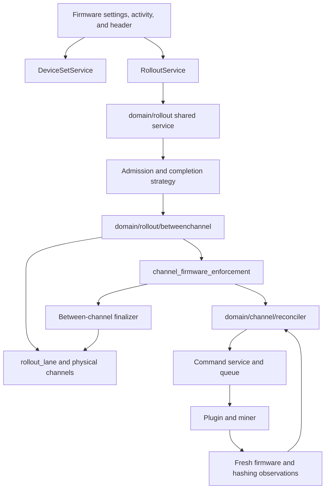
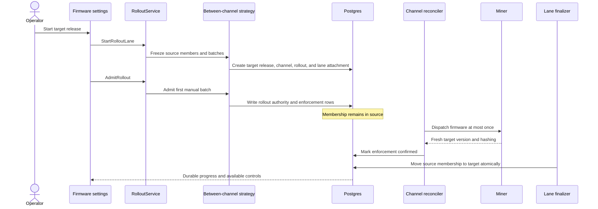

# TDD: Software Channels for Proto Fleet

Related documents: RFC: Software Channels for Proto Fleet (and its Round 1 feedback tab), TDD: Rig FW Phased Deployment via ProtoFleet, Notes: Cohort design for Proto Fleet, rollout design jam notes (Aug 6, Aug 11).

## Motivation

A firmware update in Proto Fleet today is a one-shot bulk command: the operator selects miners, picks a firmware file, and the update dispatches to the whole selection as one un-gated batch. As the fleet grows from hundreds of miners to thousands across multiple sites, that leaves the riskiest operation the product performs without the safeguards it needs:

- No staged exposure. There is no way to update a few miners, observe them, and expand on evidence; a regression reaches the whole selection un-gated, and a bad release can cut a site's hashrate in one step.
- No health verification. Success means the update command completed, not that the miner came back online and hashing on the new version.
- No durable record. Nothing records what an update was trying to achieve, on which miners, or whether it achieved it; per-miner command detail is eventually pruned by retention.
- No desired state. Nothing records what a miner should be running, so a miner offline during an update silently stays on the old version, and drift can be neither detected nor corrected.

Software channels address this the way mature device-fleet update platforms do:

- A _software channel_ is a named, opt-in, exclusive container of miners that declares what its members should run, as a _firmware release_ per hardware model.
- A new release reaches members through a _rollout_: staged _batches_, with pause, abort, per-miner progress, and a durable outcome.
- A _rollout policy_ paces and gates each batch: the rollout advances on evidence, such as each miner's telemetry compared before and after the update.
- _Reconciliation_ keeps members on the channel's declared state afterward, catching miners that were offline while the rollout ran.

This TDD turns these concepts into a concrete design: the schema, the APIs, the reconciliation and rollout machinery, and the delivery phasing.

## Goals

These are the v1 goals; any proposed design must satisfy them. Functional:

1. **Channels as the unit of desired state.** Operators can create software channels and explicitly assign miners. Membership is exclusive and opt-in: a miner belongs to at most one channel, channel-less miners keep today's behavior, and Fleet defines no channels by default. A channel declares a firmware release per hardware model; unset models are left alone, and a channel that declares nothing is a valid container.
2. **Compliance visibility.** Per-channel and per-miner views of declared versus reported state, available before any enforcement acts on it.
3. **Staged rollouts with a durable record.** A rollout takes a channel's members to a new release in batches, with pause, resume, and abort. The rollout records status, per-miner progress, and an outcome that survives retention. Rollback reverts only miners the rollout actually transitioned.
4. **Evidence-gated advancement.** A batch advances on evidence: each miner's telemetry compared before and after the update, with error rates surfaced alongside. Advancement can be automated against operator-defined thresholds or held for manual approval (per batch, or at the pilot gate); the design must support both, and which is the default is a decision this TDD makes.
5. **Delegated control.** An external service can drive a rollout through the API: create it, choose batch membership, advance, abort, and mark completion, while Fleet stays the system of record. An operator can always pause or abort, which detaches the controller.
6. **Continuous reconciliation.** Fleet detects and corrects drift from the channel's declared state, converges miners that were offline or newly assigned, and tracks per-miner convergence. Deliberate exceptions survive it: a group or batch of miners held back for pre/post-rollout comparison is not drift to correct, and the design must define how that hold-back works and how held-back miners count toward channel compliance.
7. **A defined interaction model.** The design specifies what direct one-off and bulk actions do to a channel-managed miner, and how they behave against an in-flight rollout: blocked, queued, or erroring, but never undefined.

Safety and policy:

8. **Safe execution.** A miner mid-update is never re-dispatched to, health is verified before a batch counts as done, and enforcement is bounded and haltable: visibility ships before enforcement, and an operator can stop in-flight enforcement at any time. Abort is quick and cheap: a single action stops the rollout from issuing new work, so an in-flight rollout never delays an emergency operation. In an emergency curtailment, the operator or Fleet aborts the rollout and curtails immediately.
9. **Rollout logic split.** The product ships only generic rollout policies. Complex advancement logic, such as regression analysis and decision rules tuned to our own firmware and hardware, is not part of Proto Fleet's code in v1: it lives outside, driving rollouts through the API seam. The split is a waypoint, not the end state: the seam is designed so advancement logic can later run as an extension alongside Fleet, or move in-product once Fleet accumulates enough telemetry signal to gate rollouts itself (a candidate delivery phase of its own).

Integration and delivery:

10. **Prefer existing machinery over new.** Where the product already has a primitive that fits, the design should extend it rather than build a parallel one, provided the reuse is both conceptually aligned and compatible at the code level, not a force-fit. The model must back the rollout UI flows already designed: the batches method, pilot review, and the activity surfaces.
11. **Independently useful phases.** Delivery is phased so each step stands alone: channel entity and membership, then enforcement, then staged rollouts, then policies and external control.

## Non-Goals

- **Configuration enforcement.** Channels carry firmware only in v1. Operational configuration (pool settings, power limits, tuning) is deferred pending its own follow-up; if it joins the channel later, it arrives as a profile the channel can optionally enforce, and gets designed then.
- **PDU firmware.** PDUs are not yet a managed device class in Fleet: no device type, driver, or firmware-delivery path exists. The firmware release model should not preclude them, but nothing here builds them.
- **Staging one-shot bulk actions.** Reboots and curtailment are not rollouts, even when batched. The UI may share batching and pacing controls across both, but this design does not turn bulk actions into rollouts or route them through channels.
- **The external controller, and defining regressions.** This TDD specifies the API surface a controller drives. The controller itself (regression analysis, advancement heuristics) is separate work under separate ownership, and what counts as a firmware regression stays outside the product entirely (G9).
- **Richer telemetry analysis.** v1 advancement evidence is each miner compared against its own pre-update state. Batch-to-batch baselines and statistical anomaly detection are later work.
- **Organizational labeling.** Channels declare software state only. How miners are grouped, labeled, and filtered stays a separate concern, whatever today's groups end up being called.
- **Developer rig reservations.** Reserving, leasing, and resetting test rigs is developer tooling. Channels contribute exclusive dev channels and a known-good stream to reset to, nothing more.
- **Fleet's own updates.** The Fleet server updating itself (the instance release channel) is a separate mechanism and stays that way.
- **Scheduling.** Rollouts are initiated by an operator or an external controller. Time-based or event-triggered starts are not part of this design.
- **Per-miner settings.** Channel state is shared by all members. Per-miner identity such as hostnames or network settings is not channel content.

## Critical Factors

The solution options in the next section are weighed against these factors.

1. **Firmware dispatch is destructive and not safely repeatable.** A flash can brick a miner; a miner mid-update must never be re-dispatched to, and recovery after a failure needs authoritative state. Whoever owns that state is effectively the system of record, which is why "drive the existing one-shot APIs from outside" is not a neutral option: a crashed orchestrator loses track of in-flight updates.
2. **Install feedback is weak and uneven.** Some third-party miners cannot report install progress at all; command success only means the upload was accepted and a reboot was issued. Verification has to come from observed state: the miner came back, reports the target version, and is hashing, and its telemetry needs a 15 to 30 minute stabilization window before pre/post comparison means anything. Batch completion is therefore slow by nature, and the design must treat waiting as the normal case, not a timeout path.
3. **Rollouts are long-running and must survive failures.** With stabilization windows, review gates, and offline miners, a rollout spans hours to days. Its state must be durable across Fleet restarts, and the design must define what happens when an external controller goes silent mid-rollout: the rollout is recoverable and abortable regardless.
4. **Channels join a product that already has command paths.** One-off commands, bulk actions, and the curtailment reconciler (which already owns per-miner desired power state) all touch the same miners. Enforcement dimensions need clear ownership so two systems never fight over one miner, and emergency operations take precedence: abort must be immediate so a rollout never delays curtailment (G8). The new machinery adds claimants of its own: the channel reconciler, an in-flight rollout, and a deliberate hold-back (G6) can each assert what a miner should run, so the design must give each miner a single authority at any moment. A rollout's pending members are not drift to correct, and neither are held-back comparison groups.
5. **Scale bounds everything.** At thousands of miners across sites, enforcement must be paced and capped (the reconciler acts on a bounded number of miners at a time; mass membership changes above a threshold are refused), and rollout status must stay cheap to compute and query at fleet size.
6. **The API is public product surface.** Proto Fleet is open source, so the controller API must be generic: complete enough for any third-party controller, with authentication and authorization for who may advance or abort, and no concepts specific to our own firmware or operations leaking into it (G9). The contract must also outlive its first consumer: the same seam should serve advancement logic running as an extension alongside Fleet later, without growing a parallel surface.
7. **Reuse cuts both ways.** Exclusive device_sets (racks), firmware file records, TimescaleDB telemetry, and the activity/command history all look reusable, and G10 prefers extending them. But each reuse must hold conceptually and at the code level; where a primitive was built for a different meaning (organizational groups being many-to-many is the canonical example), forcing it costs more than a new concept.

## Rollout Model: Within or Between Channels

Design review reopened a fork the RFC's Round 1 had settled toward staged activation: what a rollout fundamentally is. Two approaches were proposed: rollouts _within_ a channel, with channels front and center in the UI; and rollouts _between_ channels, where the channel graph need not be user-facing. Both models are specified here, and two prototypes (one per model, sharing the invariant machinery) will be compared on operator ergonomics before this fork is closed. Everything after this section stands for both models except where flagged.

**Model A: within a channel (staged activation).** A channel is a long-lived cohort ("production", "canary") whose declaration changes over time. A rollout publishes a new release to the channel and admits members to it batch by batch; members transition in place, and the cohort persists across releases.

**Model B: between channels (confirmed migration).** A physical channel is pinned to the release set it declares ("S21 fw 2.3.2"); declarations do not change after creation. Admission installs rollout authority and target desired state while the miner remains a source-channel member. Fresh target firmware and hashing confirmation then finalize the source-to-target membership move atomically. Operators use a stable rollout lane facade while Fleet manages the physical version channels underneath it.

### Common ground

- Channels as exclusive, opt-in device_set containers with per-model declarations (Axis 1), audited membership, and the same CRUD surface.
- Per-member enforcement rows and one enforcement engine as the only executor (Axis 2). The row is each miner's actionable desired state and a rollout controls when rows change. Model A writes the target at admission against the channel's new declaration. Model B writes the target at admission under rollout authority, then changes membership only after confirmation.
- Staged, batched rollouts with pause, resume, and abort; a durable rollout record; snapshot-based evidence and gated advancement (Axes 3, 6).
- Abort establishes a no-new-work boundary. Undispatched members do not start, pre-abort claims may settle, transitioned members stay transitioned, and revert remains a separate action.
- The interaction model: the channel owns firmware, direct updates are refused at preflight, curtailment always wins (Axis 4).
- One imperative control API used by the manual UI now and available to later policy runners or external controllers (Axis 5).

The difference concentrates in one place: **how confirmed target state is represented**. Model A rewrites a stable channel declaration and admits members in place. Model B installs temporary rollout authority, then finalizes confirmed miners into an immutable target version channel.

### Core differences

| Dimension         | A: within (staged activation)                                        | B: between (migration)                                                                                          |
| ----------------- | -------------------------------------------------------------------- | --------------------------------------------------------------------------------------------------------------- |
| Channel identity  | Stable cohort, changing content                                      | Stable content, changing cohort                                                                                 |
| A rollout mutates | The declaration, then per-member admission                           | Rollout authority at admission, then membership after confirmation                                              |
| Mid-rollout state | One channel, mixed versions, tracked by the rollout record           | Admitted miners stay in source while converging; confirmed miners move to target                                |
| Compliance        | Member vs current declaration; needs "pending, not drift" and `held` | Target membership is confirmed compliance; admitted source members are tracked by rollout and enforcement state |
| Hold-back         | `held` enforcement rows inside the channel                           | Members left in the source channel                                                                              |
| Revert            | Rewrite rows to recorded revert targets                              | Restore source firmware, then move confirmed members back to source                                             |
| Abort aftermath   | Must define what the channel declares (open item)                    | Undispatched members stay source; pre-abort claims may settle; no forced revert                                 |
| Channel lifecycle | Few, long-lived, operator-created                                    | One per release per lane; retirement policy required                                                            |
| Cohort continuity | The channel is the cohort                                            | The stable rollout lane is the cohort facade                                                                    |
| Version history   | Declaration history plus rollout records                             | Membership history is the version timeline                                                                      |
| UI mapping        | Publish on the channel page (the existing rollout UI prototype)      | Stable-view facade over churning channels, or channel-per-version exposed                                       |

### Trade-offs

- **Model A: within.**
  - Cohort stability: hold-backs, comparisons, dashboards, and permissions attach to one object that persists across releases.
  - No channel churn: no per-release naming scheme, creation, or retirement flow.
  - Membership changes stay rare and operator-meaningful, keeping the audit stream high-signal.
  - Matches the existing rollout UI prototype directly.
  - Costs: mid-rollout heterogeneity is real machinery (admission, `held`, "pending, not drift"); the abort-aftermath declaration question must be answered explicitly; past declared states need their own history record to stay legible.
- **Model B: between.**
  - Target channels are homogeneous by construction because membership moves only after fresh firmware and hashing confirmation.
  - Abort has a simple boundary: no new claims start, undispatched members remain in source, and pre-abort claims may settle.
  - Per-miner version history falls out of membership history.
  - Confirmation has one atomic membership mutation after the shared executor proves target state.
  - Costs: channel count grows as cohorts × releases, and lifecycle becomes hidden machinery behind the lane facade; the facade and physical channels must remain consistent; fleet-scale rollouts produce membership churn through the exclusivity index and activity log; hold-backs and failures split physical membership even though the lane presents one operator-facing cohort.

### Resolution path

Two prototypes, one per model, compared on operator ergonomics: the publish/move flow, mid-rollout legibility, hold-back handling, abort and its aftermath, and what the fleet view looks like after several consecutive releases.

The prototypes share one substrate because admission has a model-neutral post-condition: every admitted member has an enforcement row whose desired release is the target, whose cause is the rollout, and whose revert snapshot captures the source. Model A writes that row against a changed stable-channel declaration. Model B writes it under rollout authority while membership remains source, then a strategy finalizer moves membership after fresh target firmware and hashing confirmation. The engine, evidence, controls, abort boundary, revert machinery, and durable audit are shared, so the public admit verb does not decide the model fork (F6).

The outcome selects the model and this TDD is updated in place. The Proposed Solution below describes the shared base and both admission branches without selecting a winner.

## Solution Options

The RFC settled two concept-level forks: the rollout logic split, and the channel as a product concept stored on existing set machinery. The rollout model itself is carried open in the previous section, and the axes below are model-invariant except where flagged (Axis 3). Options cite the Critical Factors (F1–F7 by their numbering above), each axis ends on the recommended option, and the recommendations compose into the Proposed Solution that follows.

One piece of prior art recurs. The curtailment reconciler is the in-product precedent for continuous desired-state enforcement: per-target rows carrying desired state, lifecycle, and a baseline snapshot; a bounded singleton tick loop with heartbeat; compare-and-set transitions keyed by dispatch batch UUID; dispatch through the shared command service under a dedicated actor.

### 1. Where channel state lives

Racks already solve exclusive membership on shared machinery: a `device_set` type made exclusive by the partial unique index `idx_one_rack_per_device`, a 1:1 extension table for type-specific shape, and an atomic move RPC. Retrofitting exclusivity onto groups was rejected in RFC review (Decision 3).

- **1a. Standalone channel tables:** a `miner_channel` table plus its own membership table with a one-channel-per-device constraint.
  - No shared-table blast radius.
  - Duplicates device_set machinery (CRUD, labels, org scoping, permissions, list UI) against the Round 1 consensus (Q1); a parallel surface to maintain indefinitely (F7).
- **1b. `device_set` type `'channel'` plus channel extension tables (recommended).** Add `'channel'` to the type enum, enforce exclusivity with `idx_one_channel_per_device` (the racks pattern), hang channel state off extension tables.
  - Per-model declarations keyed (channel, manufacturer, model) → firmware file: one channel holds a mixed fleet, each model resolving to its own artifact.
  - Rack and channel exclusivity are independent partial indexes, so a miner keeps its rack; org-scoped sets mean channels span sites by construction, resolving the RFC's site-scoping question.
  - Costs: guard the many queries that hardcode `'rack'` versus `'group'`; a dedicated atomic assign RPC; a `ChannelInfo` proto arm; rack-only side effects (site cascade, slots) stay off the channel path.
  - RoM: medium.

Declarations, either way: firmware files are filesystem artifacts with a metadata sidecar, not DB rows, so a declaration needs a lifecycle guard (a declared file cannot be silently deleted) and reuses the existing target-match validation (PR #815).

### 2. How desired state is tracked and enforced

Whoever owns per-miner desired firmware is the safety-critical core (F1): compare desired against reported state (`discovered_device.firmware_version`, roughly 5-minute refresh, invalidated after reboot) and correct drift within bounded budgets (F5). Event-only convergence (acting just on reconnect or assignment) was considered and folded in: alone it gives no steady-state drift detection and no compliance guarantee, but its triggers become fast paths of the loop below.

- **2a. Extend the curtailment reconciler into a multi-dimension engine.**
  - One engine to operate, but the loop is power-entangled end to end: tables, desired states, power-threshold drift predicates, Curtail dispatch.
  - Curtailment's corrective action is cheap and repeatable; a flash is destructive and is not (F1). The force-fit G10 warns about, with regression risk in a feature customers contractually depend on.
- **2b. A sibling channel reconciler on the proven loop pattern (recommended).** Per-member enforcement rows (desired firmware; lifecycle pending → dispatching → dispatched → confirmed / drifted / held / failed; retry budget; last dispatch batch), driven by a dedicated bounded tick loop.
  - Reuses curtailment's operational patterns: singleton with heartbeat; compare-and-set keyed by batch UUID, so a crashed tick cannot double-dispatch (F1); dispatch via the command service under a dedicated actor.
  - Semantics differ where they must: the drift predicate is version match plus online-and-hashing health (G8); dispatch never re-issues while a flash may be in flight.
  - The rows natively give compliance counts (G2), convergence tracking and the `held` state for hold-backs (G6), and "pending, not drift" (F4).
  - RoM: large; the biggest new component, but isolated from curtailment.

Phasing: rows and comparison ship first with dispatch disabled (Phase 1, G2); bounded corrective dispatch follows (Phase 2). Retry exhaustion lands in `failed` and surfaces for attention; escalation into notifications follows the notification stack's existing patterns.

### 3. How a rollout executes

Dispatch today means immutable command batches (`command_batch_log` plus per-device `queue_message`, per-device serialization, 15-minute firmware worker timeout): no append, pause, or mid-flight abort, capped per-miner results, and a schema that anticipates pruning. That is a usable dispatch primitive but not a rollout record (G3); a parallel dispatch engine of our own is rejected outright (F7, G10).

- **3a. Rollout as an orchestrator dispatching command batches directly**, suppressing the reconciler while it runs.
  - Thinnest layer over today's code.
  - Two writers of firmware state to mutually exclude per miner (F4), and the reconciler must still catch offline members afterwards, so the handoff ambiguity shows up anyway.
  - Durable rollout state must be copied out of the prunable batch tables regardless.
- **3b. Rollout as gated admission into enforcement (recommended shared contract).** A strategy prepares the source and target representation, then the rollout admits members batch by batch. Admission writes each member's enforcement row (desired = the target release, source recorded as the revert target), and the 2b engine performs every physical transition.
  - Rollout work and drift correction share one executor and one set of safety rails (F1, F4).
  - Offline members stay pending until they return; no special path.
  - Abort is one action that starts no new work: admission stops, pending work is cancelled, a pre-abort claim may settle, and transitioned members keep the new release (G8). Revert is separate and deliberate.
  - Cause attribution on enforcement rows distinguishes rollout, membership, drift correction, and between-channel revert authority.
  - RoM: medium on top of 2b.

Promotion needs no machinery under 3b: publishing the same release to the next channel is just another publication starting that channel's own rollout, with no pipeline object. Ungated changes stay cheap the same way: a channel move writes enforcement rows directly, with no rollout record. The membership change is audited as an activity event (the path device_set changes already use), and the rows it writes carry it as their cause.

Model note: under Model B, admission does not mutate membership. It installs rollout authority and target desired state while the member stays in source. The finalizer moves a member to target only after fresh target firmware and hashing confirmation. Revert restores source firmware under separate authority before source membership is finalized. Gated admission, the single executor, and the rollout record remain shared.

### 4. What direct actions do to channel-managed miners

The mechanisms exist: fail-closed preflight filters (curtailment already blocks non-curtailment commands on actively curtailed devices, its reconciler bypassing its own filter via a dedicated actor) and per-device queue serialization, so overlapping commands on one miner wait rather than interleave.

- **4a. Allow direct firmware updates; revert on the next pass.** No refusal path to build, but two systems fight over one miner (F4), the losing flash was destructive and pointless (F1), and compliance flaps confusingly.
- **4b. Lock managed miners against all direct actions.** Rejected: curtailment must always win (G8), and blocking operational actions over a software-state membership is hostile at site scale.
- **4c. The channel owns firmware; everything else stays open (recommended).**
  - Direct one-off and bulk firmware updates are refused at preflight for channel-managed miners (a channel filter on the curtailment-filter pattern, already contract-tested); the refusal points at the channel: publish there, or unassign.
  - Cheap dev and maintenance channels cover the legitimate one-off; Round 1 favored this over pinning.
  - Reboot, pools, curtailment, and diagnostics stay available: one authority for the one dimension the channel declares (F4), no wasted destructive flashes (F1).
  - RoM: small.

Against an in-flight rollout the same split holds: non-firmware bulk actions are neither blocked nor queued by the rollout, since per-device queue ordering already serializes the few miners actually mid-flash, miners themselves may refuse or defer, and outcomes surface per miner. Curtailment takes precedence in both directions: enforcement dispatch to actively curtailed members is skipped per member (held, not failed: the engine must not fail a whole batch over one filtered miner), and an emergency abort is a single action stopping all pending rollout work (G8).

### 5. How policies and external controllers drive rollouts

- **5a. Fleet polls an external verdict service**, the earlier phased-deployment TDD's hold / forward / rollback shape. Set aside by RFC Decision 1: the progression model stays fixed in product code, every new advancement scheme is a product change, and gated progress depends on the polled service's availability.
- **5b. One imperative control API; the UI is its first consumer (recommended).** A single control surface: create a rollout with explicit batches, admit or continue, read evidence, pause, resume, abort, revert, complete.
  - The prototype UI drives manual batches through this surface. Later built-in policies can add single-batch, pilot, or threshold-driven progression without changing the underlying controls.
  - An external controller is the same caller over the Connect API with an API key: delegated control (G5) is a permission grant into the existing RBAC catalog (channel- and rollout-scoped permissions beside today's device and command grants), not a special mode, and needs no dedicated UI method.
  - Operators keep precedence: pause and abort outrank the controller; detaching a controller revokes its writes (F3). Controller silence policy is deferred with external controller hardening. Nothing external is ever required to abort or revert.
  - The cost: the API is public product surface designed once, early, where naming, auth, and error semantics carry compatibility weight from the first release (F6).
  - RoM: medium.

### 6. What evidence gates advancement

Raw telemetry (`device_metrics`, roughly 10-second samples, 10-day retention) answers ±30-minute pre/post windows (F2) with about 180 points per window. There is no per-miner error-rate time series; errors are incident rows opened and closed per device.

- **6a. Compute evidence on demand from telemetry.** No new storage, but the durable outcome (G3) evaporates with raw retention after 10 days, and every status render re-runs window queries at fleet size (F5).
- **6b. Snapshot baselines and persist verdicts on the rollout record (recommended).**
  - At admission, snapshot each member's baseline for the metrics the UI's performance strip renders (hashrate, power, efficiency, temperature); after the stabilization delay (F2), compute the post-window once and store per-member deltas and the batch verdict.
  - Error evidence is the change in open incident counts for admitted members, matching the UI's error callout and max-errors threshold; a true error-rate series is later work (Non-Goals).
  - Outcomes survive retention (G3); review screens read stored rows rather than scanning hypertables (F5); baseline-at-admission is what the design jam asked for and the UI assumes.
  - RoM: small to medium.

The prototype advancement default (G4) is manual review between batches. A later policy phase can add opt-in server-side auto-continue against operator thresholds (max hashrate drop, max efficiency increase, max temperature increase, max error count) and can require a manual pilot gate.

## Proposed Solution

The implementation is split into a model-neutral base and sibling admission branches. The base is load-bearing for both prototypes. The between-channel branch exercises Model B now, while Model A remains open for comparison. This structure does not select a winner.

The shared organizing rule is: **`channel_firmware_enforcement` rows are the only actionable desired-firmware state, and the channel reconciler is the only component that dispatches channel-managed firmware** (F1, F4).

**Shared base**

- A software channel is a `device_set` of type `channel`. `device_set_membership` enforces one channel per miner independently from rack placement.
- `firmware_release_set` and `firmware_release_target` snapshot immutable per-model firmware identity, version, and checksum. `device_set_channel` pins a physical channel to one release set.
- `channel_firmware_authority` names who currently controls a miner's firmware target. `channel_firmware_enforcement` stores the desired release, state, command correlation, observations, and cause.
- The channel reconciler claims work with compare-and-set, dispatches through the existing command service, and confirms from a fresh firmware observation plus fresh hashing. Once a command may have reached a miner, Fleet never retries it automatically. Uncertain execution becomes `attention_required`.
- `firmware_rollout`, `firmware_rollout_batch`, `firmware_rollout_member`, `firmware_rollout_control`, `firmware_rollout_cause`, and `firmware_rollout_evidence` preserve the frozen plan, controls, outcomes, and evidence independently from command retention.
- The generic rollout service delegates admission, completion, and revert behavior through strategy interfaces. Model-specific lane APIs do not change the generic control contract.

**Model B branch**

Operators use a stable rollout lane instead of managing physical version channels. `rollout_lane` stores the durable label and current physical channel pointer. `rollout_lane_channel` stores an ordered, immutable history of physical channels.

The physical channel lifecycle is:

1. Creating a lane creates an immutable source release set and physical source channel, assigns the selected miners, attaches that channel at position zero, and makes it current.
2. Starting a rollout creates an immutable target release set and physical target channel, appends the target to the lane, and freezes source members and manual batch assignments.
3. Admitting a batch advances rollout authority and creates target enforcement rows. Membership remains in source while miners are pending, flashing, or verifying.
4. The reconciler dispatches at most once and requires target firmware plus hashing observations newer than the command completion boundary.
5. The between-channel finalizer locks the lane, both channels, and the miner, then atomically moves confirmed membership to target and marks the rollout member succeeded.
6. Completing a successful rollout advances the lane's current pointer to target. Aborting does not advance the pointer, starts no new work, and allows pre-abort claims to settle.
7. Revert selects only members moved by that rollout. The reconciler restores captured source firmware first, then the finalizer moves confirmed members back to source. Completing revert restores the lane pointer to source.
8. Lane-channel attachments remain immutable audit history. Retirement and garbage collection require a separate policy that proves a physical channel is not current, has no members, and remains safe to retain or remove.

The operator surface presents membership migration and firmware convergence as separate progress measures. A confirmed target member contributes to both. A flashing or verifying source member contributes only to convergence work in progress.

**Model A branch**

The later sibling keeps a stable physical channel and changes its declaration. It reuses the same immutable releases, enforcement rows, reconciler, rollout records, evidence, controls, abort boundary, and revert snapshots. Its admission strategy and channel-history presentation remain the comparison variables.

**Interaction and control**

- Direct firmware updates to channel-managed miners fail closed in command preflight. Reboot, diagnostics, pool changes, and curtailment remain available.
- Curtailment takes precedence. The reconciler does not consume a firmware attempt while a miner is actively curtailed.
- `RolloutService` provides create, read/list, admit/continue, pause/resume, abort, revert, and complete controls with expected revisions and idempotency keys.
- Manual batch review is the prototype path. Threshold automation, scheduling, controller silence policy, and external controller hardening remain later work.

## Technical Design

### Architecture

The server remains one deployable: Connect handlers call domain services backed by sqlc stores over Postgres and TimescaleDB. The channel reconciler and between-channel finalizer run as bounded runtime jobs beside existing command execution. No new queue or dispatch path is introduced.

Components, mapped to the codebase:

- **Channel and release storage** (`domain/collection`, `SQLCollectionStore`): channel device sets, immutable release snapshots, artifact guards, exclusive membership, and `AssignDevicesToChannel`.
- **Firmware enforcement** (`domain/channel`, `SQLChannelEnforcementStore`, `domain/channel/reconciler`): authority, desired state, at-most-once claim and command correlation, fresh confirmation, and attention-required outcomes.
- **Generic rollout** (`domain/rollout`, `SQLRolloutStore`): frozen batches and members, optimistic revisions, idempotent controls, evidence, cause history, and model-neutral strategy seams.
- **Between-channel strategy** (`domain/rollout/betweenchannel`, `SQLRolloutLaneStore`): lane creation, immutable target channel creation, admission authority, completion pointer updates, revert preparation, and atomic membership finalization.
- **Command service** (`domain/command`): one channel-managed firmware preflight filter plus the existing queue and worker. The reconciler's dedicated actor is the only bypass.
- **Client** (`useRolloutApi`, `RolloutLanesTab`, `BetweenChannelRolloutStatus`): the stable lane facade, manual batch controls, durable reopen, separate membership and convergence progress, abort, and revert.

State ownership (the single-writer rule from the Proposed Solution, made concrete):

| State                           | Storage                                                      | Written by                                                     | Read by                                 |
| ------------------------------- | ------------------------------------------------------------ | -------------------------------------------------------------- | --------------------------------------- |
| Physical channel and membership | `device_set`, `device_set_membership`, `device_set_channel`  | DeviceSet service; between-channel finalizer for rollout moves | lane service, compliance, UI            |
| Immutable releases              | `firmware_release_set`, `firmware_release_target`            | channel and lane creation                                      | admission, reconciler, audit            |
| Lane facade and channel history | `rollout_lane`, `rollout_lane_channel`                       | between-channel lane service and completion strategy           | lane API and UI                         |
| Actionable desired firmware     | `channel_firmware_authority`, `channel_firmware_enforcement` | admission or assignment; reconciler by CAS                     | reconciler, finalizer, rollout progress |
| Rollout plan and outcome        | `firmware_rollout*` tables                                   | generic rollout service and finalizer                          | API, UI, activity projection            |
| Dispatch state                  | `command_batch_log`, `queue_message`                         | reconciler through command service                             | command execution and confirmation      |
| Reported state                  | `discovered_device`, `device_metrics`                        | telemetry ingest and direct sampling                           | reconciler, evidence, compliance        |

**Runtime and failure boundaries**

- The rollout service never calls the command service. It writes durable intent; only the reconciler dispatches.
- Restart resumes from database rows. A claimed or enqueued attempt is correlated to one command batch and is never recreated automatically.
- Abort halts authority before pending work is cancelled. Finalization may still settle a claim created before the halt.
- Finalization validates expected lane, authority, enforcement, and membership revisions in one transaction. A conflicting manual move becomes attention required instead of being overwritten.
- Activity is a projection. Rollout, member, enforcement, and cause rows remain authoritative if activity logging fails.

### Interfaces

**Connect APIs**

- `DeviceSetService`: `CreateFirmwareReleaseSet`, `GetFirmwareReleaseSet`, and `AssignDevicesToChannel` support model-neutral release and exclusive-membership operations. Existing device-set CRUD carries `ChannelInfo`.
- `RolloutService` lane facade: `CreateRolloutLane`, `GetRolloutLane`, `ListRolloutLanes`, and `StartRolloutLane`.
- `RolloutService` generic lifecycle: `CreateRollout`, `GetRollout`, `ListRollouts`, `AdmitRollout`, `ContinueRollout`, `PauseRollout`, `ResumeRollout`, `AbortRollout`, `RevertRollout`, and `CompleteRollout`.
- Every mutation uses an idempotency key. Lifecycle controls also use `expected_revision`; stale writers receive a conflict and must reload.
- The prototype authorizes `channel:read`, `channel:manage`, `rollout:read`, `rollout:manage`, and `rollout:control` at organization scope.

**Key request and response contracts**

- Lane creation accepts a stable label, description, one firmware file per represented model, and explicit device identifiers. It returns the lane and current physical channel history.
- Lane start accepts target firmware files and explicit frozen batches. It returns both the appended lane state and the durable rollout.
- Rollout reads return batches, members, evidence, causes, source and target snapshots, revisions, and physical source and target IDs.
- Admission and continuation never imply membership success. A member reports success only after the finalizer commits confirmed target membership.
- Abort returns a durable aborted boundary. Revert is valid only after admitted members settle and selects only succeeded members from that rollout.
- `attention_required` is terminal for automatic execution and has no retry RPC or ordinary retry action.

**Client adapters**

- `useRolloutApi` maps generated messages into `RolloutLane` and `RolloutRecord`, hydrates lane release targets and fresh membership, and emits rollout change events after mutations.
- `RolloutLanesTab` owns lane create/start, first-batch admission, lifecycle controls, polling, durable reopen, and the stable facade. Physical channel labels are not operator controls.
- `BetweenChannelRolloutStatus` renders source remaining, target confirmed, firmware convergence, evidence, and the control set derived from server state.

## Testing & validation

- **Domain unit tests**
  - State transitions, revision conflicts, idempotency replay, abort races, at-most-once dispatch, stale telemetry, attention-required handling, and revert selection.
  - Model B admission leaves membership in source; finalization requires fresh target version and hashing; revert confirms source firmware before membership.
- **Database integration tests**
  - Exclusive channel membership, immutable artifacts and lane attachments, frozen batches, one active rollout owner, canonical locking, rollback on partial failure, org isolation, and restart reconstruction.
  - Concurrent manual assignment, abort, finalization, opposite-direction rollout, and revert conflicts fail without partial membership changes.
- **Handler and authorization tests**
  - Every `DeviceSetService` and `RolloutService` procedure checks the documented permission and maps validation, conflict, and not-found errors consistently.
- **Client tests**
  - Generated mapping for all states, separate membership and convergence progress, exact create/start payloads, durable reload, permission-hidden controls, abort and revert copy, and no retry for attention required.
- **Playwright operator evaluation**
  - The full two-miner operator journey is runnable against the resettable fake Proto rig environment with firmware filenames that deterministically change reported versions.
  - Cover lane creation, explicit target selection, first-batch source membership until fresh confirmation, manual review and continuation, final-batch completion, lane-pointer persistence after reload and reopen, abort split, explicit selective revert, and source membership after source firmware confirmation.
  - Deterministic `afterEach` cleanup aborts active work, waits for pre-abort claims to settle, reverts transitioned miners, and clears channel membership.
  - Lane and release history remains immutable audit data. Unique IDs and the isolated E2E database lifecycle are the cleanup boundary, and referenced firmware artifacts are not deleted.
  - The fake rig cannot produce a real post-upload ambiguity through its public controls. Keep only that attention-required scenario blocked; service and component tests cover the no-retry behavior.
- **Verification gates**
  - Run targeted Go and Vitest suites, client TypeScript and lint, the focused Playwright spec, then the full ProtoFleet E2E suite when the environment is ready.
  - Run plugin contract tests only when fake miner behavior changes. Do not refresh visual snapshot baselines for this work.

## Work Breakdown

1. **Shared substrate**
   - Add immutable releases, exclusive channels, artifact guards, per-miner authority and enforcement, one at-most-once reconciler, durable rollout records, evidence, controls, permissions, and model-neutral client adapters.
2. **Model B prototype**
   - Add stable lane storage and APIs, immutable physical channel history, confirmed-membership finalization, abort settlement, selective revert, activity projection, and the firmware-settings lane workflow.
   - Add the repeatable Playwright operator evaluation with mutable-state cleanup and isolated retention of immutable audit history.
3. **Model A sibling**
   - Reuse the shared substrate with staged declaration activation, hold-back semantics, abort declaration behavior, and its channel-centered UI.
4. **Comparison closure**
   - Compare publish/start flow, batch review, split-state legibility, hold-backs, abort aftermath, revert, repeated releases, and operational cleanup.
   - Select the model only after both prototypes use the same safety and persistence substrate. Update this TDD in place with the decision.
5. **Production hardening after selection**
   - Resource-instance RBAC, controller credentials and silence policy, threshold automation, scheduling, alerting, multi-instance coordination, channel retirement and garbage collection, and statistical evidence.
