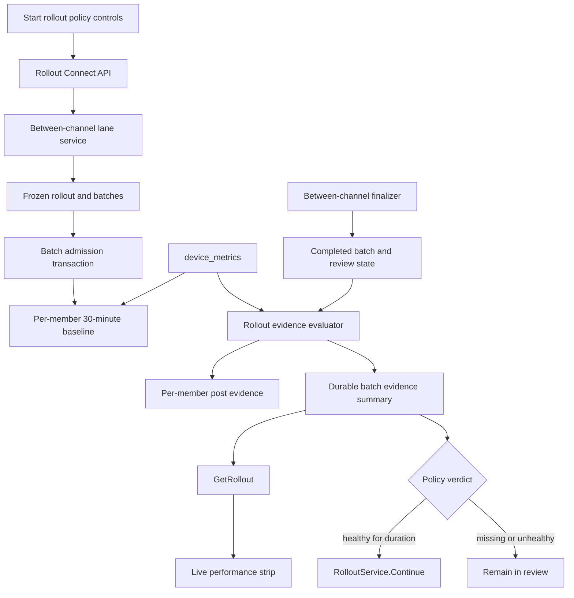
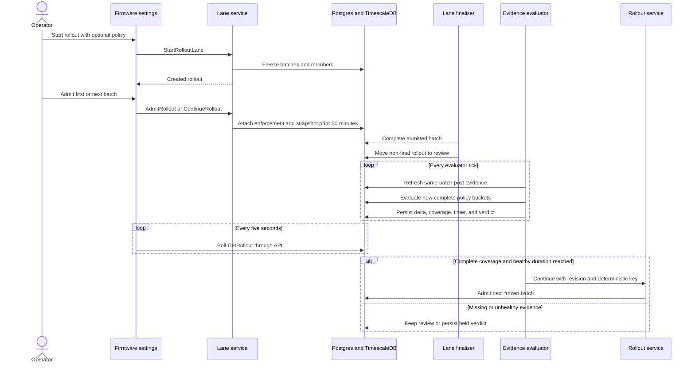

# Hashrate-gated rollout evidence

## Goal Capsule

- **Objective:** Give operators a real baseline-versus-current hashrate signal for each firmware rollout batch and optionally use that signal to advance healthy batches.
- **Product authority:** This plan extends the evidence direction in `docs/plans/2026-08-12-software-channels-tdd.md`. It brings the previously deferred hashrate threshold automation into the prototype scope.
- **Safety authority:** Missing or unhealthy evidence never advances a rollout. Manual continue, pause, and abort remain available and take precedence over automation.
- **Execution profile:** Add one durable evidence path shared by manual and automatic rollout review. Keep firmware dispatch and between-channel finalization unchanged.
- **Stop condition:** Stop implementation if the evidence evaluator cannot distinguish the frozen current batch from other rollout members or cannot perform an idempotent, revision-checked automatic continue.
- **Tail ownership:** This branch owns implementation, generated code, targeted tests, and the focused rollout E2E path. It does not own production alerting or statistical policy design.

---

## Product Contract

### Summary

Before each batch update, Fleet snapshots the available hashrate history for every frozen batch member over the preceding 30 minutes. After the batch finishes updating, Fleet refreshes the same cohort's average hashrate and percentage delta in the live rollout view. An operator can keep manual review or opt into a maximum hashrate drop and healthy-duration policy that automatically continues only after complete, healthy evidence persists for the configured duration.

### Problem Frame

The live rollout design already renders baseline and current telemetry. Between-channel admission also captures a batch-scoped 15-minute baseline, but production rollouts do not refresh post-update evidence and the client aggregates every batch with incorrect H/s and W display units. Operators therefore decide whether to continue without a trustworthy performance comparison. The rollout model also has no durable policy that can turn a healthy hashrate signal into a safe automatic continue.

### Requirements

**Baseline and live evidence**

- R1. Admitting a batch snapshots one baseline evidence row per frozen batch member from the preceding 30 minutes, using every available sample in that window.
- R2. A member with no baseline samples remains explicitly unavailable instead of receiving a zero value.
- R3. After a batch completes, Fleet refreshes post-update evidence for that batch from completion time through the earlier of now or 30 minutes after completion.
- R4. The batch comparison uses only members that have both baseline and post-update hashrate, and reports paired coverage against the frozen batch size.
- R5. The live rollout view displays the batch baseline, current average, percentage delta, coverage, and evidence status on its existing five-second refresh cadence.
- R6. Evidence remains persisted after raw telemetry expires and remains visible on completed rollout results.

**Optional automatic review**

- R7. A rollout can opt into a maximum hashrate drop from 0 to 100 percent with 0.1-percent precision and a healthy duration from 10 to 1,800 seconds in 10-second increments. Enabling the policy prefills 0.1 percent and 30 seconds.
- R8. Automatic continue is disabled by default and applies between completed non-final batches for both pilot-then-continue and batched methods.
- R9. A batch is eligible for automatic continue only when every frozen member has paired evidence, each member's newest post sample is at most 20 seconds old, and every completed 10-second policy bucket stays within the batch drop threshold for the full healthy duration.
- R10. Missing evidence keeps the batch collecting while coverage can still arrive. A permanently missing baseline or an incomplete finalized post window marks evidence unavailable. An out-of-threshold bucket holds the rollout and resets the healthy timer, while later healthy buckets can begin a new dwell.
- R11. Automatic continue shares the manual lifecycle, optimistic revision, idempotency, and cause mechanisms, but uses a system actor with the rollout creator recorded as accountable user.
- R12. An operator pause or abort prevents automatic continue. Overriding a held verdict requires a confirmation that shows the threshold, measured delta, coverage, and consequence, then records the override cause.
- R13. Active evidence becomes stale when any frozen member's newest post sample is older than 20 seconds or the evaluator has not run for 20 seconds. Stale evidence resets the healthy timer and cannot appear healthy or advance automatically.
- R14. Policy controls and evidence verdicts have associated labels and errors, text equivalents for color, stable keyboard order, meaningful state-change announcements, and a single-column phone layout.
- R15. A failed automatic continue records an automation-error verdict and is never retried with a new key. The rollout remains in review with manual controls.

### Key Flows

- F1. **Admit and snapshot**
  - **Trigger:** An operator admits the first batch or continues to a later frozen batch.
  - **Steps:** Fleet attaches batch enforcement and snapshots the 30-minute baseline in the same transaction before firmware dispatch.
  - **Outcome:** Every frozen member has either measured baseline evidence or an explicit unavailable row.
- F2. **Observe and review**
  - **Trigger:** The final member in an admitted batch settles.
  - **Steps:** The existing finalizer completes the batch and moves a non-final rollout to review. The evidence evaluator refreshes post-update evidence for only that batch and persists its aggregate comparison.
  - **Outcome:** Polling clients render a live, durable delta without querying telemetry directly.
- F3. **Advance or hold**
  - **Trigger:** The evaluator observes a review-state rollout with an enabled policy.
  - **Steps:** Complete paired coverage and an acceptable 10-second bucket start or continue the healthy timer. Every later completed bucket must remain acceptable and fresh. Once consecutive healthy buckets cover the configured duration, Fleet issues one revision-checked system continue. Missing evidence collects until the window closes, then becomes unavailable. An unacceptable bucket records a held verdict and resets the timer.
  - **Outcome:** Healthy batches advance once. All other batches remain available for operator review.

### Acceptance Examples

- AE1. **Partial history:** Given a miner with 12 minutes of telemetry before batch admission, when Fleet captures the baseline, then its average uses those 12 minutes and records the actual sample count.
- AE2. **No history:** Given a frozen member with no telemetry in the baseline window, when the batch is admitted, then the member's baseline is unavailable and the rollout can still run manually.
- AE3. **Paired cohort:** Given three members where only two have baseline and post evidence, when Fleet calculates the live delta, then it compares those same two members and reports coverage of two out of three.
- AE4. **Healthy automatic continue:** Given complete coverage, a maximum drop of 0.1 percent, and a 30-second duration, when three consecutive 10-second bucket deltas remain at or above negative 0.1 percent, then Fleet admits the next batch exactly once.
- AE5. **Unhealthy hold:** Given an enabled policy and a bucket delta below the threshold, when the evaluator runs, then the rollout remains in review with a held verdict and a reset timer. A later healthy bucket can start a new dwell, or an operator can override.
- AE6. **Operator precedence:** Given a healthy timer in progress, when an operator pauses or aborts the rollout, then later evaluator passes do not continue it.
- AE7. **Restart safety:** Given a healthy timer or held verdict persisted before restart, when Fleet restarts, then a held verdict remains held, a fresh healthy timer resumes, a stale healthy timer resets, and no continue control is duplicated.
- AE8. **Unavailable evidence:** Given a member without a baseline or a finalized post window without complete coverage, when the evaluator can no longer obtain a paired cohort, then the live view reports unavailable coverage and retains manual controls.
- AE9. **Held override:** Given an out-of-threshold held verdict, when an operator chooses Continue, then Fleet shows the measured comparison and advances only after explicit confirmation with a durable override cause.
- AE10. **Stale evaluation:** Given an active verdict with a member sample or evaluation older than 20 seconds, when the live view polls again, then it displays stale evidence, resets the healthy timer, and does not continue.
- AE11. **Automatic control failure:** Given a healthy batch whose system Continue fails after its control starts, when the evaluator runs again, then it reports an automation error without creating another automatic control and preserves manual Continue.

### Success Criteria

- A real local rollout displays a changing hashrate delta sourced from persisted telemetry evidence.
- The displayed delta is scoped to the most recently completed or active review batch, not all rollout members.
- An opt-in policy can automatically continue a healthy non-final batch after its configured duration.
- Missing and unhealthy evidence never cause automatic progress.
- Existing manual rollout, abort, revert, and at-most-once firmware behavior remains unchanged.

### Scope Boundaries

**In scope**

- Hashrate baseline, post-update average, paired coverage, percentage delta, and persisted verdicts.
- Manual review with live evidence.
- Optional hashrate-only automatic continue.
- Between-channel rollout UI, API, runtime evaluation, and tests.

**Deferred to follow-up work**

- Power, efficiency, temperature, and error thresholds.
- Statistical confidence intervals, outlier rejection, model-specific normalization, and weighted policies.
- Optional per-member drop thresholds beyond complete paired coverage and fresh-hashing confirmation.
- Alerting, external controller callbacks, and policy templates.
- A charted time series. The first version uses the existing performance strip and evidence status copy.
- Evidence gating for initial lane firmware convergence and the future within-channel strategy.

### Assumptions

- "Average hashrate for a batch" means the arithmetic mean of per-member averages. This gives each miner equal influence even when sample cadence differs.
- "When creating a rollout" is implemented as part of each batch's admission boundary. This preserves a fresh pre-update comparison for later batches that may run long after the rollout record was created.
- Post-update evidence begins only after every member in the batch reaches a terminal forward state. This avoids treating expected reboot downtime as post-update health.
- Consecutive complete policy buckets provide the stabilization period. There is no additional fixed wait after finalization because a succeeded member has already reported fresh target firmware and hashing.
- A threshold violation holds the rollout and resets dwell. Later healthy buckets can recover automatically within the 30-minute post window.
- Zero baseline hashrate is unavailable for percentage comparison. It cannot satisfy automatic policy coverage.

---

## Planning Contract

### Key Technical Decisions

- KTD1. **Snapshot baselines inside batch admission.** Extend the existing batch-scoped admission snapshot from 15 to 30 minutes. This keeps later batches anchored to telemetry immediately before their firmware update instead of a potentially stale rollout-creation timestamp.
- KTD2. **Keep per-member evidence and persist a batch summary.** Per-member rows preserve drill-in and retention durability. A typed batch summary owns the aggregate, paired coverage, verdict, and healthy timer so every client sees the same decision.
- KTD3. **Use paired, equal-member batch aggregation.** Baseline and post values are joined by frozen member identity before aggregation. A miner with denser telemetry cannot outweigh another miner, and denominator drift cannot improve the delta silently. The first policy gates the requested batch average, while per-member drop thresholds remain deferred.
- KTD4. **Evaluate through a bounded runtime job.** A model-neutral rollout evidence evaluator follows the existing lifecycle pattern used by channel enforcement and lane finalization. It processes bounded candidates, persists each pass, and resumes from the database after restart.
- KTD5. **Use review as the fail-closed hold.** The evaluator does not add a parallel pause state. Missing or unhealthy evidence leaves the rollout in its existing review state and records why automation did not continue.
- KTD6. **Route automatic progress through `RolloutService.Continue`.** The evaluator supplies a deterministic idempotency key, the current revision, the rollout creator as accountable user, and a system actor type. It does not mutate lifecycle state directly.
- KTD7. **Expose server-derived evidence status.** The client maps an authoritative batch summary into the existing `RolloutPerformanceStrip`. It converts persisted H/s to TH/s for display and does not re-query TimescaleDB or recompute policy eligibility.
- KTD8. **Persist the drop threshold as integer basis points.** The API and database store 0 to 10,000 basis points in increments of 10. The client presents percent values, which avoids floating-point policy drift across server and browser validation.
- KTD9. **Evaluate dwell with completed 10-second buckets.** Live post evidence can retain its cumulative comparison, but policy health advances only on new non-overlapping buckets with fresh samples for every member. Persist the last evaluated bucket boundary so restart and duplicate ticks cannot count time twice.

### High-Level Technical Design

### State and Timing Rules

- Baseline window: `[batch_admitted_at - 30 minutes, batch_admitted_at]`.
- Post window: `[batch_completed_at, min(now, batch_completed_at + 30 minutes)]`.
- Policy buckets: non-overlapping 10-second windows after batch completion. A bucket is usable only when every member has a post sample no older than 20 seconds at evaluation.
- Collecting: no complete paired cohort exists yet.
- Unavailable: complete paired coverage cannot be obtained because a baseline is permanently absent or the finalized post window ended without coverage.
- Observing: full paired coverage exists and the delta is within threshold, but the healthy duration has not elapsed.
- Healthy: the threshold has held for the duration. A non-final review batch is eligible for automatic continue.
- Held: the latest completed policy bucket violated the threshold. The timer is reset, the operator can override, and a later healthy bucket can start a new dwell.
- Stale: a member sample or evaluator pass is more than 20 seconds old. It is a display and automation guard over the persisted verdict.
- Automation error: the automatic Continue control failed. Fleet does not retry it, and an operator can inspect evidence and continue manually with a new control.
- Final batch: evidence continues to refresh for its post window, but no automatic continue is attempted.

### System-Wide Impact

- **Database:** One additive migration extends rollout and batch records. Existing migration files remain unchanged.
- **Telemetry load:** Each active review batch scans at most 30 minutes for a bounded frozen member set every evaluator tick. Candidate and batch-size limits must bound concurrent scans.
- **API compatibility:** New request fields are optional. Existing clients continue to create manual rollouts.
- **Generated code:** Proto and sqlc output must be regenerated and committed with their sources.
- **Audit:** Automatic continue produces the same durable control and cause records as a manual continue with system actor attribution.
- **Client polling:** The existing five-second rollout detail poll is sufficient. No new browser timer or telemetry endpoint is needed.

### Risks and Mitigations

- **Telemetry scan amplification:** Limit candidates per pass, index by batch state, and query only the frozen batch member identifiers and 30-minute raw window.
- **Stale revision race:** Call the generic service with the revision loaded for the candidate. Treat revision conflict as a benign retry after reload.
- **Duplicate automatic continue:** Use one deterministic idempotency key per completed batch and the existing control uniqueness constraint.
- **Failed automatic continue:** Persist an automation-error verdict and stop automatic attempts for that batch. A manual Continue uses its own operator key and reason.
- **Misleading partial averages:** Persist paired coverage and require complete coverage for automation. Display coverage beside the delta.
- **Restart during dwell:** Persist `healthy_since`, the last policy bucket boundary, latest verdict, and evaluation timestamps on the batch. Reset the healthy timer when freshness exceeds 20 seconds.
- **Aggregate masking:** Complete paired coverage and fresh-hashing finalization limit denominator failures, but an aggregate can still hide one member's regression. Surface member details and defer an optional per-member threshold to follow-up policy work.
- **Operator race:** Candidate selection and service transition both verify review state. Pause and abort win by changing state or revision first.
- **Finalizer and evaluator ordering:** Only completed batches are evidence candidates. The evaluator never reads an admitted batch as post-update health.
- **Long-lived branch migration collision:** Recheck the highest migration on `origin/main` before landing and renumber `000154` if another branch claims it.

### Sequencing

1. Land storage and API contracts.
2. Extend the existing admission baseline to 30 minutes.
3. Add the bounded post-evidence evaluator and durable batch summary.
4. Wire the manual live evidence display.
5. Add automatic continue after the evidence path works manually.
6. Wire production policy controls and held-override confirmation.
7. Validate persistence, safety races, and the local operator journey.

---

## Implementation Units

### U1. Persist policy and batch evidence state

- **Goal:** Add typed storage and API contracts for the optional hashrate policy and server-derived batch evidence summary.
- **Requirements:** R4, R6, R7, R8, R10, R15.
- **Dependencies:** None.
- **Files:**
  - `server/migrations/000154_hashrate_rollout_evidence_policy.up.sql`
  - `server/migrations/000154_hashrate_rollout_evidence_policy.down.sql`
  - `proto/rollout/v1/rollout.proto`
  - `server/internal/domain/rollout/models.go`
  - `server/internal/handlers/rollout/translate.go`
  - `server/internal/handlers/rollout/handler.go`
  - `server/internal/handlers/rollout/handler_test.go`
  - `server/internal/domain/rollout/service_test.go`
  - `server/generated/**`
  - `client/src/protoFleet/api/generated/rollout/v1/rollout_pb.ts`
- **Approach:**
  1. Add optional rollout policy fields with the R7 defaults and bounds, storing maximum drop as integer basis points per KTD8.
  2. Add batch completion time, evidence status including unavailable and automation error, paired counts, cumulative averages and delta, latest policy-bucket average and delta, healthy start, last policy bucket boundary, and evaluation time.
  3. Carry the policy through both generic rollout creation and lane start so the shared rollout model remains strategy-neutral.
  4. Expose the policy and batch summary on rollout reads.
  5. Keep completion time nullable for rows created before this migration. Do not infer an inaccurate timestamp from `updated_at`, and exclude legacy null rows from evaluator candidates.
- **Patterns to follow:** Additive migrations, proto validation, `rolloutToProto`, and existing actor identity handling.
- **Test scenarios:**
  - A request without policy remains valid and stores manual mode.
  - An enabled policy outside the R7 bounds or precision is rejected with the same limits used by the client.
  - Proto translation preserves threshold basis points, duration, nullable evidence values, and status.
  - Existing rollout creation requests remain backward compatible.
  - A pre-migration completed batch with no completion time is excluded from evidence evaluation and remains readable.
- **Verification:** Generated output matches source contracts, and targeted domain and handler tests pass.

### U2. Extend the batch-admission baseline

- **Goal:** Persist the prior 30 minutes of available hashrate for every frozen member inside each batch admission transaction.
- **Requirements:** R1, R2, R4, R6; KTD1, KTD2, KTD3.
- **Dependencies:** U1.
- **Files:**
  - `server/sqlc/queries/rollout_lane.sql`
  - `server/internal/domain/stores/sqlstores/rollout_lane.go`
  - `server/internal/domain/stores/sqlstores/rollout_lane_integration_test.go`
  - `server/generated/sqlc/**`
- **Approach:**
  1. Reuse `CaptureBetweenChannelBatchBaseline`, which is already batch-scoped and idempotent.
  2. Change its shared baseline window from 15 to 30 minutes.
  3. Keep capture in the same transaction that attaches enforcement before firmware dispatch.
  4. Preserve unavailable rows when no sample exists.
- **Execution note:** Start with integration coverage because transactionality and Timescale aggregation are the proof.
- **Patterns to follow:** `CaptureBetweenChannelBatchBaseline`, `AdmitBatch`, and sqlc transaction helpers.
- **Test scenarios:**
  - Thirty minutes of regular samples produces the expected per-member average and sample count.
  - Less than 30 minutes uses all available samples.
  - A member with no samples receives an unavailable evidence row.
  - An idempotent admission replay does not create duplicate baseline rows.
  - A failure after enforcement attachment rolls back enforcement and baseline rows together.
- **Verification:** An admitted batch returns baseline evidence before dispatch, and integration tests prove atomic persistence.

### U3. Refresh post evidence and persist the batch comparison

- **Goal:** Add a bounded runtime evaluator that produces a live, durable comparison for completed batches.
- **Requirements:** R3, R4, R5, R6, R9, R10, R13; KTD2, KTD3, KTD4, KTD9.
- **Dependencies:** U1, U2.
- **Files:**
  - `server/internal/domain/rollout/evidence/evaluator.go`
  - `server/internal/domain/rollout/evidence/evaluator_test.go`
  - `server/internal/domain/rollout/evidence/models.go`
  - `server/internal/domain/rollout/evidence/store.go`
  - `server/sqlc/queries/rollout_evidence.sql`
  - `server/sqlc/queries/rollout_lane.sql`
  - `server/internal/domain/stores/sqlstores/rollout_evidence.go`
  - `server/internal/domain/stores/sqlstores/rollout_evidence_integration_test.go`
  - `server/cmd/fleetd/config.go`
  - `server/cmd/fleetd/main.go`
  - `server/cmd/fleetd/runtime_jobs.go`
  - `server/cmd/fleetd/runtime_jobs_test.go`
  - `server/generated/sqlc/**`
- **Approach:**
  1. Select bounded completed-batch candidates that still need live or final post evidence.
  2. Add a batch-scoped post upsert beside the existing admission baseline query, then refresh only the candidate batch's members from completion through the capped post window.
  3. Pair baseline and post values by member, calculate equal-member averages and delta, and persist coverage plus status.
  4. Produce complete non-overlapping 10-second policy buckets with per-member sample freshness, separate from the cumulative post comparison.
  5. Stop refreshing after the 30-minute post window is finalized.
- **Patterns to follow:** `betweenchannel.Finalizer`, `runtimejobs.Lifecycle`, bounded candidate SQL, and progress tracking.
- **Test scenarios:**
  - A completed batch moves from collecting to observing when fresh post samples arrive.
  - The evaluator excludes members without a paired baseline or post value and reports coverage accurately.
  - Uneven per-member sample counts do not change equal-member weighting.
  - A zero baseline is unavailable for percentage delta.
  - A policy bucket with any member sample older than 20 seconds is stale and cannot advance dwell.
  - Duplicate evaluator ticks do not count one 10-second bucket twice.
  - The evaluator updates the post average across ticks and freezes it at 30 minutes.
  - A permanently absent baseline or incomplete finalized post window becomes unavailable instead of collecting forever.
  - Restart reconstructs candidates from persisted state.
  - A legacy completed batch with a null completion time is not repeatedly selected.
  - Candidate batch limits prevent an unbounded pass.
- **Verification:** A seeded integration rollout shows post evidence and a changing persisted delta without a client telemetry query.

### U4. Advance healthy review batches exactly once

- **Goal:** Convert a persisted healthy threshold and dwell result into one normal rollout continue.
- **Requirements:** R7, R8, R9, R10, R11, R12, R13, R15; KTD5, KTD6, KTD9.
- **Dependencies:** U3.
- **Files:**
  - `server/internal/domain/rollout/evidence/evaluator.go`
  - `server/internal/domain/rollout/evidence/evaluator_test.go`
  - `server/internal/domain/stores/sqlstores/rollout_evidence.go`
  - `server/internal/domain/stores/sqlstores/rollout_evidence_integration_test.go`
  - `server/internal/domain/rollout/service_test.go`
- **Approach:**
  1. Start `healthy_since` only with complete paired coverage and an acceptable fresh policy bucket.
  2. Reset `healthy_since` and persist held when a later bucket violates the threshold. Allow a later healthy bucket to start a new dwell.
  3. After the duration, call `RolloutService.Continue` with current revision, deterministic batch key, and system attribution.
  4. Persist automation error and stop retrying when a non-revision Continue failure records a failed control.
  5. Ignore final, paused, aborted, reverted, already-advanced, and automation-error candidates.
- **Execution note:** Prove concurrency and idempotency before enabling the client control.
- **Patterns to follow:** Generic rollout controls, request fingerprints, control replay, and revision conflict handling.
- **Test scenarios:**
  - Healthy evidence shorter than the duration remains in review.
  - Healthy evidence for the full duration admits the next batch.
  - A threshold violation resets dwell and holds the rollout.
  - Later consecutive healthy buckets can recover from held and auto-continue after a full new dwell.
  - Missing evidence never starts the healthy timer.
  - A member sample or evaluator pass older than 20 seconds cannot advance.
  - Two evaluator passes racing produce one continue control and one admitted batch.
  - A failed automatic Continue produces one failed control, persists automation error, and is not retried on later ticks.
  - Manual Continue after automation error uses a new operator key and remains valid.
  - Pause or abort during the dwell prevents continue.
  - Restart with a freshness gap at or below 20 seconds resumes from the next uncounted bucket.
  - Restart with a freshness gap over 20 seconds resets the healthy timer before it can continue.
  - Manual continue from held state remains valid.
- **Verification:** Integration tests prove one durable system cause and control for automatic advancement under races and restart.

### U5. Display live batch evidence in the rollout UI

- **Goal:** Show the current batch's real comparison in the existing live view before automatic advancement is enabled.
- **Requirements:** R5, R10, R13, R14, R15; KTD7.
- **Dependencies:** U1, U3.
- **Files:**
  - `client/src/protoFleet/features/rollout/rolloutTypes.ts`
  - `client/src/protoFleet/api/rolloutMappers.ts`
  - `client/src/protoFleet/api/rolloutMappers.test.ts`
  - `client/src/protoFleet/features/rollout/betweenChannel/BetweenChannelRolloutStatus.tsx`
  - `client/src/protoFleet/features/rollout/betweenChannel/BetweenChannelRolloutStatus.test.tsx`
  - `client/src/protoFleet/features/rollout/betweenChannel/betweenChannelUtils.ts`
  - `client/src/protoFleet/features/rollout/betweenChannel/betweenChannelUtils.test.ts`
  - `client/src/protoFleet/features/rollout/RolloutPerformanceStrip.tsx`
- **Approach:**
  1. Map only the server-selected batch summary into the hashrate performance metric and convert H/s to the TH/s base scale expected by the shared formatter.
  2. Show paired coverage and collecting, unavailable, observing, healthy, held, or stale status near the performance strip.
  3. When policy is enabled, label the latest 10-second policy-bucket delta separately from the cumulative post-update comparison.
  4. Derive stale display from the server evaluation time and the R13 limit.
  5. Reuse the existing rollout detail poll and lifecycle controls.
  6. Keep a completed rollout monitored while its final batch post window is not finalized, then stop polling when the server summary marks it final.
  7. Announce only meaningful verdict transitions and keep every verdict understandable without color.
- **Patterns to follow:** `mapRolloutToEvent`, `RolloutPerformanceStrip`, and `BetweenChannelRolloutStatus`.
- **Test scenarios:**
  - A review rollout renders real baseline, current hashrate, signed delta, and paired coverage.
  - A policy-enabled rollout distinguishes the latest health-check delta from the cumulative performance delta.
  - Collecting evidence does not render a fabricated zero delta.
  - Unavailable and stale evidence use non-waiting copy, last-evaluated context, and text labels.
  - Polling a newer rollout response updates the displayed delta.
  - A completed rollout keeps polling while final evidence is open and stops after finalization.
  - An automation error renders its cause and preserves manual controls without triggering another request.
  - Screen readers receive verdict transitions but not every five-second metric refresh.
  - Evidence stacks in one column on phone widths without hiding controls.
- **Verification:** Targeted Vitest coverage passes, TypeScript builds, and Storybook fixtures still render.

### U7. Configure policy and confirm held overrides

- **Goal:** Let operators enable the hashrate policy on any multi-batch method and safely override a held verdict.
- **Requirements:** R7, R8, R12, R14.
- **Dependencies:** U1, U4, U5.
- **Files:**
  - `client/src/protoFleet/features/rollout/rolloutTypes.ts`
  - `client/src/protoFleet/api/useRolloutApi.ts`
  - `client/src/protoFleet/api/useRolloutApi.test.ts`
  - `client/src/protoFleet/features/rollout/betweenChannel/StartRolloutLaneModal.tsx`
  - `client/src/protoFleet/features/rollout/betweenChannel/StartRolloutLaneModal.test.tsx`
  - `client/src/protoFleet/features/rollout/betweenChannel/BetweenChannelRolloutStatus.tsx`
  - `client/src/protoFleet/features/rollout/betweenChannel/BetweenChannelRolloutStatus.test.tsx`
  - `client/src/protoFleet/features/rollout/RolloutControls.tsx`
- **Approach:**
  1. Add one rollout-level opt-in control for pilot-then-continue and batched methods when more than one batch exists.
  2. Prefill and validate the exact R7 values with associated inline errors and predictable keyboard order.
  3. Send the policy with lane start and preserve it in client rollout records.
  4. Require a held-override dialog that shows threshold, measured delta, paired coverage, and the effect of continuing.
  5. Submit the override as a manual continue reason so cause history retains the operator decision.
- **Patterns to follow:** Fixture-backed `RolloutControls`, existing destructive confirmation dialogs, and rollout lifecycle controls.
- **Test scenarios:**
  - Manual mode omits policy fields and retains manual review copy.
  - Pilot-then-continue and batched methods both expose the opt-in control.
  - Enabling policy prefills 0.1 percent and 30 seconds and submits exact values.
  - Values outside the R7 bounds disable start and show associated errors.
  - A held rollout requires confirmation before Continue and shows threshold, delta, and coverage.
  - Cancelling the dialog leaves the rollout held.
  - Confirming continues once and records the supplied override reason.
  - Policy controls stack at phone widths with programmatic labels and logical focus order.
- **Verification:** Targeted API and component tests prove policy submission, accessibility, and the held-override flow.

### U6. Validate the operator journey and align the TDD

- **Goal:** Prove the feature against real persistence and document the new prototype scope.
- **Requirements:** R1 through R15.
- **Dependencies:** U2, U3, U4, U5, U7.
- **Files:**
  - `client/e2eTests/protoFleet/spec/firmwareRollout.spec.ts`
  - `client/e2eTests/protoFleet/pages/settingsFirmware.ts`
  - `docs/plans/2026-08-12-software-channels-tdd.md`
- **Approach:**
  1. Seed deterministic pre-update and post-update hashrate through the existing fake-rig telemetry path.
  2. Cover the deterministic healthy auto-continue journey in Playwright. Keep unhealthy hold deterministic in evaluator, SQL store, and held-confirmation component tests because the fake rig has no public hashrate override.
  3. Update the TDD's evidence option, Proposed Solution interaction-and-control statement, and production-hardening work breakdown so hashrate-only threshold automation is no longer described as wholly deferred.
- **Patterns to follow:** Existing firmware rollout E2E cleanup, simulator-safe isolation, and TDD prose conventions.
- **Test scenarios:**
  - A healthy pilot shows a live delta and automatically starts the remaining batch after the short test duration.
  - An unhealthy policy bucket remains in review and can be continued manually, proven through integration and component coverage.
  - Refreshing the page preserves policy status and evidence.
  - Completed results retain the final hashrate comparison.
- **Verification:** The focused Playwright scenario passes without refreshing visual snapshots, and the TDD matches implemented behavior.

---

## Verification Contract

- Run `just gen` after proto, sqlc query, or migration changes. Review generated output and commit it with source changes.
- Run targeted Go unit tests for `server/internal/domain/rollout/...`, `server/internal/handlers/rollout/...`, and `server/cmd/fleetd/...`.
- Run database integration tests for rollout evidence and between-channel lane start/finalization against TimescaleDB.
- Run targeted Vitest suites for rollout mappers, API hooks, start modal, and live status.
- Run `npm run build:protoFleet` and `npm run lint` from `client/`.
- Run the focused firmware rollout Playwright spec when the local E2E environment is available.
- Run `just lint` before handoff.
- Confirm migration prefixes remain unique after the final merge with `main`.
- Do not refresh visual snapshot baselines for this work.

---

## Definition of Done

- U1: Policy and batch evidence contracts are persisted, validated, generated, and backward compatible.
- U2: Every admitted batch has durable baseline or unavailable rows before firmware dispatch.
- U3: Completed batches receive bounded, live post evidence and a server-derived paired comparison.
- U4: Healthy opt-in batches continue once; missing, unavailable, stale, unhealthy, paused, or aborted rollouts do not.
- U5: Operators can use real live delta, paired coverage, unavailable, stale, and automation-error states, including finalized completed results.
- U6: Persistence and both advancement outcomes are covered by deterministic integration/component tests, the healthy browser path is implemented, and the TDD is aligned.
- U7: Operators can configure the policy for pilot or batched methods and explicitly confirm a held override.
- Existing manual controls, at-most-once firmware dispatch, lane finalization, abort, and revert tests remain green.
- Generated code is source-consistent, no abandoned experimental path remains, and no unrelated untracked RFC drafts are modified.
