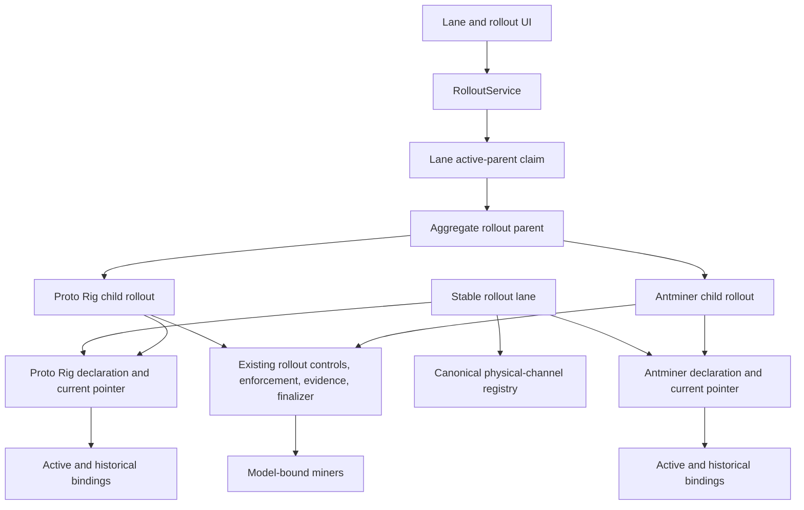
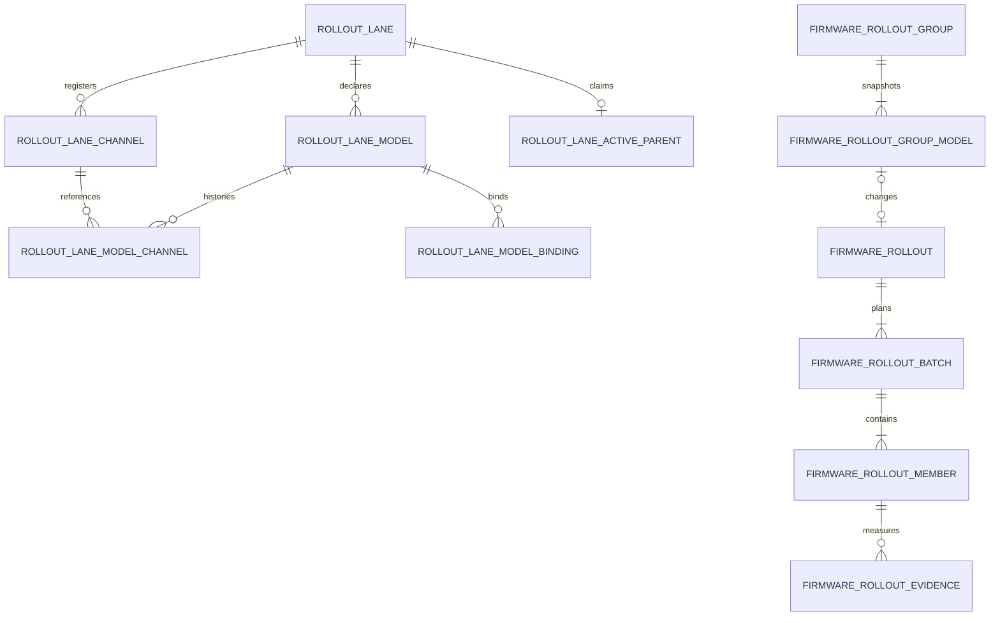
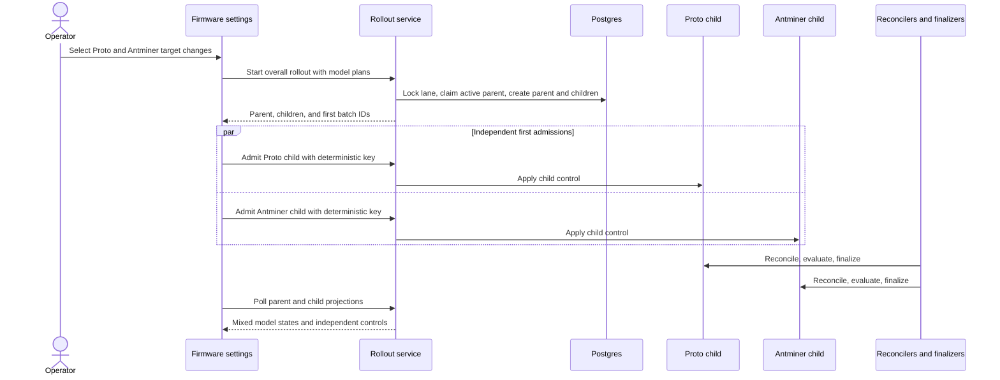

# Multi-model channel rollouts

## Goal Capsule

- **Objective:** One rollout lane manages firmware declarations and independently controlled rollouts for several miner models while presenting one coherent aggregate and one rollout result.
- **Means:** Partition the between-channel lane by model, keep the existing generic rollout as the model child, and add a thin aggregate parent (KTD1, KTD2).
- **Product authority:** `docs/plans/2026-08-12-software-channels-tdd.md` remains authoritative except for its singular Model B lane pointer. This plan supersedes that pointer with per-model pointers until U8 updates the TDD.
- **Safety authority:** Model identity, membership, authority, evidence, controls, and current release pointers are frozen and enforced independently. One model child cannot advance, pause, abort, or revert another.
- **Terminology:** A **rollout lane** is the stable operator-facing aggregate. A **physical channel** is an immutable release channel registered to that lane. Unqualified "channel" is avoided.
- **Execution profile:** This is a deep schema, API, domain, runtime, and UI change for the Model B prototype.
- **Stop condition:** Stop implementation if a model child cannot own a distinct current release pointer or if child controls require a writable parent lifecycle.
- **Tail ownership:** This plan owns implementation, generated output, migrations, deterministic tests, and TDD alignment. Shipping remains a separate user decision.

---

## Product Contract

### Summary

The rollout lane remains one operator-facing mixed-fleet container. It contains only model declarations that an operator explicitly created. Each declaration has its own current firmware target, physical-channel pointer, revision, and active or historical member bindings. Zero-member declarations are valid, and undeclared models are left alone.

Starting an overall rollout selects one or more non-empty changed declarations and creates one independently controlled child for each. The aggregate parent reports combined progress and results but has no controls. A zero-member target change uses a separate metadata-only declaration publication and never creates a parent or child.

### Problem Frame

The TDD and immutable release storage already support several model targets in one release set. The current between-channel implementation does not preserve that model boundary during execution. It has one lane-wide current physical channel, requires all lane models and members to participate in every start, orders all members in one batch sequence, computes evidence at the shared batch level, and returns no first-class model identity on rollout members.

As a result, a rollout lane cannot safely update one model while leaving another unchanged. Simultaneous model changes also appear as one fleet-flat process, so operators cannot see or control the individual firmware transitions the lane is coordinating.

### Product Contract Preservation

This plan extends the TDD with independently controlled per-model rollout behavior. It does not weaken physical-channel exclusivity, per-model declarations, per-miner enforcement, at-most-once firmware dispatch, operator precedence, evidence gating, or selective revert.

### Key Decisions

- **Independent model controls** (session-settled: user-directed - chosen over synchronized shared gates: each changed model must advance and pause without blocking siblings). Governs R6, R7, R8, R11, R12, R13.
- **Aggregate-only parent** (session-settled: user-approved - chosen over parent lifecycle controls: the confirmed scope keeps control authority on model children). Governs R7, R9, R10, R15.
- **One active overall rollout per rollout lane** (session-settled: user-approved - chosen over overlapping parents for disjoint models: one parent keeps membership and aggregate history legible). Governs R5, R14, R16.

### Requirements

**Declarations and membership**

- R1. A rollout lane exposes only explicitly created model declarations. A declaration may have zero members; undeclared models are not inferred from inventory or release metadata.
- R2. Each model declaration owns one current firmware target, current physical-channel pointer, immutable physical-channel history, and optimistic revision.
- R3. Members are grouped by persisted active model bindings with ended historical bindings, not by mutable discovery data.
- R4. Each setup or membership mutation addresses exactly one declaration by declaration ID or idempotency key and expected model revision. Adding an undeclared model, its target, and optional miners is atomic.
- R5. Membership changes are blocked only for a model with active or unsettled child work; disjoint model membership changes may proceed.

**Overall and model rollouts**

- R6. Starting an overall rollout selects one or more changed declarations with members and freezes one child rollout, cohort, batch plan, policy, source, and target for each.
- R7. Every child has its own revision and admit, continue, pause, resume, abort, revert, complete, evidence, and automatic-advance lifecycle.
- R8. Preflight validates every selected child before creating the parent. After creation, each child is admitted separately with an attempt-scoped deterministic key. A typed admission outcome distinguishes committed, definitive rollback, and transaction-outcome-unknown; only definitive rollback increments the attempt, while unknown outcome preserves the started control for reconciliation and replay.
- R9. The parent has no control endpoint or writable lifecycle. It derives lifecycle, activity, attention, terminal outcome, and evidence readiness as separate dimensions.
- R10. Unchanged and undeclared models create no children, move no membership, consume no ownership, and contribute no evidence. A zero-member target change uses metadata-only declaration publication.

**Progress, evidence, and results**

- R11. Live progress is grouped by changed model and shows source-to-target firmware, membership movement, convergence, failures, attention, evidence, and available controls.
- R12. Evidence and hashrate policy evaluation are model-child and child-batch scoped; one model's evidence cannot advance another.
- R13. Abort and revert affect only the child's frozen model members. Abort or revert terminalizes open evidence with a durable cancellation reason and disables automation.
- R14. A lane-level active-parent claim permits one active overall parent per rollout lane. The claim is orchestration metadata, not lifecycle state, and releases only after child ownership, controls, enforcement, finalization, in-flight revert, and required evidence settle.
- R15. Header and results surfaces show one parent with model-state counts. The server derives `result_ready` and a monotonic `result_revision`; client-local acknowledgement stores both only when `result_ready` is true.

**Safety, history, and recovery**

- R16. A model child advances its declaration pointer only when every target member is confirmed and the child completes successfully. `completed_with_failures` leaves the pointer at source, blocks the next child, and can revert only target-bound succeeded members without changing that pointer.
- R17. Canonical model identity is a normalization-versioned key derived from non-empty normalized `discovered_device.manufacturer` and `discovered_device.model` values and matched to the declaration target. Identity freshness uses a dedicated observation timestamp updated only when discovery writes manufacturer and model; stale or empty identity holds pre-dispatch work and defers finalization, while a fresh mismatch becomes terminal attention-required.
- R18. Archive is blocked while any child, control, enforcement, finalization, revert, or evidence window remains active, and archived lane history remains resolvable.
- R19. Parent, child, declaration, membership, control, and model progress reconstruct after restart without client state.
- R20. Migration adds model topology without rewriting immutable history. A persisted cutover record and anomaly rows keep repeated reads and writes disabled until repairs finish and active legacy work drains; completed legacy mixed rollouts remain parentless history.

**API, compatibility, and audit**

- R21. The additive API returns a parent with created children and first-batch IDs, admits each child separately, aggregates children in parent get/list procedures, rejects parent IDs at child controls, hides children from parent lists, and resolves lane lookup from either parent or child ID.
- R22. Deprecated scalar lane fields are returned only while every model pointer is identical. Once pointers diverge, scalar projection is unavailable and legacy flat mutations fail precondition. A single-model legacy write translates to that declaration and uses its model revision; lane aggregate revision is read invalidation only.
- R23. `rollout_lane_channel` remains the canonical lane-owned physical-channel registry. Setup, membership, finalizer, revert, and archive transactions validate physical membership and the active model binding, and direct physical-channel assignment guards reject bypasses.
- R24. Zero-member publication creates an immutable singleton release set and physical channel, registers history, and advances the declaration pointer under model revision and idempotency. It creates no parent, child, cohort, batch, ownership, or evidence.
- R25. Existing rollout activity metadata adds parent ID, child ID, and stable model identity for start, control, finalization, and revert. This is a projection extension, not a new subsystem.
- R26. UI loading, mutation, error, focus, destructive copy, ordering, responsive layout, and accessibility are model-child scoped while the parent summary remains control-free.
- R27. Operators can list cutover anomalies, apply supported model-binding repairs, and enable model topology through authenticated rollout-lane administration procedures; each operation is audited and idempotent.

### Actors

- A1. **Operator:** Declares supported models, assigns miners, starts model changes, and controls each model rollout.
- A2. **Rollout API caller:** Uses the same model-child controls with idempotency and expected revisions.
- A3. **Fleet runtime:** Reconciles firmware, finalizes model membership, evaluates evidence, and derives parent state.
- A4. **Miner:** Reports model identity, firmware identity, and telemetry used for compatibility and evidence.

### Key Flows

- F1. **Add model and members**
  - **Trigger:** A1 selects an undeclared model, firmware, and optional miners.
  - **Steps:** Fleet preflights artifact compatibility and member identity, creates one declaration and singleton physical channel, creates active model bindings, then starts model-scoped setup convergence.
  - **Outcome:** The model is declared even with zero members; selected members converge to its current target.
  - **Covered by:** R1, R2, R3, R4, R5.
- F2. **Start a partial or multi-model rollout**
  - **Trigger:** A1 selects changed models and supplies one target and plan per model.
  - **Steps:** Fleet validates all selected non-empty models, acquires the active-parent claim, snapshots the release vector, atomically creates the parent and children, returns first-batch IDs, then callers admit each child independently.
  - **Outcome:** Unchanged models remain on their current pointers; each changed model begins or exposes a durable created state governed by R8 retry rules.
  - **Covered by:** R6, R8, R10, R14, R21.
- F3. **Operate independent model children**
  - **Trigger:** A1 or A2 controls a child or an evidence policy evaluates a child batch.
  - **Steps:** The child locks only its child row, declaration, source and target physical channels, and sorted devices, then applies its revision, authority, batch, evidence, and control transition.
  - **Outcome:** Sibling children retain their prior state and work.
  - **Covered by:** R7, R8, R11, R12, R13.
- F4. **Advance and aggregate**
  - **Trigger:** A child settles a batch, completes, aborts, or reverts.
  - **Steps:** Fleet advances only a fully successful child's model pointer, terminalizes cancelled evidence when needed, and recomputes each parent projection dimension.
  - **Outcome:** Parent lifecycle, activity, attention, outcome, evidence readiness, and header counts remain truthful without parent control authority.
  - **Covered by:** R9, R13, R15, R16, R19.
- F5. **Publish a zero-member target**
  - **Trigger:** A1 changes the target of a declaration with no active members.
  - **Steps:** A dedicated declaration mutation validates model revision and idempotency, creates singleton immutable release and physical-channel history, and advances the model pointer.
  - **Outcome:** The declaration changes without rollout records or evidence. A request that also starts non-empty models is split into publication and rollout start, not one atomic parent operation.
  - **Covered by:** R2, R10, R24.
- F6. **Revert a terminal child**
  - **Trigger:** A1 requests revert after the child reached a terminal outcome.
  - **Steps:** For successful children, Fleet requires the model pointer to equal the child target. For `completed_with_failures`, Fleet requires the pointer to remain at source and selects only succeeded target-bound members. Both paths reject newer conflicting work and atomically reacquire model-scoped ownership.
  - **Outcome:** Eligible members return to source. Successful-child revert restores the source pointer; split-child revert leaves the source pointer unchanged. Newer work can make either path ineligible.
  - **Covered by:** R7, R13, R14, R16, R18.
- F7. **Cut over legacy topology**
  - **Trigger:** Operators deploy the additive schema and later enable new topology writes.
  - **Steps:** A resumable U1 backfill reports null, ambiguous, and mismatched bindings; supported repairs clear anomalies; the gate also waits for active legacy work to drain.
  - **Outcome:** New writes enable only at zero anomalies and zero active legacy rollouts. Legacy mixed history remains unchanged.
  - **Covered by:** R20, R22, R23, R27.

### Acceptance Examples

- AE1. **Single-model change in a mixed rollout lane**
  - **Given:** A rollout lane declares Proto Rig and Antminer models with members in both.
  - **When:** The operator changes only Proto Rig firmware.
  - **Then:** Fleet creates one Proto Rig child, leaves the Antminer declaration and membership unchanged, and shows only Proto Rig rollout progress.
- AE2. **Two simultaneous model changes**
  - **Given:** Proto Rig and Antminer targets both change.
  - **When:** Fleet creates the overall rollout.
  - **Then:** Two children start independently and the parent shows both model states.
- AE3. **Mixed child states**
  - **Given:** Proto Rig is awaiting review while Antminer is still flashing.
  - **When:** The operator opens the rollout.
  - **Then:** Each model card shows its own state and controls, while the parent reports one review and one running child.
- AE4. **Independent pause**
  - **Given:** Two children are running.
  - **When:** The operator pauses Antminer.
  - **Then:** Proto Rig continues and Antminer alone becomes paused.
- AE5. **Independent abort and revert**
  - **Given:** Proto Rig completed and Antminer is aborted.
  - **When:** The operator reverts Proto Rig.
  - **Then:** Proto Rig restores its source membership and pointer; Antminer and unchanged models do not move.
- AE6. **Add an undeclared model**
  - **Given:** A rollout lane declares only Proto Rig.
  - **When:** The operator adds an Antminer declaration, target, and miners.
  - **Then:** The declaration and membership are created atomically and Antminer setup convergence starts.
- AE7. **Declaration without members**
  - **Given:** A declared model has no miners.
  - **When:** Its firmware target changes.
  - **Then:** Fleet publishes singleton release and physical-channel history and advances only that model pointer without parent, child, cohort, batch, ownership, or evidence rows.
- AE8. **Same-model membership conflict**
  - **Given:** Proto Rig has a nonterminal child and Antminer does not.
  - **When:** Membership edits target both models.
  - **Then:** Proto Rig edits conflict with fresh state, while an isolated Antminer edit may succeed.
- AE9. **Restart before first admission**
  - **Given:** Parent and children were created but one child was not admitted.
  - **When:** Fleet and the browser restart.
  - **Then:** A recoverable pre-enforcement failure exposes child retry, while a started control with an ambiguous response is replayed with the same deterministic key.
- AE10. **Archive safety**
  - **Given:** A child control, enforcement, finalization, revert, or evidence window is still open.
  - **When:** The operator archives the lane.
  - **Then:** Fleet rejects archive and identifies the active model work.
- AE11. **Completed with failures**
  - **Given:** One target member does not confirm and the child completes with failures.
  - **When:** The child finalizes.
  - **Then:** The model pointer remains at source, the model remains split, and starting its next child is blocked. Reverting selects only succeeded target-bound members and leaves the pointer at source; after they return, a new rollout may retry the target.
- AE12. **Identity changes after freeze**
  - **Given:** A frozen member has a stale or empty discovery identity and later reports a fresh non-empty model that differs from its declaration.
  - **When:** Pre-dispatch or finalization compares the dedicated model-identity observation timestamp with its persisted validation boundary.
  - **Then:** Stale or empty identity holds or defers work without dispatch or reassignment; the fresh mismatch terminalizes the member attention-required without retry.
- AE13. **Post-terminal revert eligibility**
  - **Given:** A completed child target still equals the model pointer and no newer conflicting model work exists.
  - **When:** The operator reverts it.
  - **Then:** Fleet reacquires model ownership atomically and reverts it; if newer work starts first, the old revert fails precondition.
- AE14. **Scalar compatibility ends on divergence**
  - **Given:** A lane's two model pointers diverge.
  - **When:** An old client reads and then sends a flat mutation.
  - **Then:** The read marks the scalar unavailable and the mutation fails precondition with guidance to use repeated topology.
- AE15. **Sibling controls do not block**
  - **Given:** Two children are active and a Proto control holds its child, declaration, channels, and devices.
  - **When:** Antminer's control starts.
  - **Then:** It proceeds without waiting on Proto and neither ordinary control locks the lane claim.
- AE16. **Result acknowledgement**
  - **Given:** All children are terminal but required evidence is still open.
  - **When:** The parent result is viewed.
  - **Then:** `result_ready` remains false and acknowledgement is unavailable; after evidence terminalizes, acknowledgement stores parent ID and `result_revision`. A later eligible revert changes the revision and resurfaces the result.
- AE17. **Repair and enable cutover**
  - **Given:** Backfill reports one ambiguous member binding and no active legacy rollout.
  - **When:** An authorized operator assigns the member to a declaration and requests topology enablement.
  - **Then:** The repair is audited and idempotent, readiness reaches zero anomalies, the persisted cutover record enables repeated reads and writes, and a replay returns the same state.

### Success Criteria

- Operators can create and manage a rollout lane containing at least two miner models with distinct firmware declarations.
- A rollout changing one model leaves every other model unchanged and absent from rollout progress.
- Two changed models expose independent controls and truthful mixed states under one parent.
- Per-model pointer, membership, evidence, abort, revert, and history invariants survive restart and concurrent controls.
- Existing single-model lanes migrate without rewriting immutable history, and completed legacy mixed rollouts remain parentless legacy records.

### Scope Boundaries

**In scope**

- Model B lane topology, declaration and membership flows, partial starts, parent-child rollout persistence, child controls, model evidence, aggregate UI, migration, and deterministic tests.
- One active aggregate parent per rollout lane.
- Independent child controls and policies.
- Metadata-only publication for zero-member declaration targets.
- Additive parent and child API contracts and deprecated single-model compatibility.

**Deferred to follow-up work**

- Overlapping aggregate parents for disjoint models in one rollout lane.
- Parent-level pause-all, abort-all, revert-all, or complete-all shortcuts.
- Model-sequential orchestration policies across children.
- Removal of legacy singular lane fields and fallback reads after migration confidence.
- Multi-model Playwright coverage when deterministic fake inventory supports two models.
- Retry for terminal model-identity attention.

**Outside this product's identity**

- Configuration enforcement, PDU firmware, staged one-shot actions, external regression heuristics, and statistical anomaly detection remain outside this plan per the TDD.

---

## Planning Contract

### Key Technical Decisions

- KTD1. **Use per-model lane pointers and physical channels.** (session-settled: user-approved - chosen over one multi-model physical pointer with carry-forward members: independent controls require truthful model-specific current state.) A rollout lane is the stable aggregate; a physical channel is an immutable release channel.
- KTD2. **Keep `firmware_rollout` as the model child.** Existing authorities, batches, members, controls, evidence, finalization, abort, and revert remain child-scoped instead of acquiring model selectors.
- KTD3. **Add a thin aggregate parent and an active-parent claim.** The parent stores start identity and source/target model snapshots. The lane claim enforces one active orchestration and is released only after all required child work settles. Neither stores writable parent lifecycle.
- KTD4. **Persist versioned model identity and binding history.** Canonical v1 normalization applies `lower(btrim(value))` to each non-empty manufacturer and model and encodes the pair as an unambiguous length-prefixed `v1` key. A dedicated `model_identity_observed_at` advances only when discovery ingestion writes manufacturer and model, even when their normalized values are unchanged. The key and timestamp are frozen at validation boundaries.
- KTD5. **Create children only for changed declarations with members.** Unchanged and undeclared models remain untouched. Empty declarations use a separate metadata-only publication.
- KTD6. **Preflight and create atomically, then admit independently.** Admission returns a typed committed, rolled-back, or outcome-unknown result. Rolled-back work restores pending state and increments the persisted attempt counter; outcome-unknown keeps the current key and started control while reconciliation reads batch, member, and enforcement state before replay.
- KTD7. **Scope evidence and policy to model children.** Existing batch evidence remains valid because each child cohort is model-homogeneous. Abort and revert terminalize open evidence and disable automation.
- KTD8. **Derive separate parent dimensions on read.** Lifecycle, activity, attention, terminal outcome, evidence readiness, and `result_ready` are projections. `result_revision` is dismissal metadata incremented transactionally whenever terminal outcome or readiness changes; it is not parent lifecycle.
- KTD9. **Make U1 own additive migration readiness.** Schema, persisted cutover state, anomaly reporting, authenticated repair procedures, backfill, active-legacy drain, and the idempotent enable gate land together; U2 exposes their additive API and operator view.
- KTD10. **Use model-scoped optimistic concurrency and locks.** Same-model writes compare declaration revision. Disjoint writes avoid lane contention, and aggregate revision is read invalidation only.
- KTD11. **Keep API evolution additive during cutover.** Repeated declarations and explicit parent-child messages become authoritative. Deprecated scalar reads remain intentionally available only while pointers are uniform.
- KTD12. **Keep `rollout_lane_channel` canonical.** Model history references the canonical lane-owned physical registry. Every membership-moving transaction proves both physical membership and the active model binding.
- KTD13. **Allow guarded post-terminal child revert.** Successful-child revert requires the pointer at target and restores source. Split-child revert requires the pointer at source, selects only succeeded target-bound members, and leaves the pointer unchanged. Both reject newer conflicting work.
- KTD14. **Do not advance split models.** Only all-member confirmed success advances a model pointer. `completed_with_failures` remains split and blocks the model's next child.
- KTD15. **Keep legacy mixed history parentless.** Parent lists may expose a separate legacy-history section or link to the existing legacy API, but never synthesize false one-model children.

### High-Level Technical Design

### State Derivation

The server derives dimensions independently. `needs_action` is attention metadata, never a lifecycle state.

| Order | Predicate | Lifecycle | Activity | Attention | Evidence readiness |
| --- | --- | --- | --- | --- | --- |
| 1 | Any nonterminal child execution, control, enforcement, or finalization is active | `active` | Highest-priority child activity | True if any child needs operator action | `pending` |
| 2 | Children are terminal and the claim remains only for required evidence | `terminal` | `settled` | Derived from terminal children | `pending` |
| 3 | Claim released and a post-terminal revert is running | `terminal` | `reverting` | Derived from that revert | `pending` |
| 4 | Claim released, no follow-up work, and all required evidence is terminalized | `terminal` | `settled` | Derived from terminal children | `ready`; `result_ready = true` |

Child activity priority is: failed admission, attention-required, review, held or paused, reverting, finalizing, running, created, settled. This priority selects what to show; it does not change lifecycle. `needs_action` is true for failed admission, attention-required, review, held automation, or another child-local operator gate.

Terminal outcome uses this ordered truth table:

| Order | Child outcomes | Parent outcome |
| --- | --- | --- |
| 1 | Any child has no terminal outcome | `pending` |
| 2 | Every child is `successful` | `successful` |
| 3 | Every child is `reverted` | `reverted` |
| 4 | Every child is `aborted` | `aborted` |
| 5 | Every child is `completed_with_failures` | `completed_with_failures` |
| 6 | Every child has the same other unsuccessful terminal outcome | That uniform outcome |
| 7 | Terminal child outcomes differ | `mixed` |

A single unsuccessful child is not mixed. Uniform unsuccessful siblings are not mixed. Post-terminal revert temporarily makes evidence not ready and changes the eventual outcome projection without restoring parent control authority. Every change to terminal outcome or `result_ready` increments `result_revision`, so a previously acknowledged result resurfaces.

### Additive API Contract

- `StartRolloutLane` accepts repeated non-empty model plans. Each plan carries declaration ID, expected model revision, target, batches, evidence policy, and model-scoped start key. The response returns a `FirmwareRolloutGroup` parent, all created child rollouts, and each first-batch ID.
- The caller separately invokes existing `AdmitRollout` for each child ID and first-batch ID. The key is deterministic from child, batch, and persisted admission-attempt counter. Admission order is unconstrained.
- Additive `GetRolloutGroup` and `ListRolloutGroups` procedures return parent summaries and aggregate child projections. Child details are nested or fetched by child ID; child rollouts do not appear as top-level parents.
- Existing admit, continue, pause, resume, abort, revert, and complete procedures accept child rollout IDs and return failed precondition for a parent ID.
- Lane lookup resolves a parent ID or child ID to the same rollout lane.
- Zero-member publication is a declaration procedure, not `StartRolloutLane`. A mixed UI intent performs declaration publication and rollout start as separate operations and reports each result independently.
- Parent list output keeps completed legacy mixed rollouts in a distinct legacy-history section or links to the existing legacy API. It never fabricates parent or child rows.
- Additive topology administration procedures list cutover state and anomalies, repair one binding under expected revision and reason, and enable topology only after the canonical readiness predicate passes.
- Handler, translation, authorization, mapper, and hook tests cover request presence, ID routing, list hiding, lane lookup, deterministic admission, and parent-ID rejection.

### Locking and Ownership

- Aggregate start locks the rollout lane, checks or creates the active-parent claim, then locks selected declarations by canonical model ID, source and target physical channels by ID, and devices by identifier.
- Ordinary child controls lock only the child, its declaration, source and target physical channels, and sorted devices. They do not lock the rollout lane or active-parent claim.
- Claim release and archive lock the rollout lane and claim after proving all child ownership, started controls, enforcement, finalization, in-flight revert, and required evidence are settled.
- Successful-child revert validates that the pointer remains at target. Split-child revert validates that the pointer remains at source and selects only succeeded target-bound members. Both validate newer-work eligibility and reacquire model-scoped ownership in the same transaction.
- Setup, membership, finalizer, revert, and archive validate the device's physical channel through `rollout_lane_channel` and its active model binding. Direct physical-channel assignment and test-support mutation guards reject a physical move that would bypass binding updates.
- Lock tests prove sibling controls do not block, same-model work serializes, concurrent starts produce one claim, crash replay reuses the claim, and claim release cannot race archive.

### Migration and Compatibility

- U1 adds schema in deployable migrations, then runs an idempotent, resumable backfill and readiness workflow. Schema deployment does not fail because data needs repair.
- A persisted cutover-state row remains disabled through schema deployment, backfill, repair, and legacy drain. U2 authoritative reads and every U3 or later topology write check that one gate.
- A readiness query or anomaly table reports null identity, ambiguous target match, mismatched physical membership, missing binding, and duplicate active binding. Each row names supported repair actions: confirm identity, select a declaration, repair physical membership, end a stale binding, or rerun backfill.
- Authenticated rollout-lane administration procedures expose anomaly listing, model-binding repair, and topology enablement. They use expected revision, reason, audit identity, and idempotency instead of direct SQL as the operator workflow.
- Backfill creates declarations from existing release targets, points each declaration at the shared legacy physical channel, registers that channel once in `rollout_lane_channel`, adds model history references, and creates one active binding per current member.
- Active bindings use `ended_at IS NULL` with partial uniqueness per lane and device. Membership movement ends the old binding and creates the new binding. Archive ends active bindings but preserves history.
- Completed legacy mixed rollouts and their immutable channels remain unchanged and parentless. New singleton release sets and physical channels are created only for future per-model target changes.
- New-topology writes stay disabled until the readiness report has zero anomalies and all active legacy rollouts drain. The gate is safe to rerun after partial backfill or deployment restart.
- Repeated model topology becomes authoritative only after the persisted cutover state is enabled. Deprecated scalar projection is returned only if every declaration points to the same physical channel; otherwise the response marks it unavailable.
- Once scalar projection is unavailable, legacy flat create, membership, start, and target mutations fail precondition and direct callers must use repeated topology.
- For exactly one declared model, a supported legacy flat write translates to one model mutation. Its legacy expected revision is interpreted as the declaration revision, never the lane aggregate revision.
- Lane aggregate revision changes for read-cache invalidation only. The database `rollout_lane.current_channel_id` may remain as a representative compatibility value but is not authoritative and must not drive writes.

### Alternative Approaches Considered

- **Derived model grouping on the current rollout:** useful for read-only visualization, but it cannot support independent revision, authority, pause, abort, revert, or pointer advancement.
- **One multi-model target physical channel with carry-forward members:** appears smaller but creates false member success, no-op evidence, unnecessary membership churn, and ambiguous pointer state after one child aborts.
- **Per-model pointers and ordinary child rollouts (recommended):** more explicit schema work, but existing rollout safety machinery remains scoped to truthful model boundaries.

### System-Wide Impact

- **Data model:** Lane identity becomes one-to-many with model declarations and active or historical bindings; overall rollout identity becomes one-to-many with existing child rollouts.
- **API:** Lane reads, start requests, rollout reads, list filters, status pills, and control routing gain model and parent-child identity.
- **Runtime:** Reconciler and evidence work remain child-scoped. Identity is checked before dispatch and at finalization. Parent reads aggregate indexed children.
- **Membership:** Device exclusivity remains global, while binding history, compatibility, and active-work blocking are model-scoped.
- **RBAC:** Existing physical-channel and rollout permissions remain organization-scoped. Resource-instance permissions remain deferred with the TDD.
- **Operations:** Migration must expose unmapped legacy members before write cutover and preserve archived-lane history lookup.

### Risks and Mitigations

- **Legacy model ambiguity:** Deploy schema first, report repairable anomalies, and keep new writes gated instead of making migration deployment fail.
- **Mixed topology during deployment:** Feature writes remain disabled until model rows are backfilled and all server writers understand the new topology.
- **Parent projection cost:** Index child rows by parent and state; list APIs return bounded summaries and hydrate details only on demand.
- **Cross-model lock cycles:** Use the lock order in this plan and keep ordinary child controls off the lane lock.
- **First-admission partial failure:** Restore pre-enforcement state for retry, preserve started controls for ambiguous replay, and terminalize identity mismatch.
- **History lookup after archive:** Historical parent and child reads include archived lanes by immutable identity instead of active-lane filters.
- **Fake inventory limits:** Multi-model behavior is proven in domain, SQL integration, handler, mapper, component, and Storybook tests until E2E inventory is deterministic.

### Sequencing

1. U1 adds topology, backfill, anomaly reporting, legacy drain, and cutover readiness.
2. U2 exposes authoritative repeated reads and a useful grouped declaration UI.
3. U3 enables one-declaration membership writes and the complete declaration workflow.
4. U4 delivers one selected model through parent creation, child admission, execution, finalization, and one child card.
5. U5 adds simultaneous children, mixed aggregate projection, parent results, and the header pill.
6. U6 hardens evidence cancellation, admission recovery, post-terminal revert, locking, archive, activity, and restart behavior.
7. U7 closes compatibility and migration validation with deterministic domain, integration, component, and Storybook proof.
8. U8 updates the TDD and runs the existing single-model E2E unchanged as regression. Multi-model E2E remains deferred.

---

## Implementation Units

### U1. Add topology and cutover readiness

- **Goal:** Deploy durable model topology and make legacy data repairable and ready for read cutover without enabling new writes.
- **Requirements:** R1, R2, R3, R14, R19, R20, R23, R27; KTD1, KTD3, KTD4, KTD9, KTD12, KTD15.
- **Dependencies:** None.
- **Files:**
  - `server/migrations/000156_multi_model_rollout_topology.up.sql`
  - `server/migrations/000156_multi_model_rollout_topology.down.sql`
  - `server/migrations/000157_multi_model_rollout_indexes.up.sql`
  - `server/migrations/000157_multi_model_rollout_indexes.down.sql`
  - `server/sqlc/queries/rollout_lane.sql`
  - `server/sqlc/queries/discovered_device.sql`
  - `proto/rollout/v1/rollout.proto`
  - `server/internal/domain/rollout/models.go`
  - `server/internal/domain/rollout/betweenchannel/models.go`
  - `server/internal/domain/stores/sqlstores/rollout_lane.go`
  - `server/internal/domain/stores/sqlstores/rollout_lane_integration_test.go`
  - `server/internal/handlers/rollout/handler.go`
  - `server/internal/handlers/rollout/handler_test.go`
  - `server/internal/handlers/middleware/rpc_permissions.go`
  - `server/internal/handlers/middleware/rpc_permissions_test.go`
  - `server/generated/sqlc/**`
  - `server/generated/**`
- **Approach:**
  1. Add declarations, canonical v1 model keys, dedicated model-identity observation time, model physical-channel history, active or ended model bindings, aggregate parents with result revision, parent-model snapshots, and the lane active-parent claim.
  2. Keep `rollout_lane_channel` as the canonical immutable physical registry. Model history references its lane, organization, and physical-channel key.
  3. Enforce one declaration per canonical model, one active binding per lane and device with `ended_at IS NULL`, one child per parent and model, and one lane claim.
  4. Backfill declarations from current release targets, register shared legacy physical channels once, create model history, and bind current members without rewriting channels, releases, rollout rows, or audit rows.
  5. Persist cutover state and anomalies for null, ambiguous, duplicate, and mismatched bindings. Return supported repair actions instead of failing schema deployment.
  6. Add authenticated, audited, idempotent procedures to list anomalies, repair one binding, and enable cutover after the canonical predicate reaches zero anomalies and zero active legacy work.
- **Execution note:** Start with migration tests for single-model, mixed-target, archived, anomalous, and active-legacy fixtures. Recheck migration numbers before implementation.
- **Patterns to follow:** Immutable attachments in migration `000151`, archive lifecycle in `000152`, membership audit in `000153`, additive indexes in `000155`, and organization-scoped composite foreign keys.
- **Test scenarios:**
  - Schema deploys with a repairable ambiguous legacy member and readiness reports it.
  - Rerunning backfill creates no duplicate declarations, history, registry rows, or bindings.
  - A shared legacy physical channel is registered once and referenced by two declarations.
  - Active binding partial uniqueness rejects duplicate live bindings while ended history remains.
  - An IP or firmware-only discovery update does not advance model identity time; a discovery write containing manufacturer and model does.
  - Archive ends active bindings and preserves history.
  - Active legacy rollout work keeps cutover closed after anomalies reach zero.
  - Authorized repair updates one binding and audit row; stale revision and unauthorized calls change nothing.
  - Permission registration exposes readiness and repair only to the existing rollout-lane management role.
  - Enablement fails while an anomaly or legacy active row remains and replays safely after success.
  - Completed legacy mixed rollouts and physical channels remain unchanged and parentless.
  - Concurrent parent claim inserts allow one winner, and crash replay recovers the same claim.
  - Parent result revision changes only when terminal outcome or readiness changes and does not create a control transition.
  - Down migration refuses destructive rollback after new topology history exists.
- **Verification:** Migration, handler, and sqlc integration tests prove deployability, audited anomaly repair, resumable enablement, drain gating, constraints, and immutable legacy history.

### U2. Expose topology and grouped declarations

- **Goal:** Make repeated model topology authoritative on reads and render a useful model-first declaration view before enabling model writes.
- **Requirements:** R1, R2, R3, R19, R20, R22, R23, R26, R27; KTD1, KTD4, KTD9, KTD11, KTD12, KTD15.
- **Dependencies:** U1.
- **Files:**
  - `proto/rollout/v1/rollout.proto`
  - `server/sqlc/queries/rollout_lane.sql`
  - `server/internal/domain/rollout/betweenchannel/store.go`
  - `server/internal/domain/rollout/betweenchannel/service.go`
  - `server/internal/domain/stores/sqlstores/rollout_lane.go`
  - `server/internal/handlers/rollout/translate.go`
  - `server/internal/handlers/rollout/handler_test.go`
  - `client/src/protoFleet/api/rolloutMappers.ts`
  - `client/src/protoFleet/api/rolloutMappers.test.ts`
  - `client/src/protoFleet/api/useRolloutApi.ts`
  - `client/src/protoFleet/api/useRolloutApi.test.ts`
  - `client/src/protoFleet/features/rollout/rolloutTypes.ts`
  - `client/src/protoFleet/features/rollout/betweenChannel/RolloutLanesTable.tsx`
  - `client/src/protoFleet/features/rollout/betweenChannel/RolloutLanesTable.test.tsx`
  - `client/src/protoFleet/features/rollout/betweenChannel/RolloutLanesTab.tsx`
  - `client/src/protoFleet/features/rollout/betweenChannel/RolloutLanesTab.test.tsx`
  - `server/generated/**`
  - `client/src/protoFleet/api/generated/**`
- **Approach:**
  1. Add repeated declarations with stable model ID, declaration revision, target, current physical channel, member count, active and historical binding summaries, and convergence state.
  2. Return deprecated scalar fields only when every declaration pointer is identical and include explicit scalar availability. Treat `rollout_lane.current_channel_id` as representative only.
  3. Give U2 no migration ownership. Its server scope is additive API and read cutover after persisted enablement; every pre-enable read stays on legacy authority.
  4. Render labelled model sections showing model, firmware, member count, compatibility, and per-model preview. Show zero-member declarations and no-lane and no-compatible-firmware states.
  5. Show a rollout-lane administration callout before enablement. Authorized operators can inspect anomalies, apply supported repairs, and request enablement; other users see read-only readiness.
  6. Keep completed legacy mixed rollouts in an existing legacy view or a separate legacy-history section.
- **Test scenarios:**
  - A backfilled two-target lane returns two declarations that reference one shared legacy physical channel.
  - A single-model lane returns repeated topology plus available deprecated scalar fields.
  - Divergent pointers mark scalar projection unavailable.
  - Disabled cutover keeps legacy reads authoritative even when backfill rows exist.
  - An authorized operator repairs one anomaly and enables cutover; stale, forbidden, and still-not-ready actions stay local to the callout.
  - Archived lane reads retain declaration and binding history.
  - Initial load, no lanes, zero members, no compatible firmware, stale polling, and parent read failure render deterministic states.
  - Parentless legacy mixed history never appears as synthesized one-model children.
- **Verification:** Proto, generated output, handlers, mappers, and grouped table components agree on repeated authority and scalar presence semantics.

### U3. Enable declaration and membership writes

- **Goal:** Complete one-model-at-a-time declaration, target publication, and membership mutations with model-scoped concurrency.
- **Requirements:** R1, R2, R3, R4, R5, R10, R17, R22, R23, R24, R26; KTD1, KTD4, KTD5, KTD10, KTD11, KTD12.
- **Dependencies:** U1, U2.
- **Files:**
  - `proto/rollout/v1/rollout.proto`
  - `server/sqlc/queries/rollout_lane.sql`
  - `server/internal/domain/rollout/betweenchannel/models.go`
  - `server/internal/domain/rollout/betweenchannel/service.go`
  - `server/internal/domain/rollout/betweenchannel/service_test.go`
  - `server/internal/domain/rollout/betweenchannel/membership_service_test.go`
  - `server/internal/domain/stores/sqlstores/rollout_lane.go`
  - `server/internal/domain/stores/sqlstores/rollout_lane_membership_test.go`
  - `server/internal/domain/stores/sqlstores/rollout_lane_membership_integration_test.go`
  - `server/internal/handlers/rollout/handler.go`
  - `server/internal/handlers/rollout/handler_test.go`
  - `client/src/protoFleet/api/useRolloutApi.ts`
  - `client/src/protoFleet/api/useRolloutApi.test.ts`
  - `client/src/protoFleet/api/rolloutLaneAssignments.ts`
  - `client/src/protoFleet/api/rolloutLaneAssignments.test.ts`
  - `client/src/protoFleet/features/rollout/betweenChannel/CreateRolloutLaneModal.tsx`
  - `client/src/protoFleet/features/rollout/betweenChannel/CreateRolloutLaneModal.test.tsx`
  - `client/src/protoFleet/features/rollout/betweenChannel/ManageRolloutLaneMembersModal.tsx`
  - `client/src/protoFleet/features/rollout/betweenChannel/ManageRolloutLaneMembersModal.test.tsx`
- **Approach:**
  1. Accept exactly one declaration per mutation, addressed by declaration ID or declaration key, expected model revision, and idempotency key. Reject lane aggregate revision as write authority.
  2. For a new declaration, atomically create the declaration, singleton release set, physical channel, canonical registry and history rows, optional active bindings, and setup convergence.
  3. For a zero-member target change, publish declaration metadata and advance the model pointer without parent, child, cohort, batch, ownership, or evidence.
  4. End old bindings and create new active bindings in the same transaction as physical membership. Validate model identity and both representations before setup, update, and removal.
  5. Extend direct physical-channel assignment guards so no caller can move a lane-owned device between physical channels without a matching binding transition.
  6. Translate a supported single-model legacy write to this model mutation using the model revision. Reject legacy flat writes once scalar projection is unavailable.
  7. Build model-first declaration sections. "Add model" excludes existing declarations, permits zero miners, and shows model, firmware, optional compatible miners, and a per-model preview before confirmation.
  8. Keep empty-model target publication in its declaration flow. A user intent that also starts a rollout executes and reports two independent operations.
- **Test scenarios:**
  - Create Proto and Antminer through two declaration mutations, including one zero-member declaration.
  - Add and remove members while preserving ended binding history.
  - Add an undeclared model and optional miners atomically.
  - Publish a zero-member target with replay-safe revision and idempotency.
  - Reject mismatched model identity, physical-only assignment, binding-only assignment, stale model revision, and flat divergent mutation.
  - Concurrent same-model writes produce one success and one conflict.
  - Concurrent disjoint-model writes both complete without lane revision contention.
  - Same-model active child work blocks membership while disjoint membership proceeds.
  - Setup, membership, archive, and direct assignment tests assert physical membership and active binding agree.
- **Verification:** Dedicated membership domain and SQL tests prove atomicity, historical bindings, model-scoped locks, exclusivity, setup convergence, zero-member publication, and compatibility behavior.

### U4. Deliver one-model parent and child path

- **Goal:** Start one selected non-empty model, run its independently admitted child to a truthful terminal outcome, and render one child card under a control-free parent.
- **Requirements:** R6, R7, R8, R9, R10, R14, R16, R17, R19, R21, R23, R26; KTD2, KTD3, KTD4, KTD5, KTD6, KTD10, KTD12, KTD14.
- **Dependencies:** U1, U2, U3.
- **Files:**
  - `proto/rollout/v1/rollout.proto`
  - `server/sqlc/queries/rollout.sql`
  - `server/sqlc/queries/rollout_lane.sql`
  - `server/sqlc/queries/discovered_device.sql`
  - `server/sqlc/queries/channel_enforcement.sql`
  - `server/internal/domain/rollout/models.go`
  - `server/internal/domain/rollout/store.go`
  - `server/internal/domain/rollout/service.go`
  - `server/internal/domain/rollout/service_test.go`
  - `server/internal/domain/rollout/betweenchannel/models.go`
  - `server/internal/domain/rollout/betweenchannel/store.go`
  - `server/internal/domain/rollout/betweenchannel/service.go`
  - `server/internal/domain/rollout/betweenchannel/service_test.go`
  - `server/internal/domain/rollout/betweenchannel/strategy.go`
  - `server/internal/domain/rollout/betweenchannel/finalizer.go`
  - `server/internal/domain/rollout/betweenchannel/finalizer_test.go`
  - `server/internal/domain/channel/reconciler/reconciler.go`
  - `server/internal/domain/channel/reconciler/reconciler_test.go`
  - `server/internal/domain/stores/sqlstores/rollout.go`
  - `server/internal/domain/stores/sqlstores/rollout_lane.go`
  - `server/internal/domain/stores/sqlstores/rollout_integration_test.go`
  - `server/internal/domain/stores/sqlstores/rollout_lane_integration_test.go`
  - `server/internal/domain/stores/sqlstores/channel_enforcement.go`
  - `server/internal/domain/stores/sqlstores/channel_enforcement_integration_test.go`
  - `server/internal/handlers/rollout/handler.go`
  - `server/internal/handlers/rollout/translate.go`
  - `server/internal/handlers/rollout/handler_test.go`
  - `server/generated/**`
  - `client/src/protoFleet/api/useRolloutApi.ts`
  - `client/src/protoFleet/api/useRolloutApi.test.ts`
  - `client/src/protoFleet/api/rolloutMappers.ts`
  - `client/src/protoFleet/api/rolloutMappers.test.ts`
  - `client/src/protoFleet/api/generated/**`
  - `client/src/protoFleet/features/rollout/betweenChannel/StartRolloutLaneModal.tsx`
  - `client/src/protoFleet/features/rollout/betweenChannel/StartRolloutLaneModal.test.tsx`
  - `client/src/protoFleet/features/rollout/betweenChannel/BetweenChannelRolloutStatus.tsx`
  - `client/src/protoFleet/features/rollout/betweenChannel/BetweenChannelRolloutStatus.test.tsx`
- **Approach:**
  1. Implement the additive start response with parent, created child, and first-batch ID. Keep zero-member publication outside start.
  2. Under the lane lock, acquire the active-parent claim, validate one selected declaration, snapshot model identity and source or target, register the target physical channel, and create parent, child, cohort, and batches atomically.
  3. Extend admission strategy and transaction boundaries with typed committed, rolled-back, and outcome-unknown results. Rolled-back work writes failed audit, restores pending state, increments the attempt counter, and derives the next key; outcome-unknown preserves the current started key until reconciliation proves committed or rolled back.
  4. Before dispatch, compare `model_identity_observed_at` with the persisted admission validation boundary. At finalization, compare it with command completion. Stale or empty identity holds or defers; a fresh normalized match proceeds; a fresh mismatch terminalizes attention-required without retry.
  5. Finalization validates physical membership and active binding, moves both atomically, and advances the model pointer only after all target members confirm.
  6. Render parent details followed by selectable model rows with current target, member count, and eligibility. A selected row exposes target, batching, evidence settings, and final review. After start, render one model-labelled child card with all controls on the child.
- **Test scenarios:**
  - Start only Proto in a lane that also declares Antminer and leave Antminer untouched.
  - Return parent, child, and first-batch ID, then reject the parent ID at every child control.
  - Replay parent start and child admission without duplicates.
  - Preserve the failed attempt audit, increment the attempt counter, derive a new retry key, and leave replay of the old key on the old failure.
  - Preserve a started control after an ambiguous response and complete it by replay.
  - Classify a transaction rollback as definitive and a commit-result error as outcome-unknown; reconcile the latter from durable batch, member, enforcement, and control state before replay.
  - Hold pre-dispatch work and defer finalization for stale or empty identity until `model_identity_observed_at` crosses the relevant boundary.
  - Terminalize a fresh non-empty normalized mismatch before dispatch and at finalization with no retry action.
  - Complete only when all members confirm; keep `completed_with_failures` split and do not advance the pointer.
  - Reconstruct parent, child, batch, claim, and focused child card after restart.
- **Verification:** One deterministic server and component chain proves the complete one-selected-model path before simultaneous children are added.

### U5. Add simultaneous children and aggregate UI

- **Goal:** Run several model children independently and present truthful aggregate state, results, activity, and header entry points.
- **Requirements:** R7, R9, R11, R14, R15, R16, R19, R21, R25, R26; KTD2, KTD3, KTD8, KTD10, KTD11, KTD14.
- **Dependencies:** U4.
- **Files:**
  - `proto/rollout/v1/rollout.proto`
  - `proto/activity/v1/activity.proto`
  - `server/sqlc/queries/rollout.sql`
  - `server/sqlc/queries/activity.sql`
  - `server/internal/domain/rollout/models.go`
  - `server/internal/domain/rollout/service.go`
  - `server/internal/domain/rollout/service_test.go`
  - `server/internal/domain/activity/models/models.go`
  - `server/internal/domain/stores/sqlstores/rollout.go`
  - `server/internal/domain/stores/sqlstores/activity.go`
  - `server/internal/domain/stores/sqlstores/activity_search_integration_test.go`
  - `server/internal/handlers/rollout/handler.go`
  - `server/internal/handlers/rollout/handler_test.go`
  - `server/internal/handlers/middleware/rpc_permissions.go`
  - `server/internal/handlers/middleware/rpc_permissions_test.go`
  - `server/generated/**`
  - `client/src/protoFleet/features/rollout/rolloutTypes.ts`
  - `client/src/protoFleet/api/useRolloutApi.ts`
  - `client/src/protoFleet/api/useRolloutApi.test.ts`
  - `client/src/protoFleet/api/rolloutMappers.ts`
  - `client/src/protoFleet/api/rolloutMappers.test.ts`
  - `client/src/protoFleet/features/rollout/betweenChannel/StartRolloutLaneModal.tsx`
  - `client/src/protoFleet/features/rollout/betweenChannel/StartRolloutLaneModal.test.tsx`
  - `client/src/protoFleet/features/rollout/betweenChannel/BetweenChannelRolloutStatus.tsx`
  - `client/src/protoFleet/features/rollout/betweenChannel/BetweenChannelRolloutStatus.test.tsx`
  - `client/src/protoFleet/features/rollout/ViewRolloutModal.tsx`
  - `client/src/protoFleet/features/rollout/ViewRolloutModal.test.tsx`
  - `client/src/protoFleet/features/rollout/RolloutPill.tsx`
  - `client/src/protoFleet/features/rollout/RolloutPill.test.tsx`
  - `client/src/protoFleet/components/PageHeader/useRolloutPillData.ts`
  - `client/src/protoFleet/components/PageHeader/useRolloutPillData.test.tsx`
  - `client/src/protoFleet/features/rollout/rolloutResultAcknowledgement.ts`
  - `client/src/protoFleet/features/rollout/rolloutResultAcknowledgement.test.ts`
  - `client/src/protoFleet/features/activity/utils/formatActivityDescription.ts`
  - `client/src/protoFleet/features/activity/utils/formatActivityDescription.test.ts`
  - `client/src/protoFleet/features/rollout/betweenChannel/BetweenChannelRollout.stories.tsx`
  - `client/src/protoFleet/api/generated/**`
- **Approach:**
  1. Create all selected valid children and first batches under one parent transaction, then admit children independently.
  2. Add `GetRolloutGroup` and `ListRolloutGroups` aggregation, hide children from top-level parent lists, resolve lane lookup for either ID, and expose legacy history separately.
  3. Derive lifecycle, activity, attention, outcome, evidence readiness, `result_ready`, and monotonic `result_revision` by the ordered tables in this plan. Keep `needs_action` orthogonal.
  4. Extend existing activity metadata with parent ID, child ID, and canonical model ID for start, controls, finalization, and revert. Add projection and formatter tests without a new activity subsystem.
  5. Key client mutation state by child and model. Sort child cards action-required first, then active, then terminal. Keep parent summary control-free.
  6. Use a URL parent ID plus optional focused child ID. Opening a pill loads the parent then expands and focuses the requested child. Expansion uses `aria-expanded` and `aria-controls`; closing a child action restores focus to its trigger.
  7. Show one parent pill with priority and model counts. Results show parent summary then model rows. Store client-local acknowledgement by parent ID and `result_revision` only when server `result_ready` is true.
- **UI state matrix:**
  - Initial parent load and independent child-detail load.
  - No lanes, zero members, and no compatible firmware.
  - Parent failure and child-only failure.
  - Stale polling and failed admission.
  - Mixed active and mixed terminal.
  - Child-only loading, error, and retry preserve already loaded siblings.
- **Interaction and accessibility contract:**
  - Destructive confirmation names the model and affected member count.
  - Every model section is labelled; controls include the model name.
  - One deduplicated polite live region announces meaningful child changes, not routine polling.
  - At phone width, sections stack, the primary action remains visible, and destructive actions move to overflow.
- **Test scenarios:**
  - Start Proto and Antminer with different targets, batches, and evidence policies.
  - Admit one child while the sibling remains created, then run both independently.
  - Show Proto review while Antminer runs and keep sibling controls responsive.
  - Derive successful, reverted, uniform aborted, uniform failed, and genuinely mixed outcomes.
  - Never call a single or uniform unsuccessful outcome mixed.
  - Load parent successfully while one child detail fails, retry only that child, and preserve the sibling.
  - Reopen a URL-focused child and restore expansion and focus.
  - A pill click opens the parent and focused action-required child.
  - Acknowledge only a ready parent ID and revision, then resurface the result after an eligible revert changes that revision.
  - Show a split `completed_with_failures` model, explain why its next start is blocked, and retain sibling controls.
  - Format activity with parent, child, and model identity.
- **Verification:** Focused domain, handler, mapper, hook, component, accessibility, and Storybook tests prove simultaneous children and aggregate presentation.

### U6. Harden evidence, revert, locks, and archive

- **Goal:** Close concurrency and recovery gaps after the vertical flows work.
- **Requirements:** R7, R8, R12, R13, R14, R15, R16, R17, R18, R19, R23; KTD6, KTD7, KTD8, KTD10, KTD12, KTD13, KTD14.
- **Dependencies:** U5.
- **Files:**
  - `server/sqlc/queries/rollout_lane.sql`
  - `server/sqlc/queries/rollout.sql`
  - `server/sqlc/queries/rollout_evidence.sql`
  - `server/internal/domain/rollout/betweenchannel/strategy.go`
  - `server/internal/domain/rollout/betweenchannel/service_test.go`
  - `server/internal/domain/rollout/betweenchannel/finalizer.go`
  - `server/internal/domain/rollout/betweenchannel/finalizer_test.go`
  - `server/internal/domain/rollout/evidence/models.go`
  - `server/internal/domain/rollout/evidence/store.go`
  - `server/internal/domain/rollout/evidence/evaluator.go`
  - `server/internal/domain/rollout/evidence/evaluator_test.go`
  - `server/internal/domain/stores/sqlstores/rollout.go`
  - `server/internal/domain/stores/sqlstores/rollout_lane.go`
  - `server/internal/domain/stores/sqlstores/rollout_lane_transition_test.go`
  - `server/internal/domain/stores/sqlstores/rollout_lane_integration_test.go`
  - `server/internal/domain/stores/sqlstores/rollout_lane_archive_integration_test.go`
  - `server/internal/domain/stores/sqlstores/rollout_evidence.go`
  - `server/internal/domain/stores/sqlstores/rollout_evidence_integration_test.go`
- **Approach:**
  1. Scope evidence candidates, dwell, automation, and CAS controls to child and batch. Never aggregate hashrate deltas across models.
  2. On abort or revert, immediately terminalize open evidence with a durable cancellation reason and disable automatic controls.
  3. Release the active-parent claim only after every child owner, started control, enforcement, finalization, in-flight revert, and required evidence row settles.
  4. For successful-child revert, require the pointer at target and restore source. For split-child revert, require the pointer at source, select only succeeded target-bound members, and leave the pointer unchanged. Reacquire ownership atomically and reject either path if newer work wins.
  5. Apply the model-only lock order for ordinary controls and reserve lane or claim locks for aggregate start, claim release, and archive.
  6. End active bindings during archive while retaining history and validate physical registry plus binding before every finalizer, revert, and archive move.
- **Test scenarios:**
  - Abort and revert terminalize baseline and post evidence, record cancellation reason, disable automation, and make readiness decidable.
  - Hold Proto evidence while Antminer auto-continues.
  - Recover stale dwell and ambiguous controls without changing sibling state.
  - Run sibling pause or continue transactions concurrently and prove neither blocks on lane or sibling locks.
  - Race same-model control, finalization, membership, and revert safely.
  - Permit successful-child revert only from the target pointer, then reject it after newer model work or pointer movement.
  - Revert only target-bound successes from a split `completed_with_failures` child, leave the source pointer unchanged, and unblock a new rollout only after the split closes.
  - Race two starts and get one active-parent claim; replay a crash without a second parent.
  - Reject archive separately for active child control, enforcement, finalization, revert, and evidence.
  - Archive succeeds after all five categories settle, releases the claim, ends active bindings, and keeps history resolvable.
  - Restart with one running child, one created child, one started ambiguous control, and open evidence.
- **Verification:** SQL integration and domain tests prove lock scope, nonblocking siblings, cancellation closure, revert eligibility, claim release, archive completeness, and restart recovery.

### U7. Validate cutover and deterministic journeys

- **Goal:** Prove the migration and complete multi-model behavior without adding multi-model browser automation.
- **Requirements:** R1 through R27; KTD1 through KTD15.
- **Dependencies:** U1 through U6.
- **Files:**
  - `server/internal/domain/stores/sqlstores/rollout_lane_integration_test.go`
  - `server/internal/domain/stores/sqlstores/rollout_lane_membership_integration_test.go`
  - `server/internal/domain/stores/sqlstores/rollout_lane_archive_integration_test.go`
  - `server/internal/domain/stores/sqlstores/rollout_evidence_integration_test.go`
  - `server/internal/handlers/rollout/handler_test.go`
  - `client/src/protoFleet/api/rolloutMappers.test.ts`
  - `client/src/protoFleet/api/useRolloutApi.test.ts`
  - `client/src/protoFleet/features/rollout/betweenChannel/StartRolloutLaneModal.test.tsx`
  - `client/src/protoFleet/features/rollout/betweenChannel/BetweenChannelRolloutStatus.test.tsx`
  - `client/src/protoFleet/components/PageHeader/useRolloutPillData.test.tsx`
  - `client/src/protoFleet/features/rollout/betweenChannel/BetweenChannelRollout.stories.tsx`
- **Approach:**
  1. Run the U1 migration fixtures through anomaly repair, legacy drain, repeatable cutover, single-model compatibility, divergent scalar rejection, and archive.
  2. Cover partial start, simultaneous children, admission recovery, independent controls, identity mismatch, pointer isolation, split failures, mixed results, result readiness, restart, and post-terminal revert in deterministic server tests.
  3. Cover every UI matrix state, focus behavior, phone layout, accessibility, parent pill, results, and child-local errors in component and Storybook tests.
  4. Keep multi-model Playwright implementation deferred.
- **Test scenarios:**
  - Migrate a legacy lane, repair an anomaly, drain active legacy work, rerun cutover, and roll only one model.
  - Preserve completed legacy mixed history without parent or child synthesis.
  - Run two children independently through review, abort, completion, split failure, and revert.
  - Restart and archive only after every work and evidence predicate settles.
  - Exercise all UI matrix rows with loaded sibling preservation.
- **Verification:** Deterministic Go, SQL, handler, Vitest, accessibility, and Storybook proof covers the complete contract.

### U8. Align the TDD and retain regression coverage

- **Goal:** Replace the origin TDD's singular Model B pointer with the implemented topology and close documentation drift.
- **Requirements:** R1 through R27; KTD1 through KTD15.
- **Dependencies:** U1 through U7.
- **Files:**
  - `docs/plans/2026-08-12-software-channels-tdd.md`
- **Approach:**
  1. Update Model B terminology, interfaces, diagrams, pointer authority, compatibility, migration, validation, and historical policy after implementation matches this plan.
  2. Record that a rollout lane is the stable aggregate and physical channels are immutable per-model release channels.
  3. Run the existing single-model E2E unchanged as regression. Do not add or modify multi-model Playwright files in this unit.
- **Test scenarios:**
  - TDD interfaces and diagrams match implemented parent, child, declaration, binding, claim, and pointer authority.
  - Existing single-model E2E passes unchanged.
  - Multi-model E2E remains explicitly deferred.
- **Verification:** Documentation review, generated consistency, targeted deterministic suites, full lint, client build, and unchanged single-model E2E pass without visual snapshot refresh.

---

## Verification Contract

- Run `just gen` after every proto, migration, or sqlc source change and review generated Go and TypeScript output with the source.
- Run model topology, anomaly readiness, legacy drain, lane membership, parent claim, parent creation, child control, admission recovery, identity, finalizer, evidence cancellation, revert, archive, and restart database integration suites with TimescaleDB.
- Run rollout domain, handler, runtime job, and authorization tests for every new or changed procedure.
- Run focused client mapper, API hook, declaration, membership, start, child detail, aggregate status, result, pill, activity formatter, accessibility, responsive, and Storybook tests.
- Run `npm run build:protoFleet`, `just lint`, and the existing single-model E2E unchanged as regression.
- Do not add multi-model Playwright implementation in this plan.
- Recheck migration prefixes against `origin/main` before landing and keep concurrent index operations in dedicated migrations.
- Do not refresh visual snapshot baselines for this work.

---

## Definition of Done

- U1: Schema, backfill, anomaly repair, legacy drain, bindings, physical registry, parent claim, and resumable cutover readiness are proven.
- U2: Repeated topology is authoritative on reads and grouped declarations are useful before new writes.
- U3: One-declaration setup, membership, zero-member publication, historical binding, and compatibility writes are model-scoped and atomic.
- U4: One selected model completes the parent and child path with deterministic admission recovery and identity enforcement.
- U5: Simultaneous children expose independent controls and truthful aggregate, activity, result, pill, focus, and accessibility behavior.
- U6: Evidence cancellation, post-terminal revert, lock scope, claim release, split failure, archive, and restart invariants are proven.
- U7: Migration and multi-model journeys have deterministic domain, SQL, handler, component, accessibility, and Storybook coverage.
- U8: The TDD matches implemented Model B topology and the existing single-model E2E remains unchanged and green.
- Existing firmware authority, at-most-once dispatch, curtailment precedence, idempotency, audit identity, and selective revert tests remain green.
- Intentional deprecated compatibility reads remain only under the uniform-pointer rule. No incomplete new-topology path remains.
- Generated output is source-consistent, no unrelated file or RFC draft is changed, and multi-model E2E remains deferred.
