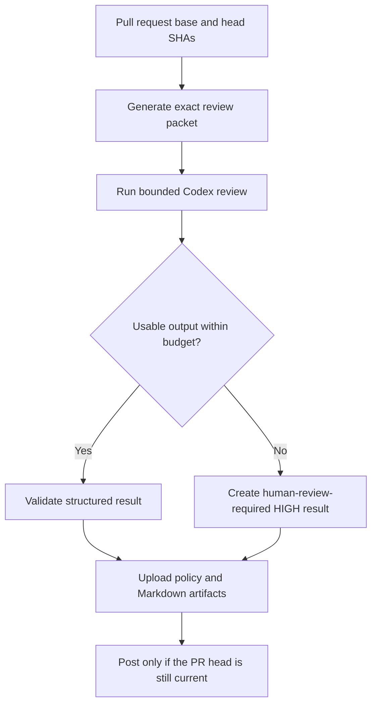

# Bounded Codex security review

## Context

The `Codex Security Review` workflow gives useful security, correctness, and
reliability feedback, but its runtime is unbounded until the job-level
30-minute timeout. Since the explicit `fast` service tier was removed in
[#947](https://github.com/block/proto-fleet/pull/947), several upstream runs
have reached that timeout:

- [PR #957 run 32521375916](https://github.com/block/proto-fleet/actions/runs/32521375916)
- [PR #960 run 32546391170](https://github.com/block/proto-fleet/actions/runs/32546391170)
- [PR #963 run 32744946137](https://github.com/block/proto-fleet/actions/runs/32744946137)
- [PR #964 run 32757955649](https://github.com/block/proto-fleet/actions/runs/32757955649)

Each run ended with `The job has exceeded the maximum execution time of
30m0s`; GitHub then spent about five minutes cleaning up the cancelled job.
This is too slow for pull-request feedback and produces no review artifact for
the review-policy evaluator.

A successful large review also shows why raising the timeout is not the right
fix. The agent can repeatedly regenerate diffs, inspect full files, compact its
context, and revisit earlier analysis. The current workflow does not constrain
agent turns, tool calls, or token consumption.

The initial review packet uses `git diff --unified=40`. Reducing that value may
save input tokens, but it can also fragment related changes and force more file
reads. On the downstream PR that exposed this issue, changing from 40 lines to
3 lines of context reduced the packet by 35%, while increasing the number of
hunks from 103 to 252. Context size must therefore be selected through replay,
not changed on intuition alone.

## Goals

- Return useful automated review feedback within 10 minutes for normal pull
  requests.
- Bound the production workflow so it cannot occupy a runner for 30 minutes.
- Preserve or improve recall for known high- and medium-risk findings.
- Preserve the exact PR three-dot diff, pinned base/head SHAs, prompt-injection
  boundary, read-only sandbox, artifact contract, and stale-comment checks.
- Produce an explicit human-review-required result when automation cannot
  complete within its budget, instead of leaving only a cancelled check.
- Make future model, prompt, effort, and diff-context changes measurable before
  rollout.

## Non-goals

- Reintroducing the retiring `fast` service tier.
- Weakening human-approval or review-policy requirements.
- Narrowing the check to security-only findings; high-impact correctness and
  reliability findings remain in scope.
- Excluding tests, stories, generated files, or other changed content before
  evidence shows that exclusion preserves review quality.
- Adding sharding in the first production change. Sharding remains a fallback
  if one bounded reviewer cannot meet the runtime and quality targets.
- Treating a larger timeout as a performance improvement.

## Approach

Separate measurement from production changes. First add a manually dispatched,
non-blocking replay workflow that compares diff-context strategies against
historical PRs with adjudicated findings. Hold model, reasoning effort, prompt,
and sandbox constant while testing context. Then select a context strategy and
measure reasoning effort and prompt constraints independently.

Roll the selected configuration into the production workflow with a nine-minute
review-agent job budget and a separate trusted finalizer. The one-minute margin,
plus GitHub's observed five-minute cancelled-job cleanup, leaves time to create
and upload fallback artifacts within 15 minutes. If the model exceeds its budget
or returns no usable output, create a structured `HIGH` result that states
automated review was incomplete and human review is required. Missing secrets, malformed trusted workflow configuration,
or artifact-writing errors remain workflow failures.

## Steps

### 1. Add a non-blocking replay benchmark

Add `.github/workflows/codex-security-review-benchmark.yml` with
`workflow_dispatch` only. It must:

- Run only when manually dispatched by an actor accepted by
  `openai/codex-action`'s write-access check.
- Use hardcoded, reviewed base/head SHA pairs rather than arbitrary user input.
- Fetch and check out the same-repository historical commits with credentials
  disabled after fetch.
- Reuse the production model, `xhigh` effort, security boundary, output schema,
  read-only sandbox, and review prompt for the context experiment.
- Never post PR comments, publish the production artifact name, or participate
  in review-policy evaluation.
- Upload distinct, uniquely named completed-result and outer-timeout artifacts
  for each case and variant. Record cancellation elapsed time as unknown unless
  it was measured before cancellation.
- Limit matrix parallelism to two jobs to bound API load and cost.
- Cap each benchmark review at 12 minutes. A timeout is a benchmark result, not
  a reason to extend the run.

Use this initial corpus:

| Case | Exact range | Existing adjudicated result | Purpose |
| --- | --- | --- | --- |
| PR #944 | `6837a03...ab5991b` | `NONE` | Large auth change; clean control |
| PR #948 | `0227f3e...3623813` | One `MEDIUM` finding | Large client/domain cross-boundary finding |
| PR #953 | `333bad9...586901c` | One `HIGH`, one `MEDIUM` | Migration and lock-order recall |
| PR #954 | `333bad9...a306748` | Two `MEDIUM` findings | Small file count with deep database lifecycle reasoning |
| PR #956 | `75fcebb...db6effb` | `NONE` | Large dependency-only clean control |
| PR #961 | `2215589...0e27f86` | One `HIGH`, one `MEDIUM` | Small diff where unchanged deployment context matters |

Store full 40-character SHAs in `.github/codex-benchmark-corpus.json`; the table
abbreviates them for readability. Preserve links to the original successful run
and final review comment in benchmark metadata.

Keep the corpus in that data file rather than inline in the workflow's
`strategy.matrix`. GitHub does not provide the `matrix` context to a job-level
`if`, so the corpus cannot be filtered by dispatch input at the job that
consumes it. A `select-cases` job filters the data file and publishes the matrix
as a job output, which `strategy` reads through the `needs` context. Keeping the
corpus as data also makes the filter itself testable.

### 2. Pressure-test diff context independently

Run each corpus case once with:

1. `--unified=40` as the control.
2. `--unified=10` as the moderate reduction.
3. `--unified=3 --inter-hunk-context=10` as the compact, less-fragmented
   candidate.

Do not change effort or prompt in this phase. Record:

- Completion and wall time.
- Overall risk and material findings.
- Recall of each adjudicated finding, reviewed by a human rather than matched by
  wording.
- New medium-or-higher findings, including whether they are valid.
- Tool-call count, repeated diff/file reads, context compactions, and reported
  token usage from the action log.
- Review packet bytes, lines, files, hunks, and unchanged context lines.

Repeat only cases where variants disagree, a finding is missed, or runtime is
within 10% of the budget. Use two additional runs for those cases to separate a
context effect from model variance.

Select a context strategy only when it:

- Retains every adjudicated `HIGH` finding without a severity downgrade.
- Retains at least 90% of adjudicated `MEDIUM` findings across completed runs;
  any miss receives manual review before acceptance.
- Introduces no invalid `HIGH` findings on either clean control.
- Does not increase median tool calls or context compactions relative to
  `unified=40`.
- Improves median wall time by at least 20%, or provides equivalent runtime with
  measurably lower token use.

If no candidate passes, retain `unified=40`; optimize another dimension instead
of accepting an unmeasured recall loss.

### 3. Test effort and prompt bounds separately

After selecting the context strategy, replay the same corpus with one variable
changed at a time:

- Compare `xhigh`, `high`, and `medium` reasoning effort.
- Add explicit review-budget guidance: prioritize material findings, avoid
  tests/lint/type checks covered by other CI, inspect tests only to validate a
  suspected finding, avoid rereading the complete diff, and return no more than
  five material findings.
- Use `openai/codex-action`'s `output-schema` input for the outer JSON contract
  while retaining repository-side semantic validation.

Do not depend on the prompt's tool-call budget as an enforcement mechanism; the
current action and CLI expose no hard maximum-turn setting. Accept a lower effort
or the bounded prompt only if the same finding-recall criteria pass.

### 4. Bound production execution and fail closed

Update `.github/workflows/codex-security-review.yml` with the selected context,
effort, and prompt configuration. PR #965 retains `xhigh` plus the baseline
prompt until the adjudicated benchmark corpus shows that a lower effort or the
bounded prompt preserves finding recall. The enforced outer job budget and
fail-closed finalizer can roll out independently of model tuning.

- Keep a nine-minute timeout on both the Codex step and its outer `review-agent`
  job. The job boundary is the enforceable control because the pinned composite
  action did not stop at its caller step timeout in production.
- Run trusted fallback creation and production artifact uploads in a separate
  five-minute `security-review` finalizer that uses `always()` after the review
  agent. Accept cancellation as a timeout only when Actions job/step state and
  timing show trusted setup completed, Codex started, and the outer budget was
  reached; early, manual, superseded, or ambiguous cancellation remains a hard
  failure.
- Pass completed output through a uniquely named internal artifact so the
  finalizer can validate it without executing code from the PR checkout.
- For timeout, empty output, model-output parse failure, missing required review
  sections/fields, unparseable severity headings, or disagreement between the
  structured risk and review Markdown, write:
  - `overall_risk: HIGH`
  - the exact base/head range and run ID
  - Markdown stating that automated review did not complete within its budget
    and human review is required
- Keep a missing `OPENAI_API_KEY`, unsafe checkout state, malformed trusted
  configuration, stale SHA metadata, or artifact upload problem as a hard
  workflow failure.
- Preserve the existing production artifact names and schema consumed by
  `.github/scripts/evaluate_review_policy.py`; require `automation_completed`,
  force incomplete artifacts onto the human-review path, and require successful
  `Post Codex Security Review` completion before approval-free policy.
- Serialize post-review jobs without cancelling the running poster, preserve the
  head-SHA check, and reject newer runs for the same pull request so stale or
  concurrency-cancelled results never update the PR comment. Treat API and
  posting failures as hard failures rather than warning-only success.
- Select same-named policy checks by workflow invocation order before job start
  time so a superseded finalizer that starts late cannot replace newer policy
  input.
- Reduce the post-review job timeout only after its observed runtime confirms a
  safe bound.

Add workflow-policy tests proving that a bounded-review fallback cannot be
classified as low risk or used for approval-free merge.

### 5. Validate large-PR behavior

After choosing the candidate on the adjudicated corpus, compare the control and
candidate against exact historical ranges for PRs #957 and #964, which timed
out in production.

These cases do not have a completed baseline review, so evaluate the union of
findings manually. The candidate must either complete within 10 minutes with a
credible review or produce the explicit human-review-required fallback within
15 minutes. It must never run until GitHub's 30-minute cancellation path.

If large semantic reviews still exceed the budget, evaluate a follow-up design
that partitions the exact diff by architectural subsystem and runs a bounded
matrix in parallel. Shards must retain shared contract changes and changed-file
metadata needed for cross-boundary reasoning. Aggregate severity and findings
without a second unbounded model pass. Do not add arbitrary file-count shards
that hide cross-file behavior.

### 6. Roll out and observe

Land benchmark infrastructure separately from the production behavior change
so reviewers can inspect the evidence used to select the configuration. Include
the benchmark run table in the production PR description.

For the first 30 production runs, record:

- Median and 95th-percentile review wall time.
- Completion versus fallback count.
- Timeout/cancellation count.
- Packet size and selected context variant.
- Findings accepted, dismissed, or found stale by human reviewers.
- Token use, tool calls, and context compactions where available from logs.

Rollback the context, effort, or prompt change independently if finding recall
regresses. Keep the bounded timeout and explicit fallback unless they prevent
artifact creation; those controls address the operational failure independently
of model efficiency.

## Risks and mitigations

| Risk | Mitigation |
| --- | --- |
| Less diff context hides a causal relationship | Replay adjudicated findings; retain `unified=40` unless a candidate meets recall gates |
| Model variance is mistaken for a context effect | Repeat only disagreeing or near-budget cases twice more |
| Benchmark invokes expensive secret-backed jobs | Manual dispatch, fixed corpus, `max-parallel: 2`, 12-minute cap |
| Benchmark workflow drifts from production | Hold prompt/model/sandbox constant during context tests, and assert in `evaluate_review_policy_test.py` that the output schema, safety strategy, sandbox, model, and review-packet body are identical across both workflows |
| Review-packet logic diverges between the two workflows | The benchmark checks out historical commits, so a local composite action would resolve to a tree that predates it; the two copies are instead asserted byte-identical |
| A timeout fallback makes an incomplete review look successful | Emit `HIGH`, state that review is incomplete, and test that policy requires human review |
| `continue-on-error` makes broken review automation look green | The review agent's trusted handoff rejects action failures before the budget; the final `security-review` job also rejects every agent result except `success` and verified budget cancellation |
| Setup, manual, or supersession cancellation is mistaken for model timeout | Inspect the trusted prerequisite steps, Codex step state, same-PR newer runs, and observed job duration; fail hard unless all timeout evidence agrees |
| Composite-action step timeout prevents fallback steps from running | PR #965 run `32828674887` proved the caller step remained in progress until the job was cancelled and cleanup finished five minutes later. Production uses a nine-minute outer job and the benchmark uses a 12-minute outer matrix job; separate `always()` finalizers create uniquely named timeout artifacts after cleanup |
| Sharding misses cross-subsystem bugs | Defer sharding; if needed, partition by architecture with shared contract context |
| Prompt injection reaches the secret-backed reviewer | Preserve same-repo restriction, pinned SHAs, trusted workflow prompt, dropped sudo, and read-only sandbox |

## Acceptance

- A checked-in benchmark report shows context, effort, and prompt experiments
  against the fixed historical corpus.
- The selected diff-context strategy meets the high- and medium-finding recall
  gates; otherwise production stays on `unified=40`.
- Normal completed reviews have a median wall time at or below 10 minutes during
  the first 30-run observation window.
- No production security-review job reaches GitHub's 30-minute timeout.
- A model timeout or unusable response produces a valid, exact-SHA `HIGH`
  artifact and a clear human-review-required comment within 15 minutes.
- Missing secrets, unsafe checkout metadata, and artifact failures remain hard
  workflow failures.
- Review-policy tests prove fallback results cannot authorize approval-free
  merge, by executing the artifact writer against every failure mode and by
  driving `evaluate_policy` with a `HIGH` review for an otherwise-eligible
  trusted-author pull request.
- A benchmark dispatch against `corpus: large-pr` records a timeout result and
  uploads its artifacts through an enforceable boundary outside the composite
  action; caller step timeout alone is not accepted as evidence.
- Broken review automation, as opposed to an exhausted outer job budget, makes
  the final `security-review` check fail without classifying the result as an
  expected timeout.
- Existing exact-diff, security-boundary, sandbox, artifact, and stale-comment
  protections remain intact.
- Any later sharding proposal has its own reviewed design and benchmark evidence.
