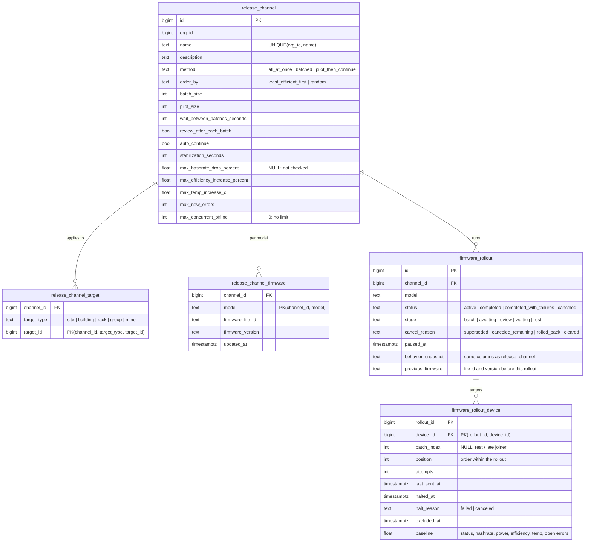
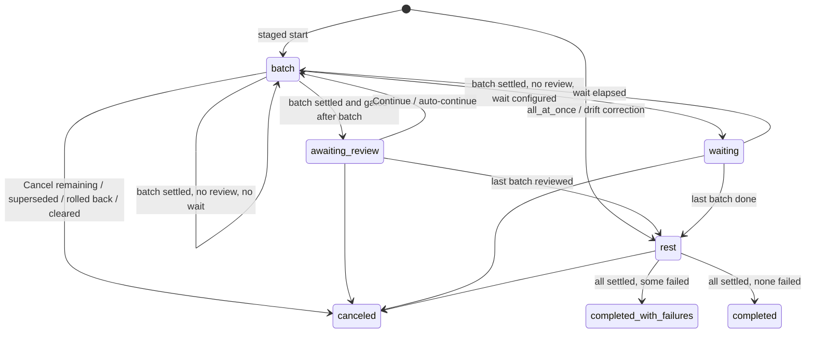

# Firmware release channels

## Context

A release channel is a set of miners with one firmware assignment per
hardware model. Once a model is assigned a firmware file, the server keeps
the channel's miners of that model on that version: any member not running
it is updated, paced by the channel's update behavior, and anything that
drifts off the version later (a replacement miner, a manual reflash, a miner
moved into the channel) is brought back. Each enforcement run for one
(channel, model) pair is tracked as a rollout.

"Rollout" is the engine's name and appears in code, the proto service and the
database. Operator-facing copy says *firmware update*, and the UI vocabulary
follows PR #881 (`feat(rollout): rollout framework presentational layer`):
methods *Single batch* / *Multiple batches* / *Pilot batch, then remaining*,
phases *Updated / Updating / Retrying / Queued / Failed / Excluded*, actions
*Continue / Pause / Resume / Retry failed / Cancel remaining / Roll back*.

This note records the data model and lifecycle the server implements. It
replaces the earlier lane-based prototype and the primitives exploration.

## Server layout

- `proto/rollout/v1/rollout.proto` — `RolloutService`.
- `server/migrations/000146_release_channels.up.sql` — schema and the two
  membership views.
- `server/sqlc/queries/release_channel.sql` — all queries.
- `server/internal/domain/rollout/` — `behavior.go` (behavior and scope
  validation), `service.go` (channels, scope preview, assignments),
  `rollout.go` (lifecycle, views), `enforce.go` (enforcement loop, dispatch,
  evidence).
- `server/internal/handlers/rollout/` — Connect handler and proto translation.
- Runtime job `rollout-enforcement` in `server/cmd/fleetd/main.go`, ticking
  every 15 seconds next to the schedule processor and curtailment reconciler.

## Data model

### Scope and membership

A channel's scope is a union of selectors stored in `release_channel_target`.
Membership is resolved live, never stored:

- `release_channel_match` joins targets to `fleet_device_placement`
  (`site_id`, `building_id`, `rack_id`, `group_id`) and to `device.id` for
  explicit miners, one row per selector hit with a specificity rank
  (miner 1, group 2, rack 3, building 4, site 5).
- `release_channel_member` is `DISTINCT ON (device_id)` over the matches,
  ordered by specificity then channel id, with a `conflicted` flag when more
  than one channel matched.

Overlapping scopes are rejected when a channel is saved: `CreateChannel` and
`UpdateChannel` take `pg_advisory_xact_lock('release_channel_scope:<org>')`,
resolve the candidate scope (`ResolveReleaseChannelScope`, which also powers
`PreviewReleaseChannelScope`) and fail with the conflicting channel names if
any miner already belongs elsewhere. Overlaps can still arise at runtime when
a miner moves; the member view resolves them deterministically and the UI
shows the flag.

### Behavior

Update behavior lives on the channel and is copied onto each rollout when it
starts, so editing a channel never changes a run in flight. Validation
normalizes away knobs a method cannot use (for example `all_at_once` clears
every batch and review setting; `pilot_then_continue` forces a review after
the pilot). Drift-correction and rollback rollouts always run `all_at_once`,
because no operator is present to review a gate.

### Rollout target set

`firmware_rollout_device` is the rollout's target set, not a cache of
channel membership: miners are snapshotted at start with their baseline
health and order, late joiners are appended by the loop (no position, so they
sort last, and only updated in the rest stage), and miners that leave the
scope are marked `excluded_at` rather than deleted. Finished rollouts
therefore read the same forever.

### Halts

`halted_at` / `halt_reason` is the one mechanism behind both *Failed* and
*Cancel remaining*. A miner that has not verified after `MaxAttempts` (3)
commands, roughly 30 minutes at the 10-minute resend interval, is halted as
`failed`; cancelling a rollout halts its unfinished miners as `canceled`.
Drift correction (`ListReleaseChannelFirmwareNeedingRollout` and
`ListReleaseChannelMismatchedMembers`) skips miners halted for the same
`(channel, model, firmware_version)` by any rollout started since the
assignment was last made, so neither a failure nor a cancel is silently
re-attempted. `RetryFailedRolloutDevices` clears the halt: in place for an
active rollout (attempts reset), or by releasing the halts of a finished
rollout and starting a new all-at-once rollout for those miners.

## Lifecycle

A miner is *settled* when it is verified (reports the version, is back
online, and is hashing if it was hashing at baseline) or halted. A stage
settles when every miner in scope (the current batch, or everything in the
rest stage) is settled; a failed miner therefore never blocks the rollout,
but a gate cannot auto-continue while its batch has failures.

Auto-continue releases a gate when the batch is verified, has no failures,
every configured threshold holds (hashrate drop, efficiency increase,
temperature increase, new errors — a checked threshold with a missing sample
holds), and the batch has sat at the gate for `stabilization_seconds`.
Evidence compares each miner against its own baseline and aggregates the
batch: total hashrate and power, mean efficiency and temperature.

Stage transitions are compare-and-swap (`... WHERE stage = from_stage`) and
every multi-statement operation (`CreateChannel`, `UpdateChannel`,
`ApplyFirmware`, `RollbackFirmware`, `CancelRollout`, `RetryFailedDevices`)
runs in one transaction. The loop isolates errors per rollout so one bad
rollout cannot stall the others.

### Derived operator state

The API carries a derived `RolloutState` next to the normalized fields:
`PAUSED` when paused; at a gate `STABILIZING_TELEMETRY` (auto-continue,
stabilization pending), `PAUSED_AT_PILOT_GATE` (first batch of a pilot) or
`PAUSED_AT_BATCH_REVIEW`; otherwise `IN_PROGRESS` or the terminal status.
Per-miner phase: `QUEUED` (no attempt), `IN_PROGRESS` (one attempt),
`RETRYING` (two or more), `DONE`, `FAILED`, `EXCLUDED`.

## Permissions and attribution

Every RPC requires `miner:firmware_update`. Commands the loop dispatches run
under a synthesized `ActorRolloutEnforcement` session carrying the id of the
user who assigned the firmware, so the schedule-conflict and curtailment
filters apply and activity rows attribute to that user.

## Deferred

Scheduled start; pacing on the Fleet bulk "Update firmware" modal; caching
the `ListRollouts` read path at fleet scale.
