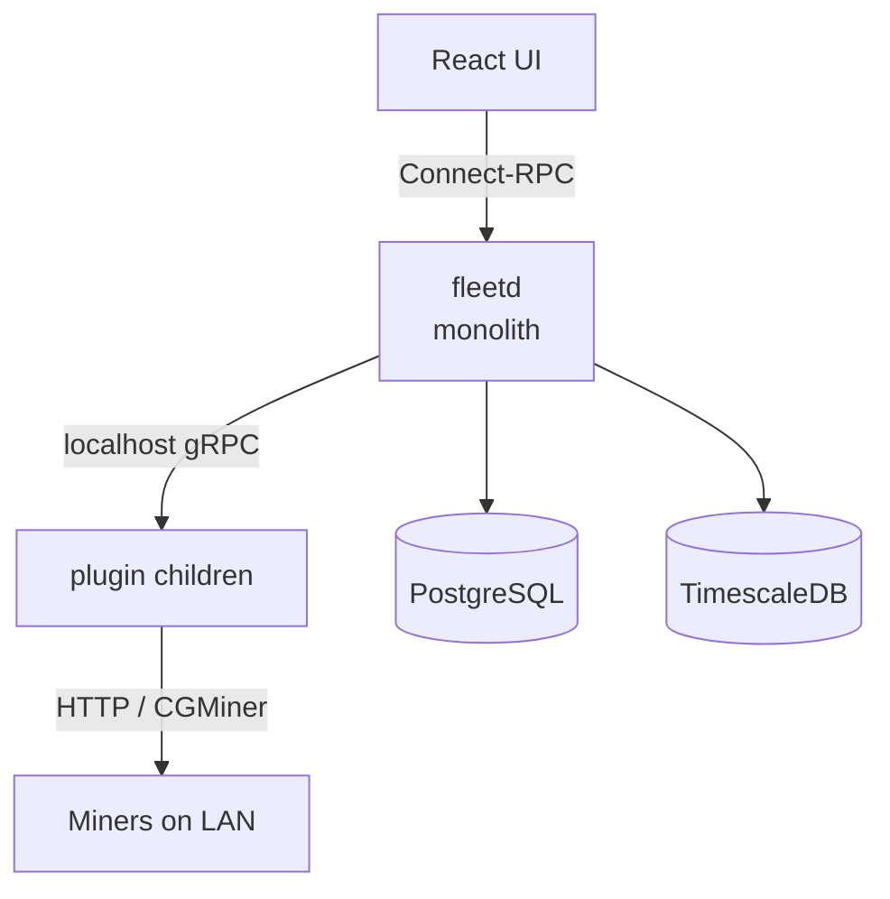
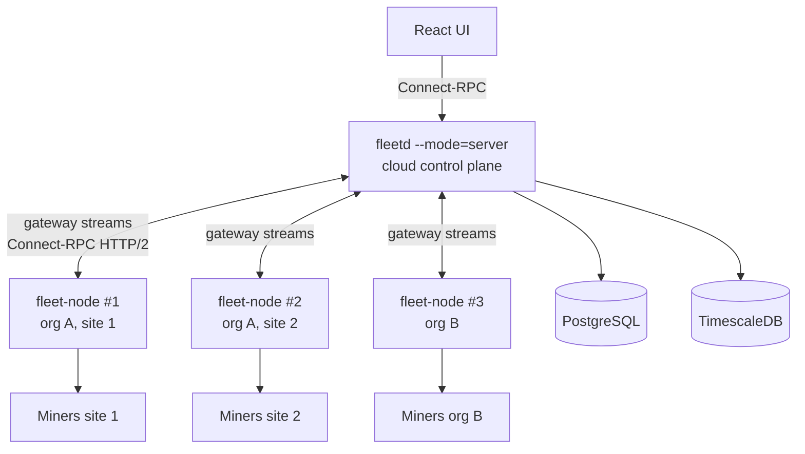

# RFC 0001: Fleet node + cloud-server split

- **Status**: draft
- **Author(s)**: Ankit Goswami (@ankitgoswami)
- **Created**: 2026-04-30
- **Last updated**: 2026-05-12

## Summary

Split proto-fleet into:

- A **fleet node** binary running on-prem next to miners. Owns plugin orchestration and miner I/O.
- A **server** running either in the cloud (managed) or on-prem in Docker. Owns API, persistence, UI, and fleet-wide state.

Multiple nodes per server. Today's `fleetd` keeps a `combined` mode for backward compatibility. Behaves like Foreman/pickaxe.

## Motivation

`fleetd` ships today as one Go binary owning everything from plugin orchestration to the React UI backend. That works for "customer runs Docker on-prem" but blocks two things we want next:

1. **Hosted cloud version**. Customers want a managed proto-fleet they don't deploy themselves. Today's monolith requires Postgres + TimescaleDB on the customer's host.
2. **Air-gapped miners**. Customers don't want individual miners exposed to the internet. They need an on-prem proxy that fronts their LAN-only miners and forwards telemetry/commands to a remote control plane.

## Architecture

- The server keeps today's databases and gains a new gateway service for nodes.
- The node is a single Go binary that boots plugin children, scans for miners, polls them, and proxies telemetry and command traffic to the server.
- Combined mode keeps everything in one process for existing on-prem deployments.

Key properties:

- **Wire**: Connect-RPC over HTTP/2, with separate streams for telemetry, events, heartbeats, and server-to-node control traffic. All streams are node-initiated, so the cloud never needs inbound connectivity into customer networks.
- **Telemetry source of truth**: cloud TimescaleDB. The node has a small on-disk spool for offline windows.
- **Miner I/O**: stays on the node. The server's existing `Miner` interface gains a remote-node adapter; command/telemetry code is unchanged.
- **UI**: the server hosts the fleet-wide UI. Each node serves a scoped local UI for on-site operations during a WAN outage (see *Local control during WAN outage*).
- **Network assumptions**: all node→cloud traffic is outbound HTTPS/443 over HTTP/2, end-to-end. No inbound port on the customer network is required for any flow, including cloud-initiated bulk actions (which ride down the node-initiated `ControlStream`). Customer egress proxies that strip HTTP/2 are unsupported; enrollment fails fast on this case with a clear error. The cloud never resolves a customer-network hostname or IP.

## Local control during WAN outage

When the gateway stream to the cloud is down, the node enters **local-degraded mode** and remains operationally useful to on-site staff. This is the primary defense against a cloud or WAN outage taking out the customer's ability to operate their own site.

- **Local UI**: each node serves an authenticated HTTPS UI on a configurable local port (default `:8443`), backed by the same `Miner` interface and plugin layer it uses for cloud-initiated traffic.
- **Surface**:
  - Read: miner list, per-miner status and live telemetry (direct from the plugin, not cached from cloud).
  - Write: per-miner and bulk reboot / start mining / stop mining / set power target; start and stop curtailment scoped to this site.
  - The local UI is a strict subset of the cloud UI, scoped to *this node's* devices.
- **Authentication**: a separate local-admin credential is established at enrollment and stored on the node host. Distinct from the cloud bearer token, so cloud compromise does not grant local UI access and vice versa. File-permission hardening only for v1; HSM/keychain integration is a follow-up.
- **Reconciliation on reconnect**: every local-issued command carries a `local_origin` flag and an idempotency key. On gateway reconnect the node backfills the command log to the cloud so audit history is unified. Conflict resolution is last-write-wins per miner, and the cloud surfaces a "local action while offline" event for the operator.
- **Out of scope for v1**: cross-site curtailment from a single node, locally-scheduled actions (the scheduler lives cloud-side; see *High availability and self-hosted topologies*).

## Non-miner device integration

Out of scope for v1. The plugin system already speaks gRPC to opaque device drivers, so PDUs, environmental sensors, and similar on-prem hardware can be added later with small tweaks: a device-type discriminator on the plugin contract, per-type capability and authz, and additional telemetry messages alongside the existing miner-specific ones. A dedicated RFC will define the exact shape when there is a concrete customer ask.

## High availability and self-hosted topologies

Both halves of the split must support HA, and every supported HA tier must be deployable fully self-hosted with no vendor-cloud dependency.

### Server HA

Multi-replica server HA is a separate body of work and is out of v1 scope. v1 ships single-replica (Tier 1 below). The known prerequisites for multi-replica — Postgres advisory-lock leader election for the scheduler (`server/internal/domain/schedule/processor.go` currently uses in-memory `cron.Cron`) and a multi-replica `ControlStream` command-routing strategy — will be designed in a follow-up RFC. The DB-backed message queue (`server/internal/infrastructure/queue/service.go`) is already multi-replica safe via `ClaimMessageForProcessing`, so it does not block the future work.

### Fleet node HA

- Multiple fleet nodes per site are supported. Each node owns a disjoint subset of the site's devices via the operator-confirmed `fleet_node_device` ownership map (e.g., one node per container, rack, or LAN segment); loss of one node is isolated to its own devices, and sibling nodes at the same site keep operating.
- Recovery for a lost node is operator-confirmed re-pair of its devices onto a sibling or replacement node.
- Warm-standby pairings ship in Phase 6: two nodes share ownership of the same devices via an operator-confirmed pair declaration, the cloud grants an active lease to one half of the pair, and the standby takes over automatically when the active node's heartbeat lapses.

### Support tiers

| Tier | Shape | Status |
| ---- | ----- | ------ |
| 0 | Combined-mode single binary, single Postgres | Today, unchanged |
| 1 | 1 server replica + 1 node + Postgres primary | Default new shape (Phase 2) |

Every tier listed above must run fully on-prem without any vendor-cloud component.

## Deployment and live updates

The split adds two binaries with independent update cadences. The deployment story has to cover both, plus an explicit cloud reference architecture.

### Cloud reference architecture

- Single-replica server behind an HTTP/2-capable L7 entry point (ALB, nginx, CloudFront, etc.). HTTP/2 termination is required end-to-end for streaming. Multi-replica deployments are out of v1 scope (see *Server HA*).
- Managed or self-managed Postgres + TimescaleDB. Either is supported.
- No customer-network ingress is ever required.

### Server rolling deploys

- Graceful drain: a draining replica sends `ControlGoaway` (new oneof in `agentgateway.proto`); nodes reconnect to a healthy replica with jittered exponential backoff.
- Schema migrations are forward-only and additive-only: add → backfill → cut over → drop, with the destructive step landing in a later release. Never rename or drop a column in the same release that consumes it.

### Fleet node updates

- Signed release artifacts (ed25519 fleet release key). v1 ships one delivery channel: operator-initiated download via the existing install path. Self-update over the gateway is not in scope.
- **Zero-downtime upgrade procedure**: stand up a new node on the target version, declare it as the warm standby for the outgoing node (see *Fleet node HA*), wait for the active lease to transfer on the next heartbeat cycle, then decommission the old node. This is the recommended path for upgrading a production node without an operational gap.
- Plugin updates ride with node updates for v1.

### Combined mode

Combined-mode updates remain operator-driven (`docker compose pull && up -d`), identical to today.

## Host observability

HA needs visibility into the host running each binary. Both halves of the split expose process telemetry by default.

- **`/metrics` endpoint**: both `fleetd` (server) and the fleet node expose Prometheus `/metrics` by default.
  - Golden signals: CPU, RSS, goroutines, GC pause, open FDs.
  - Domain signals: queue depth (server), gateway stream up/down events, plugin-child PID / start time / restart count / last error, command latency histogram, miner-poll error rate.
- **Combined-mode parity**: the combined-mode binary exposes the union of both metric sets, so single-binary deployments get the same observability as split deployments.
- **Optional cloud forwarding**: the node can stream its own process telemetry to the cloud over the existing `UploadEvents` channel for customers without their own Prometheus. Default off.
- **Local access control**: `/metrics` binds to a local interface by default; basic-auth or cert-auth is required if exposed externally.

## Strategy

Three pieces of work, in order:

- Define the wire protocol between node and server.
- Build the node reusing today's internal packages directly (no package reorganization yet).
- Reorganize internal packages so each binary owns its own code.

The reorganization lands:

- After multi-node and deployment ship, so customer-visible capability isn't gated on a pure-internal PR.
- Before the SQLite/offline-buffer work, so those caches drop into the new package layout from the start.

## Drawbacks

- **Operational complexity**. Two binaries instead of one, two install paths plus the existing combined-mode docker-compose, multi-node introduces device-ownership routing concerns.
- **WAN dependency for cloud-initiated commands**. Cloud UI command clicks traverse the WAN twice; combined mode keeps localhost latency. The local UI on the node (*Local control during WAN outage*) addresses the operational risk of WAN loss but does not change cloud-initiated latency.
- **Enrollment and migration are interactive**. Each node needs an operator-confirmed pairing, and migrating an org to cloud-mode requires upfront ownership-map declaration plus a Proto re-pair pass. No "walk away" flow.
- **Compromising one node host yields the org's stored stratum credentials**. The disclosure is bounded in attack value (no payout-address change, no withdrawal). The actual hashrate-redirection blast radius is gated by the device-scoped authz invariant in any credential model. Per-node envelope encryption tightens the disclosure boundary further and is a future option.
- **Revocation requires rotation, not just a delete**. Both the org data key and the affected credentials must be rotated; some per-device cases need manual miner recovery.

## Alternatives considered

- **Ports/adapters carve-out first**. Establish package roots and dependency direction before any wire-protocol work. Cleaner from day one, but defers customer-visible capability by weeks. We do the carve-out last instead, informed by what earlier phases revealed.
- **Federation: cloud as view aggregator only**. Each on-prem `fleetd` keeps its own DB; a cloud `fleetd` aggregates views. Rejected because (1) we want a primary cloud experience, not a secondary view, and (2) it requires every customer to keep running the on-prem Docker stack, which is exactly the operational burden a hosted offering should remove.
- **Per-secret envelope encryption** for pool/miner credentials (each row gets a fresh DEK wrapped to each authorized node's pubkey). Rejected for v1: pool/miner credentials aren't in a class that justifies the schema and protocol surface area. The simpler per-org key gives "cloud can't decrypt at rest" without that machinery.

## Unresolved questions

- **Plugin versioning per node**. Plugin binaries today ship in the node installer and are upgraded together with the node binary. A separate per-plugin upgrade cadence is a future RFC.
- **Telemetry sampling beyond the spool window**. Today's plan drops samples after the spool fills; backpressure or downsampling are alternatives, out of scope for v1.
- **Cross-tenant load-balancing strategy at large node counts**. Per-connection routing is fine at small fleet sizes; sharded clusters or consistent hashing on `node_id` may be needed at scale.
- **Cross-device policy engine**. Policies that span device types (miner + PDU + sensor) need a dedicated execution model, out of scope here.
- **Node failover policy**. Phase 3 supports multiple disjoint-ownership nodes per site with operator-confirmed re-pair on loss; Phase 6 adds warm-standby pairs sharing ownership with automatic promotion. Fully automatic re-assignment across non-paired nodes is a future RFC.

## Authentication

Per-node identity and per-command issuance are signed independently. A compromise of either side has bounded blast radius.

### Node identity (ingress)

- Each node generates two ed25519 keypairs at first run: an *identity* keypair for gateway-stream proof-of-possession, and a *miner-signing* keypair for Proto miner JWTs. Each is used in exactly one signing context, so a malicious cloud cannot use one handshake as a signing oracle for the other.
- Both public keys register with the cloud at enrollment via a challenge-response flow: the node prints its identity-pubkey fingerprint locally on first run, and the operator confirms the same fingerprint appears in the UI before the cloud issues an api_key, so a substituted-pubkey attack from a compromised cloud fails the comparison.
- Gateway streams require both a long-lived bearer api_key (authorization) and a short-lived session token minted from a unary handshake (proof-of-possession). A leaked api_key alone cannot impersonate the node from another host.
- Device-scoped actions are gated by a `node_device` ownership map populated only by operator-confirmed pairing; discovery never auto-claims ownership.

### Command issuance (egress)

The node-initiated `ControlStream` is the cloud's egress path. Bearer-token identity gates the stream, but the cloud also signs every command so that a compromised TLS terminator or LB sidecar cannot forge commands.

- Each `ControlCommand` carries `(actor, monotonic_seq, signature)`. `actor` is the issuing user id or api-key id. `signature` is over `(actor, seq, payload, node_id)` using a cloud command-issuance ed25519 key, separate from any TLS or session key.
- The node pins the cloud command-issuance pubkey at enrollment and verifies every command before dispatch. Out-of-order or replayed `seq` values are rejected; the last accepted seq is persisted on disk.
- TLS is required on the gateway. mTLS is offered as an optional defense-in-depth, default off (to preserve the "no special customer-network config" property).
- Audit trail: every accepted command is logged at the node with `(actor, seq, signature, miner_id, result)` and backfilled to the cloud on reconnect.
- Blast radius of a compromised cloud: forged commands until the command-issuance key is rotated. A compromised cloud *cannot* impersonate nodes to other tenants, decrypt at-rest org credentials, or replay across sessions thanks to per-node seq.

## Credentials

Two classes with different threat models.

### Pool and miner credentials: per-org symmetric key

- One AES-256-GCM data key per org, present on every node in the org and never on the cloud.
- The per-org data key is stored in a separate `0600`-protected file from the node identity and miner-signing private keys, so a single key-file disclosure does not yield both identity material and decryptable org credentials.
- Cloud stores ciphertext; nodes decrypt just-in-time.
- UI credential edits go through one online node for encryption; the cloud holds plaintext only for the round-trip.

*Trade-off*:

- Any node in the org can decrypt any pool/miner credential, so compromising one node yields the org's stored credentials.
- The disclosure is bounded in attack value: stratum credentials authenticate share submission to existing pool accounts. They do not grant payout-address change or withdrawal (those are gated by separate web-UI credentials, typically 2FA, on every major pool).
- The actual hashrate-redirection vector is the node's `UpdateMiningPools` capability, gated by the device-scoped authz invariant in any credential model.
- Beyond that authz invariant, leaked credentials for miners owned by *other* nodes aren't directly exercisable either: those miners sit on their own node's LAN, with no network path from the compromised host to reach them.
- Per-node envelope encryption tightens the disclosure boundary further and is a future option.

*Revocation*:

- Cutting off a node's gateway access does not invalidate the credentials it cached.
- Revocation is a workflow: rotate the org key, then rotate the affected credentials.
- Per-device credentials with no other working node path require manual miner recovery.
- The UI tracks revocation-pending until both rotations complete.
- Operators needing immediate cutoff couple revocation with network isolation.

### Proto miner JWTs: per-node ed25519 keys

- Each node signs JWTs for its own miners using its miner-signing keypair. The cloud holds no signing key.
- Migration re-pairs every Proto miner with its assigned node's pubkey while still in combined-mode, then flips to cloud-mode.
- Ownership transfer between nodes is a re-pair handed off while the outgoing node is still trusted.
- No firmware change required: the existing pair endpoint already overwrites the single authorized pubkey.

*Trade-off*:

- Closes the cloud-as-signing-oracle gap and shrinks the compromise blast radius.
- Costs: migration is heavyweight, and rotating a node's keypair forces re-pair across every miner it owns.

*Node reinstall*:

- *Planned same-host reinstall*: backup/restore of the key files **and the persisted `ControlStream` `monotonic_seq` counter**, atomically so the restored node refuses any command with `seq` at or below the restored high-water mark. Miners still trust the same keypair; no re-pair needed.
- *Planned hardware swap*: `TransferNode` before decommission, while the outgoing node is still alive to hand miners off.
- *Unplanned loss*: manual factory-reset-and-re-pair on each affected miner. HSM-backed escrow is a future RFC.

## Phased rollout

Combined mode keeps working through every phase and is a fully supported deployment shape, not a transitional fallback. Every feature added in Phases 2-6 is either a no-op in combined mode or has a combined-mode equivalent: the local node UI is unnecessary in combined mode because the existing UI already serves that role; per-command signing is a no-op when issuer and verifier are in the same process; `/metrics` works identically.

Cloud-mode capability ramps up:

- **Phase 1**: gateway proto, node-related schema, stub handler, mode flag (no behavior change).
- **Phase 2**: single-node, plus local UI, host metrics, and per-command signing.
- **Phase 3**: multi-node, curtailment handlers implemented.
- **Phase 4**: packaged for production deploy, including signed releases and graceful drain.
- **Phase 5**: architecturally tidy (internal package split).
- **Phase 6**: self-sufficient (offline buffer, credential edits, cloud-forwarded host telemetry, warm-standby node pairs).

| Phase | Ships | Behavior change | Combined-mode parity |
| ----- | ----- | --------------- | -------------------- |
| 1 | Gateway proto (lands every message field referenced by later phases up-front: `ControlCommand` signing fields `actor` / `monotonic_seq` / `signature`, `ControlGoaway` drain variant on `ControlStreamResponse`, `standby` flag on `ControlHello` and active-lease handshake for warm-standby), node-related schema, stub handler, mode flag | None | N/A (no behavior change) |
| 2 | Node binary; per-org credential encryption; per-node Proto JWT signing with re-pair migration; device-scoped authz; revocation primitives (org-data-key rotation, per-credential rotation, revocation-pending state, gateway-access cutoff); `--mode=server` skips local I/O; **local-degraded-mode UI on the node**; **`/metrics` on server and node**; **per-command signing on `ControlStream`**; **Tier-1 HA shape** | New deployment shape, opt-in. Single node end-to-end with working incident-response controls and local override during WAN outage | Yes — local UI is no-op in combined mode (existing UI fills the role); per-command signing is no-op in-process; `/metrics` works identically |
| 3 | Multi-node UI; visibility and transfer flows; combined-mode signer reassignment and rotation tools; **curtailment handlers implemented** | Cloud-style multi-site visible; curtailment works (cloud-initiated and local) | Yes |
| 4 | Cloud Dockerfile and node installers; **graceful drain (`ControlGoaway`)**; **signed node release artifacts**; **optional mTLS** | New install paths | Yes — combined mode pulls the same signed release; mTLS off by default |
| 5 | Internal package reorganization (core/server/node split) | None for combined-mode users | Yes |
| 6 | SQLite-backed caches and offline spool; UI-edit encryption proxy; **cloud-forwarded host telemetry**; **warm-standby node pairs (operator-confirmed pair declaration, cloud-issued active lease, automatic standby promotion on heartbeat lapse)** | Node self-sufficient. Credential edits unblocked. Pair-level failover available | Yes — combined mode emits the same telemetry locally; warm-standby is no-op for single-binary deployments |

Each phase corresponds to one or a small handful of implementation PRs; design and naming details that don't change the architecture or trade-offs documented here are decided at PR review time.
