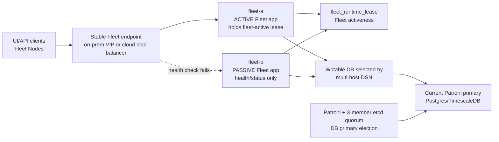
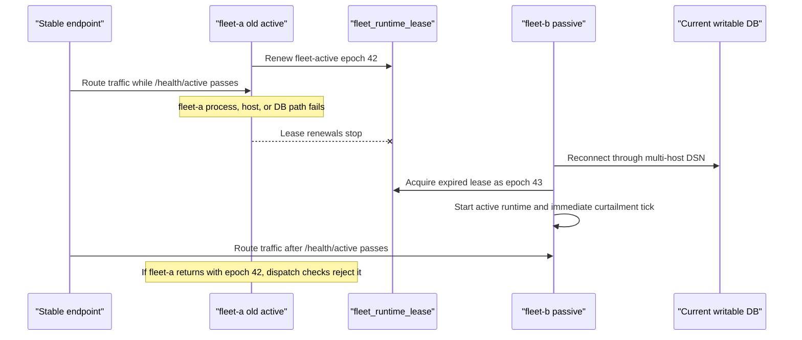

# RFC 0002: Active/passive Fleet HA for real-time control

- **Status**: draft
- **Author(s)**: Ankit Goswami (@ankitgoswami)
- **Created**: 2026-07-13
- **Last updated**: 2026-07-14

## Summary

Add a supported high-availability install mode for Proto Fleet where two warm Fleet app hosts share a self-managed Postgres/TimescaleDB HA cluster, but exactly one Fleet app instance is active for real-time control at a time. The active instance is selected by a Fleet-owned, epoch-fenced database lease. Postgres failover is handled by Patroni over a three-member quorum, and Fleet connects to the current writable database through a pgx/libpq-style multi-host DSN rather than a DB proxy.

This RFC deliberately scopes the HA promise to the real-time control plane. Curtailment dispatch, command execution, schedules, Fleet Node ControlStreams, MQTT curtailment intake, and the database state required for those flows must recover automatically after a single failure. Live HA alerting for failover readiness and control-plane health remains in scope. Historical telemetry, Grafana dashboards, alert history, logs, and cache-like artifacts may be stale, delayed, unavailable, or partially lost in degraded mode.

## Decision summary

| Area | Direction |
| ---- | --------- |
| Fleet app model | Single-active Fleet app with a warm passive peer. |
| DB HA | Patroni-managed Postgres/TimescaleDB on two Fleet app hosts plus a quorum-only witness. |
| Fleet activeness | Fleet-owned DB lease, independent from Patroni primary placement. |
| DB writer routing | pgx/libpq-style multi-host DSN, not HAProxy by default. |
| On-prem endpoint | keepalived/VRRP VIP on the same L2/subnet. |
| Cloud endpoint | Cloud load balancer using the same `/health/active` contract. |
| Durability default | Auto-degrade + HA status reporting; strict sync remains opt-in. |
| V1 HA scope | Real-time control only; history/observability can degrade. |

## Motivation

The HA design needs to satisfy four requirements:

- **No single point of failure** in the supported HA topology.
- **Automatic recovery** of curtailment dispatch, with a target recovery time under 60 seconds.
- **Correctness over convenience**: never run two active control dispatchers at once.
- **Deployment simplicity** across on-prem and cloud installs.

The simplest correct shape is not active/active Fleet. Active/active would require distributed ownership for the scheduler, command execution, MQTT sources, Fleet Node command routing, and curtailment reconciliation. Instead, this RFC keeps Fleet single-active in v1 and makes the substrate and activation rules correct.

## HA contract

The supported HA contract is intentionally narrower than "every subsystem stays perfect during failover."

| Class | Examples | HA guarantee |
| ---- | -------- | ------------ |
| Critical control state | Curtailment events and targets, command queue/status, schedules, Fleet Node auth/pairing state, MQTT curtailment source config and runtime edge state, active Fleet lease | Durable while replication is healthy; required for RTO |
| Real-time runtime | Active Fleet app, Fleet Node ControlStreams, command executor, curtailment reconciler, scheduler, MQTT subscriber | One active instance; resumes automatically on another Fleet app host |
| Live HA alert state | Failover readiness, active Fleet holder count, DB primary/standby health, quorum, replication lag, VIP/load-balancer target | Must be emitted from control-plane HA status, independent of Grafana history |
| Best-effort history | Raw telemetry samples, rollups, notification metric samples, Grafana dashboards, alert history, logs | May be stale, delayed, unavailable, or partially lost |
| Local artifacts | Firmware files, command artifacts, cached downloads | Not v1 HA unless explicitly promoted to critical storage |

For MQTT intake, critical control state includes persisted source runtime state (`curtailment_mqtt_source_state`) such as last target, processed-target deduplication state, and pending edge retry state.

If a command cannot complete after failover without a local file, that file must be stored in replicated/shared storage before the command type is covered by the v1 HA guarantee. Otherwise the command remains outside the v1 HA contract.

## Architecture

### Supported topology

The minimum supported topology uses three hosts:

| Host | Fleet app | DB data | Quorum member | Role |
| ---- | --------- | ------- | ------------- | ---- |
| `fleet-a` | warm | Patroni + Postgres/TimescaleDB | etcd | eligible active Fleet app host |
| `fleet-b` | warm | Patroni + Postgres/TimescaleDB | etcd | eligible active Fleet app host |
| `witness` | no | no | etcd | quorum-only witness host |

Use "host" or "Fleet app host" for these machines. "Fleet Node" remains the existing Proto Fleet concept from RFC 0001 and is not used to describe HA server machines.

The topology has three separate authorities:

- Patroni chooses the writable Postgres/TimescaleDB primary.
- Fleet's database lease chooses the one active Fleet app.
- The stable endpoint routes only to the Fleet app whose `/health/active` passes.

The Fleet binary and activation model are the same in all environments.

### Stable endpoint

Endpoint adapters differ by environment:

- **On-prem same subnet/L2**: bundled keepalived/VRRP floating VIP checks `/health/active`.
- **Cloud**: cloud load balancer checks `/health/active`.

For on-prem installs, the supported endpoint is a Fleet VIP managed by keepalived/VRRP:

- the operator chooses one unused VIP in the same subnet as both Fleet app hosts;
- both Fleet app hosts run keepalived with the same VIP;
- keepalived advertises the VIP only on the host whose local Fleet app passes `/health/active`;
- the VIP moves to the peer after the old active fails health and the peer acquires the Fleet lease;
- existing long-lived UI and ControlStream connections reconnect to the same stable endpoint after VIP movement.

The VIP is an endpoint routing mechanism, not the correctness authority. Fleet's database lease remains the only source of truth for app activeness. The VIP must follow `/health/active`; it must not decide which Fleet app is allowed to dispatch commands or curtailment.

Endpoint-adapter failures that make the active Fleet endpoint unavailable are active-readiness failures. In the on-prem VIP profile, if the current active host cannot maintain local VIP ownership or advertisement, it must fail `/health/active` and stop renewing or relinquish the Fleet lease, or provide an equivalent endpoint-adapter fencing mechanism that lets the peer take over. An active Fleet app that is no longer reachable through the supported stable endpoint must not keep the active lease indefinitely.

The stable endpoint must preserve Fleet's client-facing identity and network-security expectations in every environment. VIP movement must not make UI/API, Fleet Node, or ControlStream traffic reachable outside the intended private network. The supported on-prem VIP profile can rely on the site VPN/private network plus VIP ownership controls that restrict advertisement to the intended Fleet app hosts. Cloud or otherwise untrusted network paths require environment-appropriate transport security and server identity.

MQTT curtailment intake is not Fleet VIP traffic. It is an active runtime responsibility: the old active subscriber must quiesce on failover, and the new active Fleet app must subscribe to the configured broker within the RTO target.

### Failover path

## Database layer

### HA substrate

Postgres/TimescaleDB runs under Patroni on `fleet-a` and `fleet-b`. etcd runs on all three hosts and provides quorum. Patroni owns primary election, failover, rejoin, and Postgres parameter parity through the DCS. Patroni's documentation describes the external DCS model and synchronous replication modes:

- <https://patroni.readthedocs.io/>
- <https://patroni.readthedocs.io/en/latest/replication_modes.html>

Required DB HA behavior:

- exactly one writable Postgres primary at a time;
- streaming replication from primary to standby;
- automatic standby promotion and old-primary rejoin;
- timings tuned and validated against the RTO target;
- existing Postgres/TimescaleDB tuning preserved in the HA profile.

The HA management plane is part of the correctness boundary. Patroni, etcd, and Postgres must be reachable by the HA peers, but they must not become open LAN services. The supported on-prem profile may rely on VPN/private-network isolation and host/network allowlists scoped to HA peers and approved operator diagnostics paths. Cloud or otherwise untrusted network paths require environment-appropriate authenticated transport.

### Durability modes

| Mode | Default? | Behavior |
| ---- | -------- | -------- |
| Auto-degrade + alert | yes | Critical writes use synchronous replication while a synchronous standby is healthy. If the standby is lost, Fleet continues real-time control in async-degraded mode and reports `FAILOVER READY: NO` through HA status surfaces. |
| Strict sync | no | Critical writes block when no synchronous standby is available. This gives a stronger durability contract but can halt real-time control during degraded periods. |

The default is auto-degrade because real-time functionality should continue after standby loss while the reduced durability state is made explicit. In degraded async mode, a second failure may lose recently acknowledged writes; this is acceptable only because the system is explicitly degraded and visible through control-plane-owned HA status.

Historical telemetry and notification metrics may use weaker durability than critical control writes where safe. The exact commit settings are an implementation detail.

### Fleet database routing

Fleet uses pgx/libpq-style multi-host DB routing instead of HAProxy. Conceptually, Fleet is configured with both DB candidates and connects only to the current writable primary.

Requirements:

- preserve existing single-host installs;
- support environment-specific DB transport security: VPN/private-network isolation for the on-prem profile, and server-verified TLS or equivalent identity verification for cloud or otherwise untrusted network paths;
- select the writable DB after Patroni failover without a DB proxy;
- avoid using stale pooled connections after DB role changes;
- retry failover-class DB errors automatically only for reads and explicitly idempotent operations;
- require critical control writes to use idempotency or reconciliation before retrying when the original commit outcome is unknown.

Non-Fleet consumers are handled separately:

- Deployment scripts that currently `docker compose exec timescaledb ...` must become Patroni-aware and run write steps only against the current primary.
- Grafana is not on the dispatch RTO path. It can use a best-effort Postgres datasource in v1. If Grafana cannot cleanly use the same HA writer targeting, that is not a blocker for control-plane HA.
- `ha-status.sh` and operator-protected `/health/ha` are the authoritative HA status surfaces in v1.
- HA failure alerts are derived from those control-plane status surfaces, not from Grafana dashboard availability or telemetry history.

PostgreSQL documents multi-host connection strings and writable-session targeting:

- <https://www.postgresql.org/docs/current/libpq-connect.html>
- <https://www.postgresql.org/docs/current/runtime-config-wal.html>

## Fleet activeness

### Active lease

Fleet owns one database-backed active lease, separate from Patroni. Patroni decides which DB is writable; the Fleet lease decides which Fleet app may run active control.

V1 uses one logical lease store, `fleet_runtime_lease`, and one active-runtime lease name, `fleet-active`, with a holder identity, epoch, and expiry.

Rules:

- `holder_id` is a cryptographically random process-incarnation ID generated at Fleet startup, not a hostname, stable host ID, or install ID.
- A restarted Fleet process or second Fleet process on the same host must get a different `holder_id`; host identity belongs in diagnostics, not in the lease identity.
- Lease acquisition and renewal must be atomic database-enforced state transitions. Racing Fleet processes must not be able to observe the same expired lease and both conclude they became active.
- The lease epoch advances only when acquisition succeeds, and active runtime may start only after the committed epoch is returned to that Fleet process.
- Acquire succeeds when the row is absent, expired according to DB time, or already held by the same process incarnation.
- Renew succeeds only when `name`, `holder_id`, and `lease_epoch` still match and the lease has not expired according to DB time.
- A process that resumes after its lease expires must reacquire the lease and receive a new epoch before active runtime can resume.
- Active renews every few seconds with a short TTL.
- Lease renewal and `/health/active` depend on critical active-runtime health. If the active instance cannot run required control loops, it must stop passing active health and stop renewing or relinquish the lease.
- Every active-only runtime loop carries the activation epoch and confirms the local coordinator still owns that epoch before dispatching or claiming work.
- External side effects must be fenced at the nearest durable boundary. Effects that cannot be receiver-fenced must be idempotent, cancelable, or reconciled before the implementation can claim zero dual dispatch.
- A stalled old active that resumes after takeover cannot dispatch because its epoch is stale.

This lease model intentionally allows future per-subsystem leases, but v1 does not use them. Active/active Fleet is out of scope.

### Runtime modes

Both Fleet app instances run continuously.

| Mode | Behavior |
| ---- | -------- |
| Active | Holds `fleet-active`; passes `/health/active`; serves product traffic; accepts Fleet Node ControlStreams; runs active-only runtime services. |
| Passive | Does not hold `fleet-active`; fails `/health/active`; serves load-balancer-safe health and operator-protected HA status; rejects product traffic and Fleet Node ControlStreams with a machine-readable `not-active` detail. |

Passive is deliberately dumb in v1. It does not need a carefully audited read-only API allowlist. The stable endpoint should not send normal UI/API traffic to passive.

### Runtime supervisor

Add a runtime supervisor that starts and stops active-only services on lease transitions. Startup moves from "all runtime work starts when the process starts" to "active runtime work starts only after activation."

Active-only work in v1 includes:

- command execution and command-state repair;
- telemetry polling and discovery work that feeds active control;
- schedule processing;
- curtailment reconciliation and MQTT intake;
- cleanup/sweep work that mutates shared control state or external command artifacts.

Always-on services:

- HTTP server;
- load-balancer-safe health endpoints and operator-protected HA diagnostics;
- auth/session plumbing needed to answer status endpoints;
- components required to construct service dependencies but not start active work.

Activation must trigger required control reconciliation promptly enough to meet the RTO target.

### Request and ControlStream gating

Add a single active-mode request gate for product traffic:

- In active mode, requests proceed normally.
- In passive mode, Connect/gRPC product traffic fails with `Unavailable` and a machine-readable `not-active` detail; other product transports use the equivalent retryable status.
- Load-balancer-safe health endpoints and operator-protected HA diagnostics bypass active gating.
- Bypassing active gating does not bypass auth; HA diagnostics still require operator access.

Fleet Node ControlStreams are explicitly gated:

- Passive Fleet rejects ControlStreams with `not-active`.
- Lease loss cancels active-scoped request contexts and closes already accepted product streams with `not-active`.
- Fleet Node clients treat `not-active` as a cheap redirect signal and reconnect quickly, with bounded jitter so large fleets do not reconnect in lockstep.
- Fleet Node transport must detect dead streams quickly enough to meet the RTO target.

This preserves the RFC 0001 model where Fleet Nodes connect outbound to the server/Fleet app endpoint, while ensuring only the active Fleet app host owns command routing state.

## Health and operator status

Endpoints:

| Endpoint | Exposure | Meaning |
| -------- | -------- | ------- |
| `/health` | Load-balancer-safe | Process liveness. Does not check DB or HA state. |
| `/health/ready` | Load-balancer-safe | Fleet app can reach a database. Returns minimal readiness only. |
| `/health/active` | Load-balancer-safe | Fleet app is the active controller and can safely run real-time control. Returns minimal active/passive status only. |
| `/health/ha` | Operator-only | Admin-authenticated diagnostics: lease holder/epoch, DB primary, replication mode, quorum, degraded reasons. Redact sensitive hostnames and internal addresses where possible. |

`/health/active` is intentionally narrow. It must not fail because Grafana is down, telemetry history is stale, alert history is unavailable, or dashboards cannot query.

`/health/ha` is not a load-balancer health check and must not be exposed wherever unauthenticated `/health` endpoints are exposed. It bypasses active-mode gating so either Fleet app host can report diagnostics, but it still requires admin auth in every supported profile. Network allowlists can be added as defense in depth, not as the primary auth boundary.

`ha-status.sh` provides the operator view:

- Patroni cluster table;
- etcd quorum;
- sync standby and replication lag;
- active Fleet holder and lease epoch;
- VIP/load-balancer target;
- `FAILOVER READY: YES/NO`;
- degraded reason.

The v1 HA contract requires degraded readiness to be visible through `/health/ha` and `ha-status.sh`. Grafana dashboards, alert history, and notification metrics remain best-effort; they must not be the only source of HA degraded-state reporting.

Live HA alerting is control-plane owned. The supported alert source should evaluate the same state exposed through `/health/ha` and `ha-status.sh`, including active Fleet count, lease freshness, DB primary reachability, sync standby health, etcd quorum, replication lag, and VIP/load-balancer target. Alert delivery can use the install's notification mechanism, but alert generation must not depend on Grafana, telemetry ingestion, dashboard queries, or alert-history storage being healthy. Grafana can visualize these states when available; it is not the source of truth for v1 HA failure detection.

## Deployment model

HA is opt-in. Existing single-host installs remain unchanged.

Host-to-host networking is a prerequisite:

- All HA hosts must have stable peer names or addresses reachable from every other HA host over the chosen transport.
- Docker bridge service names are local to one Docker daemon and must not be used as cross-host peer identities.
- A VPN can be used only if its device policy gives the HA hosts a full peer mesh; client-to-host access from an operator laptop is not enough.
- When same-subnet LAN connectivity is available, it is the simplest on-prem transport for Patroni, etcd, Postgres, and the VIP path.

Before generating HA config, the installer must run a role-aware pre-config connectivity preflight from each HA host to the peers it is expected to use. This preflight verifies stable peer identities, the selected network path, and role-specific peer reachability. It must not require Patroni, Postgres, Fleet health endpoints, keepalived, or the VIP to already be running. A host that is reachable from the operator machine but cannot reach the peers required for its HA role must fail preflight.

After HA config is applied and services are started, a post-start validation pass must prove DB, Patroni, Fleet health, etcd quorum, and endpoint behavior. For the on-prem VIP profile, post-start validation checks that the proposed VIP can move between the two Fleet app hosts and that VIP ownership is protected.

Any HA join material generated by the installer must be role-scoped, short-lived, least-privilege, protected during storage and transfer, cleaned up after successful join, and revocable from the init host.

Operator flow at a high level:

1. Initialize HA on the first Fleet app host with a cluster name, local host identity, peer list, and endpoint profile.
2. Generate role-scoped join material for the peer Fleet app host and the witness host.
3. Join the remaining hosts with their role-specific material.
4. Run pre-config preflight before config generation, then run post-start validation gates before advertising the stable endpoint as supported.

The exact installer flags, templates, compose files, and runbook commands belong in implementation PRs, not this RFC.

## Failure behavior

| Failure | Expected behavior |
| ------- | ----------------- |
| Active Fleet app process dies | Lease expires; peer activates and starts active runtime. |
| Active Fleet app hangs | Lease renewal stops or epoch checks fail; peer takes over; old active cannot dispatch with stale epoch. |
| DB primary dies | Patroni promotes standby; new Fleet DB connections select the read-write host; lease renews or is reacquired. |
| Sync standby dies | Fleet continues in async-degraded mode after the configured behavior; HA status reports `FAILOVER READY: NO`. |
| Witness host dies | Service continues; quorum tolerance is degraded; HA status reports degraded readiness. |
| Network partition isolates old DB primary | Patroni/quorum fencing prevents two DB primaries; old active Fleet cannot renew lease against the authoritative writer. |
| On-prem active Fleet host loses health | keepalived stops advertising the VIP; the peer advertises the same VIP after acquiring the Fleet lease and passing `/health/active`. |
| On-prem active Fleet host loses VIP ownership | Active readiness fails or equivalent endpoint-adapter fencing triggers; the peer can acquire the Fleet lease and advertise the VIP. |
| Endpoint routes to passive | Passive fails `/health/active` and rejects product traffic and ControlStreams. |
| Grafana fails | Real-time control continues; `/health/active` remains based on control readiness only; HA alert generation continues from control-plane status. |
| Historical telemetry ingestion stalls | Real-time control continues; history is stale/lossy and HA status/alerts still report control-plane degraded state. |

## Validation gates

The HA mode is not supported until these gates pass.

Activation and fencing:

- Two Fleet app processes against the same DB produce exactly one active holder.
- Killing active Fleet activates the peer within 15 seconds.
- Partial active-runtime failure causes `/health/active` to fail and allows the peer to take over.
- Network partition tests produce zero dual dispatch.
- Passive mode rejects all product traffic, including non-RPC HTTP routes, while preserving the explicit health and operator-status bypasses.
- Lease loss terminates already accepted product streams and active-scoped request work.
- A stalled active process cannot dispatch after lease loss, emit stale external side effects, or renew an expired lease with its old epoch.
- Fleet-scale reconnect tests avoid synchronized ControlStream reconnect storms during failover.

Database and durability:

- Killing DB primary recovers writable DB access within 30 seconds.
- No acknowledged critical write is lost while synchronous replication is healthy.
- Auto-degrade mode keeps real-time control working when standby is lost and reports `FAILOVER READY: NO` through control-plane-owned HA status.
- Strict mode blocks critical writes when no synchronous standby is available.
- DB routing tests prove Fleet reconnects to the writable primary after DB failover.

Real-time control:

- Full curtailment dispatch recovery after a single failure completes within 60 seconds across repeated trials.
- MQTT curtailment intake failover resumes on the new active Fleet app within the RTO target without dual processing.

Deployment and diagnostics:

- Pre-config HA preflight proves every host can reach every peer required for its role over the selected LAN, VPN, or cloud private-network transport without depending on service listeners created later by HA config.
- Post-start HA validation proves DB, Patroni, Fleet health, etcd quorum, and endpoint behavior after the HA services are running.
- Same-subnet on-prem validation proves the configured VIP is unused, moves only to the Fleet app host passing `/health/active`, remains reachable only through the intended private network, and resists unintended VIP ownership by non-HA hosts.
- Same-subnet on-prem failover tests prove loss of local VIP ownership on the active host triggers active-readiness failure, lease release/expiry, or equivalent endpoint-adapter fencing so the peer can take over within the RTO target.
- HA management-plane ports are restricted to HA peers and approved operator diagnostics paths; cloud or untrusted network profiles add authenticated transport.
- HA alerts fire from control-plane status for standby loss, quorum loss, active holder anomalies, replication lag, and endpoint targeting failures even when Grafana or telemetry history is unavailable.
- Telemetry/Grafana failures do not fail `/health/active`.
- Unauthenticated health endpoints do not expose HA topology, and `/health/ha` requires operator access.

## Drawbacks

- **More moving parts than single-host installs**. Patroni, etcd, and a witness host add operational surface area.
- **The default durability mode is intentionally degraded after standby loss**. Auto-degrade keeps control running but exposes the site to data loss on a second failure until redundancy is restored.
- **Passive Fleet is not a read-only replica**. This simplifies correctness but means passive hosts are not useful for normal UI/API browsing in v1.
- **Historical views can be incomplete during incidents**. Operators may lose dashboard fidelity exactly when an incident is happening; live HA alerting, `ha-status.sh`, and operator-protected `/health/ha` become the authoritative status surfaces.
- **Local artifacts are not automatically HA**. Firmware and command artifacts need shared/replicated storage before they can be part of the v1 HA guarantee.
- **Implementation touches startup wiring**. Moving runtime services behind an activation supervisor changes `fleetd` lifecycle code and needs careful tests.

## Alternatives considered

| Alternative | Decision | Reason |
| ----------- | -------- | ------ |
| Active/active Fleet | Rejected for v1 | Requires distributed ownership for scheduler, command execution, MQTT sources, Fleet Node routing, and curtailment reconciliation. Too much app complexity for the near-term HA goal. |
| Fleet follows Patroni primary | Rejected | Keeps app code smaller but couples Fleet app activeness to DB primary location. App-only failure, cloud load-balancer behavior, and future active/active evolution are weaker. |
| Client-configured multi-endpoint Fleet failover | Rejected for v1 | Avoids a VIP, but pushes HA behavior into every UI, Fleet Node, and MQTT client. |
| Bundled HAProxy pair for Fleet endpoint | Rejected as default | Adds another HA component and still typically needs a VIP or equivalent stable endpoint in front of the proxies. |
| HAProxy DB writer router | Rejected as default | pgx/libpq multi-host DSN with `target_session_attrs=read-write` removes a component from the install. Keep HAProxy only as a fallback if implementation finds a DB client path that cannot use multi-host routing. |
| Two DB hosts with no witness/quorum | Rejected | Cannot safely distinguish peer death from network partition; correctness requires a third vote or equivalent fencing authority. |
| Strict synchronous replication by default | Rejected as default | Stronger data contract, but standby loss can halt real-time control. Keep as an opt-in mode for sites that prefer blocking to degraded durability. |
| Make telemetry/Grafana HA in v1 | Rejected | It expands the HA surface without improving curtailment RTO or dispatch correctness. History and dashboards are degraded-mode features in v1. |

## Unresolved questions

- **Exact Patroni timings**. Initial targets are chosen to fit the 60s RTO, but final `ttl`, `loop_wait`, and `retry_timeout` values must be set from lab measurements.
- **Critical write classification**. The implementation must audit write paths and decide which writes require critical durability and which are best-effort.
- **Artifact HA boundary**. Firmware and command artifact behavior after failover needs a product decision: document re-upload in v1, add rsync, or require shared storage for covered command types.
- **Grafana HA datasource**. Grafana is out of the RTO path, but the install should still decide whether dashboards use best-effort single-host datasource config, multi-host config if supported, or an explicit "not HA" warning.
- **Passive status surface**. V1 keeps passive health/status-only. A future RFC or PR can add a reviewed read-only allowlist if a product need emerges.
- **Cloud substrate**. Cloud can use Patroni-on-VMs, CloudNativePG, or another TimescaleDB-compatible self-managed option. The deployment reference should choose one default when cloud packaging starts.

## Phased rollout

| Phase | Goal | Scope | Behavior change |
| ----- | ---- | ----- | --------------- |
| 1 | DB writer routing | Multi-host DSN, read-write targeting, stale pooled connection discard, failover retry classification | Fleet can reconnect to the current DB writer without HAProxy. |
| 2 | Active lease | `fleet_runtime_lease`, sqlc queries, `ha.Coordinator`, `/health/active`, operator-protected `/health/ha` | Fleet can decide active/passive state safely. |
| 3 | Runtime supervision | Move active-only services behind a supervisor; immediate reconciler tick on activation | Passive Fleet stays warm but does not dispatch or mutate control state. |
| 4 | Passive gating and Fleet Node retry | Active-mode request gate, ControlStream `not-active`, Fleet Node fast retry and stream liveness tuning | Traffic can safely route only to active Fleet. |
| 5 | HA substrate | Patroni image/config, etcd, keepalived/VRRP VIP templates, peer-connectivity preflight, install/join flow, `ha-status.sh` | Operators can install the on-prem HA profile. |
| 6 | Degraded-mode observability | Alerts and status for standby loss, quorum loss, active count, replication lag, failover readiness | Operators can distinguish full HA from control-only/degraded operation. |
| 7 | Lab and cloud references | Repeated failover tests, partition tests, runbook, cloud deployment reference | The install mode can be marked supported after validation gates pass. |

Each phase should preserve existing single-host installs. `FLEET_HA_ENABLED=false` remains the default outside the HA profile.
