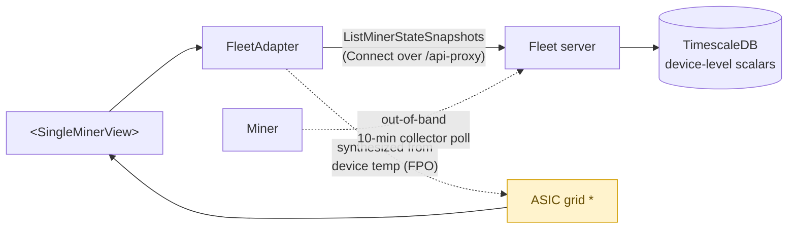
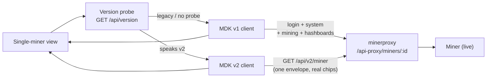
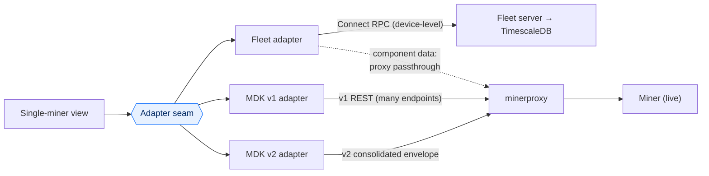

# RFC 0003: Single-miner view — sourcing & versioning strategies

- **Status**: draft
- **Author(s)**: Matt Flesher (flesher)
- **Created**: 2026-08-06
- **Last updated**: 2026-08-06

## Summary

We need to decide how the **single-miner view** sources and versions its data —
and, as a consequence, how far we can consolidate our client footprint. Today
that view is the ProtoOS React app talking directly to a miner's `/api/v1/*`
REST surface — either served from the device itself or reverse-proxied through
the fleet server. That model couples the UI to a device being online, reachable,
and running a specific firmware generation.

This RFC defines the objective, then evaluates three strategies for how the
single-miner view sources and versions its data:

1. **Fleet-native** — render entirely from fleet-collected data (Connect RPCs),
   never touching the device.
2. **Proxy, version-aware** — proxy to the device, probe firmware, and dispatch
   to a per-version client.
3. **Adapter layer** — one generic view behind an adapter seam, with swappable
   backends (fleet, MDK v1 REST, MDK v2 consolidated), optionally combined with
   proxying.

Each strategy is illustrated by a working prototype in the throwaway **Prototype
Lab** (`/lab`) on branch `migrate-single-miner-to-fleet`
(`client/src/protoFleet/prototypes/`). This document describes the **production
architecture** each prototype approximates — with diagrams, pros, and cons — so
we can pick a direction.

One framing note up front, because it drives the trade-offs: only **fleet-native**
truly collapses us to a single client app. The proxy and adapter strategies still
require shipping a client bundle onto the miner for each firmware generation we
support, plus the fleet bundle — so we continue to build and ship multiple
clients, and the win there is streamlined *maintenance* (shared view code), not a
single-client end state.

## Motivation

### The objective

We need to:

1. **Deliver a rich single-miner UI experience** — the identity + KPIs + a
   hashboard/ASIC grid + controls that operators rely on — whether it is served
   from the miner (as today) or from a local ProtoFleet "single-miner mode."
2. **Accommodate proto rigs on varying firmware** — different MDK API
   generations (v1 REST spread across many endpoints; v2 consolidated envelope
   with real per-chip data) must all render the same experience.
3. **Simplify development and maintenance of the single-miner view** — one view
   to build and maintain instead of a matrix of app × firmware × transport.

### Why now

Today's single-miner UI ("ProtoOS") is served two ways, and **both** are really
ProtoOS-talking-to-a-device:

- **Standalone on the miner** — ProtoOS is bundled onto the device image and
  served by the miner's embedded web server; the browser hits `/api/v1/*` on the
  miner.
- **Embedded in ProtoFleet** — the fleet UI opens `/miners/:id/*`
  (`client/src/protoFleet/components/SingleMinerWrapper/`), reusing the *same*
  ProtoOS app but pointing its API client at the fleet server, which
  **reverse-proxies** every `/api/v1/*` call to the live miner
  (`server/internal/handlers/minerproxy/handler.go`).

Both modes hard-depend on the miner being online, reachable, and running a
ProtoOS-compatible API. The
[migration plan](../plans/2026-07-28-single-miner-views-on-fleet-backend-plan.md)
sets the direction that frames this RFC: reduce or remove ProtoOS-on-miner, make
the single-miner experience first-class in ProtoFleet, and target full parity
with the explicit allowance to reduce data granularity/freshness to what the
fleet can support. How fully we reach a single-client end state depends on which
strategy we pick.

### A note on hashboard / ASIC data

One known constraint recurs across the strategies, so it's worth stating once and
then addressing in context below. Today's fleet server **does not collect or
store hashboard- or ASIC-level data** — the collector builds a full
`DeviceMetrics` (`HashBoards[] → ASICs[]`, PSU/fan arrays) in memory each poll,
but persistence keeps only device-level scalars
(`server/internal/infrastructure/timescaledb/telemetry_store.go`), and no
client-facing RPC exposes the component arrays. This is not a blocker so much as
a scoping decision: any strategy that sources the ASIC grid from the fleet needs
us to decide *how much* component-level collection and storage to build; any
strategy that reads it from the device directly already has it. Each strategy
below states where it lands.

## Detailed design

### The shared contract

The abstraction strategies (1 and 3) normalize every backend into one
`SingleMinerSnapshot` and render one presentational `<SingleMinerView>` (the
prototype implements this under `client/src/protoFleet/prototypes/shared/`):

```ts
interface SingleMinerSnapshot {
  identity: MinerIdentity;      // name, model, firmware, mdkVersion, mac, serial, ip?
  status: MinerStatus;          // mining | paused | offline | error
  kpis: MinerKpis;              // hashrateThs, tempC, powerW
  hashboards: HashboardSummary[]; // board → AsicCell[] (index, tempC, hashrateThs, health)
  dataPath: DataPathStep[];     // "how did this data get here" ribbon
  source: string;
}
```

The seam that backends implement:

```ts
interface SingleMinerAdapter {
  readonly source: string;
  fetchSnapshot(signal?, tracer?): Promise<SingleMinerSnapshot>;
  control?(action, tracer?): Promise<void>;  // optional; not every backend writes
}
```

The whole thesis of the abstraction approach: **map many backends into one
snapshot, render one view.** The proxy strategy (2) can reuse this same seam for
its fetch, but its conceptual point is that a per-version *client* could render
verbatim if we wanted divergence.

The prototype distills the view to a deliberately minimal slice — identity + 3
KPI tiles + a hashboard/ASIC mini-grid + one control — chosen so the ASIC grid
(the component-level data discussed above) is always in frame while we compare
strategies.

---

### Strategy 1 — Fleet-native

**Thesis:** one backend, any miner, regardless of on-device OS/firmware. The view
is built directly on fleet RPCs and never touches the device. This is the only
strategy that truly collapses us to a **single client app** — there is no
per-version bundle to ship on the miner.

Identity + KPIs come from the existing
`FleetManagementService.ListMinerStateSnapshots` RPC (resolved by IP) over the
fleet server; the same fleet primitives used everywhere else in ProtoFleet. The
device is never contacted, so the view renders for offline, unreachable, and
non-ProtoOS miners alike — anything the fleet has collected.

The prototype (`client/src/protoFleet/prototypes/fleetNative/`) frames this as a
"connect to a miner" flow (IP + credentials) to make the point tangible, but in
production this is just the single-miner surface of ProtoFleet reading fleet data.



Because the fleet does not persist component-level data today (see the note
above), the ASIC grid is the open scope question for this strategy. The prototype
takes a shortcut — it synthesizes the grid from the device-level temperature
(`fleetAdapter.ts` `synthGrid`) purely to fill the view. For production we'd need
to decide how much component data to build into the fleet: persist the arrays the
collector already produces (a schema + retention decision, since per-ASIC
timeseries is high-cardinality), and/or add an on-demand metrics RPC that reads
the device on request. The mechanism to fetch it exists on the server
(`interfaces/miner.go` `GetDeviceMetrics`); it's the collection/storage choice
that's the work.

**Pros**

- **Only true single-client outcome** — no per-version bundle on the miner;
  strongest answer to objective 3.
- Renders **any** miner regardless of firmware/vendor — the fleet already
  normalizes across plugins. Objective 2 falls out for free.
- Works for **offline / unreachable** miners from last-known data.
- **Simplest client** — one data path, one set of fleet components, no device
  auth/CORS/TLS in the browser, no per-miner reverse proxy to operate.
- Self-explanatory: the same fleet primitives used everywhere else in ProtoFleet.

**Cons**

- **Component-level (ASIC/hashboard) data needs to be built into the fleet** to
  reach parity — a collection + storage + RPC effort whose depth we'd need to
  scope. Until then the grid is reduced or synthesized.
- **Reduced freshness** — ~10-minute collector cadence (a 5s broadcast /
  on-demand `RefreshMiners` help but don't match ProtoOS's ~15s real-time).
- **Live operations become fleet-mediated, not on-device.** Actions like LED
  locate or firmware upload still work — but as the fleet does them today:
  dispatch a command and open a status stream that's polled, rather than a direct
  device call. That's parity with fleet's current behavior, at lower liveness than
  hitting the device. A few operations that are inherently live-from-this-device
  (e.g. `testPoolConnection`) may not fit at all.
- **Single-miner mode needs a one-click install.** Running ProtoFleet pointed at
  one device as a ProtoOS-on-miner replacement means packaging the fleet server +
  client as an easy local install — non-trivial given our Docker-based
  environment, and a prerequisite for the "served locally" half of objective 1.

---

### Strategy 2 — Proxy to miner, version-aware

**Thesis:** the client talks to the live device through the fleet's reverse
proxy, and a version probe (`GET /api/version`) selects the right client for that
firmware generation. This is the closest evolution of today's fleet embed, made
explicit with a version seam so multiple firmware generations coexist.

In production, the client resolves the miner's firmware generation up front and
dispatches to the matching per-version client. Requests ride the minerproxy path
(`/api-proxy/miners/:id`, `server/internal/handlers/minerproxy/handler.go`),
which handles device auth/token caching and TLS — so there's no browser
CORS/TLS and no direct device exposure. The firmware version changes only the
data path; the rendered view is the same across versions. Firmware that predates
the probe falls back to the legacy (v1) client.

Because reads come straight from the device, this strategy has **no fleet
component-data gap** — v2 firmware returns real per-chip data in a single
consolidated call, so the ASIC grid is genuinely live; older v1 firmware, which
spreads data across many endpoints and exposes no bulk per-chip readings, is the
one place a grid would be reduced or approximated (a limitation of that firmware,
not of the fleet).

The prototype
(`client/src/protoFleet/prototypes/proxyVersioned/`, `adapter/probe.ts`)
illustrates this with two fake rigs on different MDK versions; selecting one
probes it, picks the v1 or v2 path, and renders the identical view.



**Pros**

- **Live, real-time data** at ProtoOS fidelity — including a **real ASIC grid**
  where the firmware exposes it (v2). Best serves objective 1 today, with no fleet
  backend work.
- **Explicit versioning** via the probe — new firmware generations plug in as a
  new per-version client without touching the shared view. Directly serves
  objective 2.
- Closest to the current fleet-embed behavior — lowest conceptual migration risk.

**Cons**

- **Hard dependency on device reachability** — offline/unreachable miners render
  nothing. Doesn't serve the "any miner, any state" goal.
- **Does not consolidate the client footprint.** We still build and ship a client
  bundle per firmware generation (plus the fleet bundle), so this only partially
  serves objective 3 — the win is shared view code, not one app.
- Keeps the **minerproxy** reverse proxy alive (token caching, TLS to device,
  per-miner web auth) — a component the migration plan hoped to reduce or remove.
- Per-vendor / non-ProtoOS devices need their own client or aren't supported.

---

### Strategy 3 — Adapter layer (backend-agnostic)

**Thesis:** one generic view, swappable backends behind a single adapter seam.
Each backend — fleet server, MDK v1 REST, MDK v2 consolidated — implements the
same `fetchSnapshot`/`control` contract and folds its very different shape into
the identical snapshot. This is strategies 1 and 2 unified under one abstraction:
the seam is the only backend-specific code, everything downstream is the same
view.

Crucially, the adapter layer and the proxy strategy **compose**. The seam handles
version/API mapping in one place; where the fleet can serve the data, a fleet
adapter reads it; where it can't — notably component-level ASIC data — an adapter
can proxy the request through to the miner. That gives a single place to reason
about data sourcing: fleet-native by default, device passthrough where fidelity
requires it, without the view ever knowing the difference. A fleet-only adapter
would still inherit the fleet component-data gap (we'd have to build that
collection); the adapter+proxy combination sidesteps it by forwarding those
specific reads to the device.

The prototype (`client/src/protoFleet/prototypes/adapter/AdapterPage.tsx`)
illustrates the seam with a backend selector — **Fleet server**, **MDK v1 miner
(direct)**, **MDK v2 miner (direct)** — each folding a different backend into the
same snapshot and rendering the same view.



This is the same abstraction the
[backend-agnostic discovery doc](../plans/2026-07-29-protoos-backend-agnostic-abstraction-discovery.md)
described — a sound seam whose flexibility is the point.

**Pros**

- **Superset flexibility** — fleet-native *and* direct-to-device coexist behind
  one view. Render fleet data for offline miners, and read (or proxy through to)
  the device where reachability and fidelity matter.
- **Streamlines maintenance across backends** — one shared view, one snapshot
  contract, and per-backend/per-version mapping isolated to small adapters
  (objectives 2 and 3). Adding a firmware generation is a new adapter, not a new
  view.
- **A path around the component-data question** — combining with proxy lets us
  ship fleet-native for what the fleet serves and passthrough for ASIC/component
  reads, so we don't have to build full component collection into the fleet up
  front.
- Clean migration story: fleet adapter as the default, device passthrough where
  needed, and shrink the device path per-domain as fleet capabilities land.

**Cons**

- **Most abstraction to carry** — a seam plus N adapters (plus a proxy path);
  risk of over-engineering if we only ever use one backend.
- **Does not by itself consolidate the client footprint** — if we keep
  direct/device adapters we still ship per-version client bundles, same as the
  proxy strategy. Only a fleet-only configuration approaches a single app.
- **Two+ sourcing paths to keep behaviorally identical** — the value proposition
  depends on fleet and device adapters producing the same snapshot; drift between
  them is a real maintenance cost.
- Backend/sourcing selection is an internal concern that needs a clear product
  rule (default backend, when passthrough kicks in) so it doesn't leak into the
  UX.

---

### How each strategy serves the objectives

| Objective / property | S1 Fleet-native | S2 Proxy version-aware | S3 Adapter layer |
| --- | --- | --- | --- |
| **1. Rich single-miner UX** | 🟡 Device-level rich today; component/ASIC data needs building into fleet | ✅ Live at device fidelity; real ASIC grid where firmware exposes it | ✅ Device passthrough gives full fidelity; component collection optional |
| **2. Accommodate firmware/MDK versions** | ✅ Fleet normalizes across all | ✅ Version probe → per-version client | ✅ Version probe + per-backend adapter |
| **3. Simplify dev & maintenance** | ✅ Thinnest client, one data path | 🟡 Shared view helps, but N client bundles + minerproxy | 🟡 Shared view + isolated adapters; still N bundles if device path kept |
| Consolidates to a **single client app** | ✅ | 🔴 fleet + per-version bundles | 🔴 unless fleet-only |
| Works for offline / unreachable miners | ✅ | 🔴 | 🟡 (fleet-sourced reads only) |
| Data freshness | 🟡 ~10-min collector (5s broadcast) | ✅ ~15s live | Depends on sourcing |
| Reduces/removes minerproxy | ✅ | 🔴 | 🟡 (as device path shrinks) |
| Fleet backend work required | Medium–High (scope component collection) | None | Low–Medium (device-level fleet reads) |

Legend: ✅ strong · 🟡 partial / with caveats · 🔴 weak.

## Drawbacks

The single-miner view is being redefined at the same time as its data source, so
whichever strategy we pick, component-level (ASIC/hashboard) and live-only data
are the parts most likely to feel different from today. Any strategy that sources
from the fleet trades some freshness (~10-min collector) and asks us to scope how
much component data to collect; any strategy that sources from the device trades
offline support and keeps per-firmware client bundles plus the minerproxy. No
single option is simultaneously live-fresh, single-client, and works offline —
the strategies sit at the three corners of that trade-off, which is exactly why
the adapter+proxy combination (S3) is attractive: it lets us choose per data
domain rather than globally.

## Alternatives considered

- **Keep ProtoOS-on-miner as-is.** Rejected by the migration direction — we want
  a first-class fleet experience and the ability to render any miner in any state.
- **A single hardcoded-version client (no probe).** Rejected: fails objective 2
  the moment firmware diverges (v1 vs v2 are already materially different wire
  shapes).
- **On-demand per-component passthrough RPC on the fleet server** (a server RPC
  that reads `miner.GetDeviceMetrics` on request rather than persisting). Not a
  separate strategy so much as one of the two ways (alongside persisting the
  collector's arrays) to source component data for S1/S3 — noted here as the
  concrete option to evaluate when scoping component collection.

## Unresolved questions

- **How much component-level (ASIC/hashboard) data do we need in the view, and at
  what granularity/freshness?** This scopes the fleet work for S1/S3 — full
  per-chip parity, an aggregated rollup, or device passthrough for the grid only.
- If we source component data from the fleet, do we **persist the component
  arrays** (a schema + retention decision for high-cardinality per-ASIC
  timeseries) or add an **on-demand passthrough RPC**? Different cost/freshness
  profiles.
- For S3, **who chooses the sourcing** — is it purely internal (default fleet,
  passthrough for specific reads) or ever surfaced? What's the default rule?
- Which **live operations** (LED locate, pool test, network write, firmware
  upload) run fleet-mediated vs. need a live device path, and does that justify
  keeping a thin device path regardless of the primary strategy?
- **Single-miner mode packaging** — a one-click local install of ProtoFleet
  pointed at a single device is a prerequisite for the "served locally" half of
  objective 1, and is non-trivial given the Docker environment. See the
  [single-miner-mode discovery](../plans/2026-07-29-protofleet-single-miner-mode-discovery.md).

## Phased rollout

A pragmatic path that treats **S3 (adapter layer) as the frame** and lets us
start where the value is highest with the least backend risk:

- **Phase 0 — Adopt the seam.** Land the shared snapshot contract, adapter seam,
  and one `<SingleMinerView>` as the single view, independent of backend.
  (Objective 3 down payment.)
- **Phase 1 — Version-aware device path (S2).** Ship the `/api/version` probe +
  v1/v2 clients through minerproxy to reach live parity, with a real ASIC grid
  where firmware exposes it. Fastest route to a rich experience today, no backend
  work. (Objectives 1 + 2.)
- **Phase 2 — Fleet adapter (S1) as default for reads the fleet already serves.**
  Identity, KPIs, status, history at device-level granularity; enables
  offline/any-firmware rendering.
- **Phase 3 — Bring component data into the fleet, as scoped.** Persist the
  collector's component arrays and/or add an on-demand metrics RPC to source the
  ASIC grid fleet-side at the granularity we decide we need.
- **Phase 4 — Shrink the device path** per-domain as fleet capabilities land,
  keeping only a thin device path (if any) for operations that must run live.

The end state: one view, one seam, fleet-native by default, with a shrinking
device path — serving all three objectives without a big-bang cutover.
