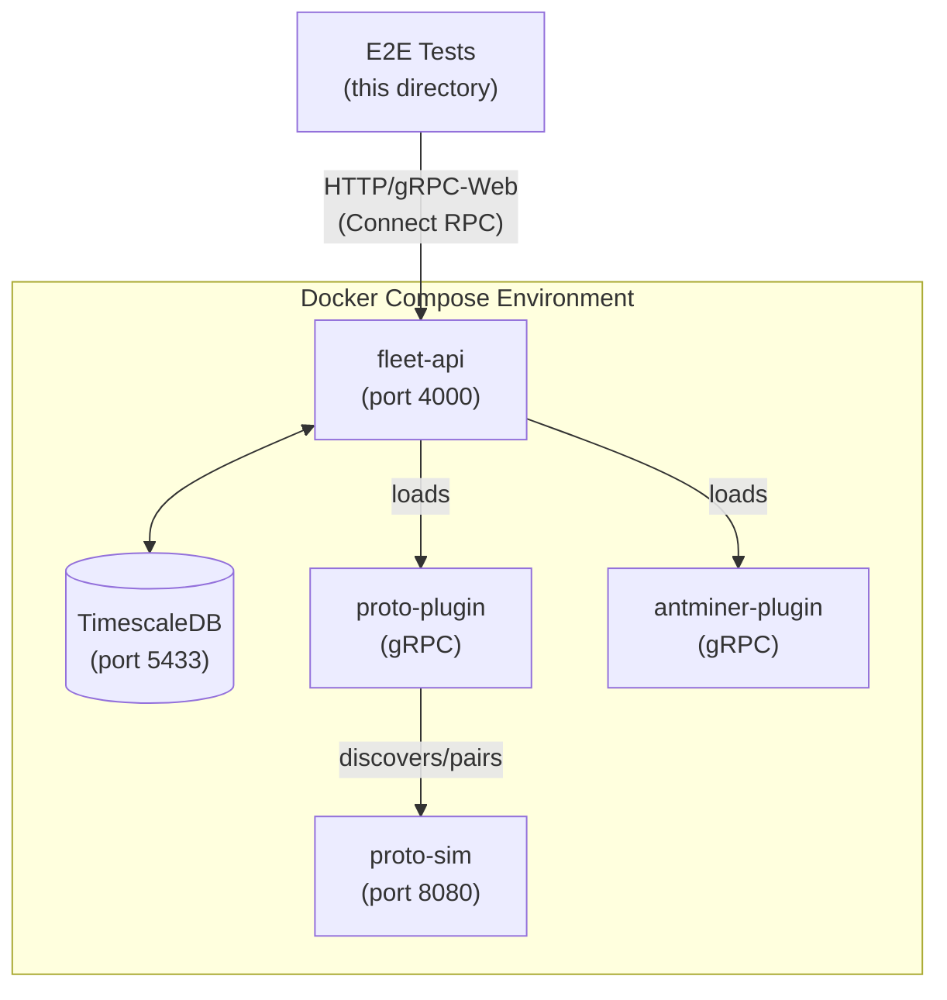

# E2E Testing Guide

This directory contains end-to-end (e2e) tests for the Proto Fleet system. These tests validate the complete plugin integration workflow using the real docker-compose infrastructure.

## Table of Contents

- [Overview](#overview)
- [Architecture](#architecture)
- [Test Categories](#test-categories)
- [Running Tests](#running-tests)
- [Test Workflows](#test-workflows)
- [Troubleshooting](#troubleshooting)

## Overview

The e2e tests validate that:

1. **Docker infrastructure** is properly configured and running
2. **Plugin system** loads and initializes correctly
3. **Complete workflows** function end-to-end (discovery → pairing → telemetry)

These tests run against the actual docker-compose environment (`just rebuild-all`), not isolated test infrastructure. This ensures we're testing the real system as users would deploy it.

## Architecture

### System Under Test



### Test Architecture

The e2e tests follow a **system testing** approach:

- Tests interact with the real Fleet API at `http://localhost:4000`
- Uses actual docker-compose services (not mocks or isolated infrastructure)
- Validates complete workflows through public API endpoints
- Triggers `just rebuild-all` to ensure clean environment state

**Key Design Principle**: Tests should interact with the system exactly as a real client would - through the Fleet API using Connect RPC (gRPC-Web).

## Test Categories

### 1. Infrastructure Validation (`TestPluginIntegration`)

Validates that the docker-compose environment is properly configured and all services are running correctly.

**What it tests**:

```
┌─────────────────────────────────────────────────────────────┐
│                   TestPluginIntegration                      │
│                                                              │
│  1. DockerContainersRunning                                 │
│     ├─ fleet-api container exists and is running           │
│     ├─ proto-sim container exists and is running           │
│     └─ timescaledb container exists and is running         │
│                                                              │
│  2. FleetAPIHealth                                          │
│     └─ /health endpoint returns 200 OK                     │
│                                                              │
│  3. PluginBinariesCorrect                                   │
│     ├─ proto-plugin binary exists                          │
│     ├─ antminer-plugin binary exists                       │
│     ├─ Binaries are ELF format (not Mach-O)               │
│     └─ Binaries are ARM64 architecture (for Docker)       │
│                                                              │
│  4. PluginsLoaded                                           │
│     ├─ Check fleet-api logs for plugin startup messages   │
│     ├─ Verify gRPC protocol is used                       │
│     └─ Ensure no plugin load errors                       │
│                                                              │
│  5. ProtoSimAccessible                                      │
│     └─ proto-sim container is running and has IP          │
│                                                              │
│  6. DatabaseConnectivity                                    │
│     ├─ Can connect to TimescaleDB                          │
│     └─ Required tables exist (device, user, etc.)         │
│                                                              │
│  7. AdminUserCreation                                       │
│     └─ Can create admin user via API                      │
│                                                              │
│  8. Authentication                                          │
│     └─ Can authenticate and receive JWT token             │
└─────────────────────────────────────────────────────────────┘
```

**Run this test**:
```bash
go test -v -tags=e2e ./e2e -run TestPluginIntegration
```

### 2. Complete Workflow Validation (`TestCompletePluginWorkflow`)

Validates the full device lifecycle: discovery → pairing → telemetry collection.

**What it tests**:

```
┌─────────────────────────────────────────────────────────────┐
│              TestCompletePluginWorkflow                      │
│                                                              │
│  Prerequisites:                                              │
│    - Triggers 'just rebuild-all' to reset environment       │
│    - Waits for fleet-api to be healthy                      │
│    - Creates admin user and authenticates                   │
│                                                              │
│  Workflow Steps:                                             │
│                                                              │
│  1. DiscoverDeviceViaPlugin                                 │
│     ├─ Calls /pairing.v1.PairingService/Discover           │
│     ├─ Uses IP list mode with proto-sim IP (127.0.0.1)    │
│     ├─ Validates proto plugin discovers device             │
│     └─ Captures device_identifier for next steps           │
│                                                              │
│  2. PairDiscoveredDevice                                    │
│     ├─ Calls /pairing.v1.PairingService/Pair               │
│     ├─ Uses device_identifier from discovery               │
│     └─ Validates pairing succeeds                          │
│                                                              │
│  3. ValidateTelemetryCollection                            │
│     ├─ Polls /telemetry.v1.TelemetryService/GetSnapshot   │
│     ├─ Waits up to 30s for telemetry data                 │
│     ├─ Validates data includes hashrate, temp, power      │
│     └─ Ensures values are in reasonable ranges            │
└─────────────────────────────────────────────────────────────┘
```

**Run this test**:
```bash
# Via just command (recommended)
just test-plugin-integration

# Or directly
go test -v -tags=e2e ./e2e -run TestCompletePluginWorkflow
```

## Running Tests

### Prerequisites

1. **Just installed**: Task runner for commands
2. **Docker running**: Docker Desktop or Docker daemon
3. **Go installed**: Go 1.21+ for running tests
4. **Hermit activated**: Run `./bin/activate-hermit` from repo root

### Quick Start

```bash
# From the server/ directory

# Option 1: Run complete workflow test (includes `just rebuild-all`)
just test-plugin-integration

# Option 2: Run infrastructure validation only (assumes docker-compose is already running)
go test -v -tags=e2e ./e2e -run TestPluginIntegration

# Option 3: Run all e2e tests
go test -v -tags=e2e ./e2e
```

### Important Notes

**Build Tags**: All e2e tests use the `//go:build e2e` tag. You must include `-tags=e2e` when running tests:

```bash
# ❌ Won't find any tests
go test ./e2e

# ✅ Correctly runs e2e tests
go test -tags=e2e ./e2e
```

**Test Duration**: `TestCompletePluginWorkflow` takes 2-5 minutes because it:
- Runs `just rebuild-all` (rebuilds containers, runs migrations, loads plugins)
- Waits for services to be healthy
- Polls for telemetry data (up to 30s)

**Skipping in Short Mode**: Tests automatically skip when running `go test -short`:

```bash
# Skips e2e tests (fast unit tests only)
go test -short ./...
```

## Test Workflows

### Discovery → Pairing → Telemetry Flow

```
┌──────────┐
│  START   │
└────┬─────┘
     │
     ▼
┌─────────────────────┐
│ just rebuild-all    │  Resets docker-compose environment
│ (2-3 minutes)       │  Rebuilds containers, runs migrations
└─────────┬───────────┘
          │
          ▼
┌─────────────────────┐
│ Wait for Health     │  Polls /health endpoint (up to 60s)
└─────────┬───────────┘
          │
          ▼
┌─────────────────────┐
│ Create Admin User   │  POST /onboarding.v1.OnboardingService/CreateAdminLogin
└─────────┬───────────┘
          │
          ▼
┌─────────────────────┐
│ Authenticate        │  POST /auth.v1.AuthService/Authenticate
│                     │  Returns JWT token for subsequent requests
└─────────┬───────────┘
          │
          ▼
┌─────────────────────┐
│ Discover Device     │  Stream /pairing.v1.PairingService/Discover
│ (proto plugin)      │  - Scans 127.0.0.1:8080 (proto-sim)
│                     │  - Plugin detects Proto firmware
│                     │  - Returns device_identifier
└─────────┬───────────┘
          │
          ▼
┌─────────────────────┐
│ Pair Device         │  POST /pairing.v1.PairingService/Pair
│                     │  - Authenticates with device
│                     │  - Stores credentials in DB
│                     │  - Starts telemetry collection
└─────────┬───────────┘
          │
          ▼
┌─────────────────────┐
│ Poll for Telemetry  │  GET /telemetry.v1.TelemetryService/GetSnapshot
│ (up to 30s)         │  - Checks every 2 seconds
│                     │  - Waits for hashrate, temperature, power data
└─────────┬───────────┘
          │
          ▼
┌─────────────────────┐
│ Validate Data       │  - Ensures telemetry has expected measurements
│                     │  - Logs sample data points
└─────────┬───────────┘
          │
          ▼
     ┌────┴─────┐
     │ SUCCESS  │
     └──────────┘
```

### Authentication Flow

All API requests (except health checks and onboarding) require authentication:

```
┌──────────────┐
│   Request    │
└──────┬───────┘
       │
       ▼
  Has "Authorization: Bearer <token>" header?
       │
       ├─ No ──► 401 Unauthorized
       │
       ▼ Yes
  Token valid?
       │
       ├─ No ──► 401 Unauthorized
       │
       ▼ Yes
  ┌────────────┐
  │  Process   │
  │  Request   │
  └────────────┘
```

**Getting a token**:

```go
// 1. Create admin user (only needed once per environment)
client := onboardingv1connect.NewOnboardingServiceClient(http.DefaultClient, "http://localhost:4000")
req := connect.NewRequest(&onboardingv1.CreateAdminLoginRequest{
    Username: "admin",
    Password: "password",
})
_, err := client.CreateAdminLogin(ctx, req)

// 2. Authenticate to get token
authClient := authv1connect.NewAuthServiceClient(http.DefaultClient, "http://localhost:4000")
authReq := connect.NewRequest(&authv1.AuthenticateRequest{
    Username: "admin",
    Password: "password",
})
resp, err := authClient.Authenticate(ctx, authReq)
token := resp.Msg.Token

// 3. Use token in subsequent requests
req.Header().Set("Authorization", "Bearer "+token)
```

## Troubleshooting

### Common Issues

#### 1. "no Go files in /server/e2e"

**Cause**: Missing `-tags=e2e` flag

**Solution**:
```bash
# ❌ Wrong
go test ./e2e

# ✅ Correct
go test -tags=e2e ./e2e
```

#### 2. "connection refused" or "context deadline exceeded"

**Cause**: Docker containers not running or not healthy

**Solution**:
```bash
# Check container status
docker ps | grep server-

# Check fleet-api logs
docker logs server-fleet-api-1

# Restart environment
just rebuild-all
```

#### 3. "plugin binary should be ELF binary"

**Cause**: Plugin built for macOS instead of Linux (Docker container architecture)

**Solution**:
```bash
# Rebuild plugins for correct architecture
just build-plugins

# Verify architecture
file plugins/proto-plugin
# Should output: ELF 64-bit LSB executable, ARM aarch64
```

#### 4. "unsupported plugin protocol 'netrpc'"

**Cause**: Plugin using wrong protocol (old HashiCorp go-plugin default)

**Solution**: Ensure plugins use gRPC protocol. Check plugin initialization:

```go
// ✅ Correct - gRPC protocol
plugin.Serve(&plugin.ServeConfig{
    HandshakeConfig: Handshake,
    Plugins: map[string]plugin.Plugin{
        "discoverer": &plugins.GRPCDiscovererPlugin{Impl: discoverer},
        "pairer":     &plugins.GRPCPairerPlugin{Impl: pairer},
    },
    GRPCServer: plugin.DefaultGRPCServer, // Important!
})
```

#### 5. "No telemetry data received"

**Cause**: Telemetry collection hasn't started yet or device not paired correctly

**Debugging**:
```bash
# Check if device was paired
docker exec server-timescaledb-1 psql -U fleet_user -d fleet -c "SELECT * FROM device;"

# Check fleet-api logs for telemetry errors
docker logs server-fleet-api-1 | grep -i telemetry

# Check if telemetry service is polling
docker logs server-fleet-api-1 | grep "Collecting telemetry"
```

#### 6. "Admin user already exists"

**Cause**: Re-running tests without clean environment (normal for TestPluginIntegration)

**Solution**: This is expected. TestPluginIntegration tests accept "already exists" errors. If you need a truly clean environment, run:

```bash
just rebuild-all
```

### Debugging Test Failures

#### View detailed test output

```bash
# Run with verbose output
go test -v -tags=e2e ./e2e -run TestCompletePluginWorkflow

# Save output to file
go test -v -tags=e2e ./e2e -run TestCompletePluginWorkflow 2>&1 | tee test-output.log
```

#### Check Docker logs

```bash
# Fleet API logs (most important)
docker logs server-fleet-api-1

# Proto-sim logs
docker logs server-proto-sim-1

# TimescaleDB logs
docker logs server-timescaledb-1

# All services
docker-compose logs
```

#### Verify network connectivity

```bash
# Check if proto-sim is accessible from host
curl http://localhost:8080/health

# Check if fleet-api is accessible
curl http://localhost:4000/health

# Check container networking
docker exec server-fleet-api-1 ping server-proto-sim-1
```

#### Database inspection

```bash
# Interactive PostgreSQL shell
just db-shell

# Check discovered devices
docker exec server-timescaledb-1 psql -U fleet_user -d fleet -c "SELECT * FROM discovered_device;"

# Check paired devices
docker exec server-timescaledb-1 psql -U fleet_user -d fleet -c "SELECT * FROM device;"

# Check users
docker exec server-timescaledb-1 psql -U fleet_user -d fleet -c "SELECT * FROM \"user\";"
```

### Performance Tuning

If tests are running slowly:

1. **Skip `just rebuild-all` for infrastructure tests**: `TestPluginIntegration` doesn't require a full environment rebuild if you already have a healthy environment

2. **Run tests in parallel** (not currently implemented, but possible):
   ```bash
   go test -v -tags=e2e -parallel 2 ./e2e
   ```

3. **Use test caching**: Go caches passing tests by default. Only changed tests will re-run:
   ```bash
   # First run: Full execution
   go test -tags=e2e ./e2e

   # Second run: Cached (instant)
   go test -tags=e2e ./e2e
   ```

4. **Reduce telemetry polling timeout**: Edit test constants in `plugin_integration_test.go`:
   ```go
   const (
       requestTimeout = 5 * time.Second  // Reduce from 10s
   )
   ```

## Test Maintenance

### Adding New Tests

When adding new e2e tests, follow this pattern:

```go
//go:build e2e

package e2e

import (
    "context"
    "testing"

    "github.com/stretchr/testify/require"
)

func TestMyNewWorkflow(t *testing.T) {
    if testing.Short() {
        t.Skip("Skipping e2e test in short mode")
    }

    ctx := context.Background()

    // 1. Setup (authenticate, etc.)
    token := authenticateViaRealAPI(t, ctx, testUsername, testPassword)

    // 2. Execute workflow
    // ... your test logic ...

    // 3. Validate results
    require.NotEmpty(t, result, "should have results")
}
```

**Best practices**:

- Use `testing.Short()` guard to allow skipping in CI
- Use subtests (`t.Run()`) for logical groupings
- Always use `require` for assertions that should stop the test
- Use `assert` for non-critical validations
- Add descriptive log messages with `t.Logf()`
- Use constants for timeouts, URLs, credentials

### Updating Tests for API Changes

When API definitions change:

1. **Regenerate code**: `just gen` (regenerates proto bindings)
2. **Update test imports**: Check if proto package paths changed
3. **Update request/response handling**: Check for new required fields
4. **Run tests**: `go test -tags=e2e ./e2e` to catch compilation errors

### CI/CD Integration

These tests can be integrated into CI/CD pipelines:

```yaml
# Example GitHub Actions workflow
name: E2E Tests

on: [push, pull_request]

jobs:
  e2e:
    runs-on: ubuntu-latest
    steps:
      - uses: actions/checkout@v3

      - name: Set up Go
        uses: actions/setup-go@v4
        with:
          go-version: '1.21'

      - name: Install Just
        run: curl --proto '=https' --tlsv1.2 -sSf https://just.systems/install.sh | bash -s -- --to /usr/local/bin

      - name: Run E2E Tests
        run: |
          cd server
          just test-plugin-integration
```

## Reference

### API Endpoints Used

| Endpoint | Method | Purpose |
|----------|--------|---------|
| `/health` | GET | Health check (no auth required) |
| `/onboarding.v1.OnboardingService/CreateAdminLogin` | POST | Create first admin user |
| `/auth.v1.AuthService/Authenticate` | POST | Get JWT token |
| `/pairing.v1.PairingService/Discover` | Stream | Discover mining devices |
| `/pairing.v1.PairingService/Pair` | POST | Pair discovered devices |
| `/telemetry.v1.TelemetryService/GetSnapshot` | GET | Get latest telemetry |

### Constants

```go
const (
    fleetAPIURL       = "http://localhost:4000"
    protoSimIP        = "127.0.0.1"  // localhost since test runs on host
    protoSimPort      = "8080"
    testUsername      = "admin"
    testPassword      = "proto"
    requestTimeout    = 10 * time.Second
    containerPrefix   = "server-"
)
```

### Docker Containers

| Container | Purpose | Exposed Port |
|-----------|---------|--------------|
| `server-fleet-api-1` | Fleet API service | 4000 |
| `server-proto-sim-1` | Simulated Proto miner | 8080 |
| `server-timescaledb-1` | TimescaleDB database | 5433 |

### Related Documentation

- **Server development**: `../README.md`
- **Plugin architecture**: `../internal/domain/pairing/plugin/README.md` (if exists)
- **API definitions**: `../../proto/`
- **Docker setup**: `../docker-compose.yml`

---

**Questions or issues?** Check the troubleshooting section above or review the test code in `plugin_integration_test.go`.
